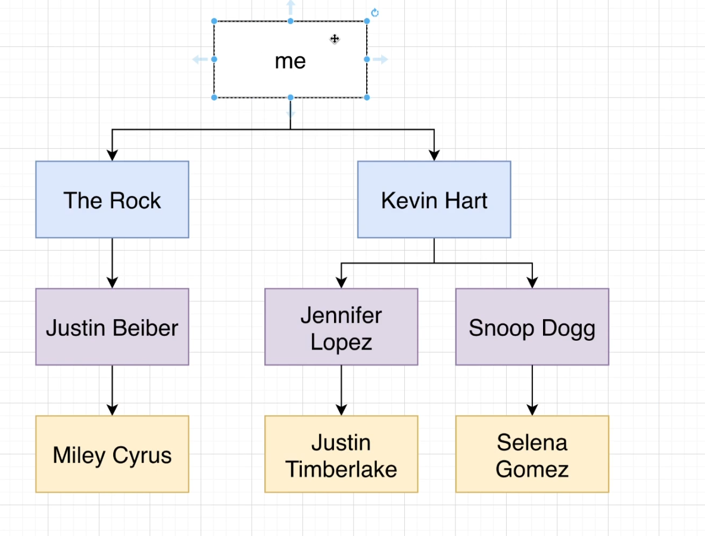

## Common Table Expressions (CTE)

CTE's are like a variable declarations in other programming languages.

Imagine we have the following query. We combine all kings of tags table, join that combined table with users table, to find all the tags for users created on that particular date.

```sql
SELECT 
    username, 
    tags.created_at
FROM users 
JOIN (
        SELECT user_id, created_at
        FROM caption_tags
    UNION ALL
        SELECT user_id, created_at 
        FROM photo_tags
) AS tags ON tags.user_id = users.id 
WHERE tags.created_at < '2010-01-07';
```

With CTE's, we can declare the subquery as a separate variable.

```sql
WITH tags AS (
    SELECT user_id, created_at FROM caption_tags
    UNION ALL 
    SELECT user_id, created_at FROM photo_tags
);

SELECT username, tags.created_at 
FROM users 
JOIN tags ON tags.user_id = users.id
WHERE tags.created_at < '2010-01-07';
```

---

## Recursive CTEs 

Important Notes on Recurisive CTEs
- Very Very different from Simple CTEs
- Useful anytime you have a tree or a graph-type data structure
- Must use a 'UNION' keyword - simple CTEs don't have to use UNION at all.
- Recursive CTEs are a lot more complicated

Example 1

```sql
WITH RECURSIVE countdown(val) AS (
    -- starting condition
    SELECT 3 AS val 
    UNION 
    -- decrement val with every call
    SELECT val - 1 FROM countdown
    -- base condition, this stops recursion
    WHERE val > 1
);

SELECT * FROM countdown;

-- prints val -> 3, 2, 1
```

Example 2

Suppose we want to find out second level follows of a user (a user follows A who follows B), depicted by the diagram: 



Query: 

```sql
WITH RECURSIVE suggestions(leader_id, follower_id, depth) AS (
        -- starting condition
        SELECT leader_id, follower_id, 1 AS depth 
        FROM followers 
        WHERE follower_id = 1000
    UNION ALL 
        -- update leader_id, follower_id every loop
        SELECT followers.leader_id, followers.follower_id, depth + 1
        FROM followers
        JOIN suggestions ON suggestions.leader_id = followers.follower_id
        -- base condition, to stop the recursion
        WHERE depth < 3
);

SELECT DISTINCT users.id, users.username
FROM suggestions 
JOIN users ON users.id = suggestions.leader_id
WHERE depth > 1
LIMIT 30;
```