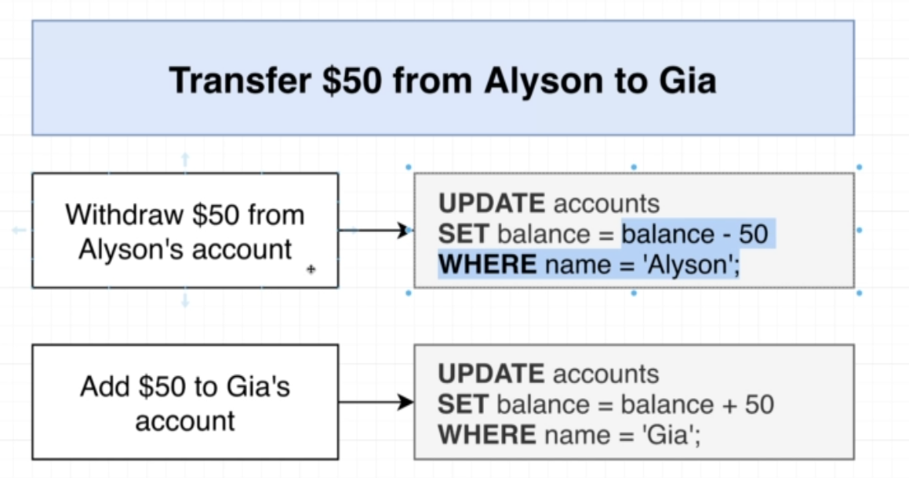

# Transactions

A canonical example of Transactions: actual Bank transactions. 



Imagine if something goes wrong between these two bank transactions, so we would have subtracted 50 from Alyson's account without actually increasing the corresponding amount to Gia's account. 

Transactions prevent these kind of errors.

In Postgres, we open a transaction by using `BEGIN` command, which starts a "valid transaction block"

```sql
BEGIN;

-- other queries...
```

When we run the `Begin` command, postgres creates a separate, isolated workspace for that connection. NO actual copying of data actually happens (its just a virtual separation). 

Once a transaction block is opened, other connections cannot change the data inside that transactions. 


We can run `COMMIT;` to merge changes back into the main data pool. 

If we do not want the changes in the transaction, we can run `ROLLBACK` command.

NOTE: Running a bad command (which results in an error), will put the transaction in an "aborted" state, after which you MUST run `ROLLBACK` command.

Losing the connection will automatically `ROLLBACK` the transaction.

### Transaction Locks 

A problem with long running Transactions is that data in use withing the transaction becomes "locked", other connections cannot then update it which that transaction is running. 

The second connection just hangs, waiting for the first transaction to finish, and runs as soon as the first one finishes.