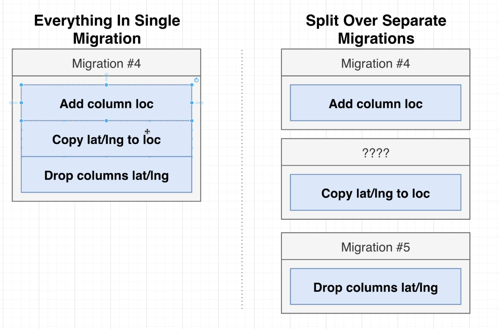
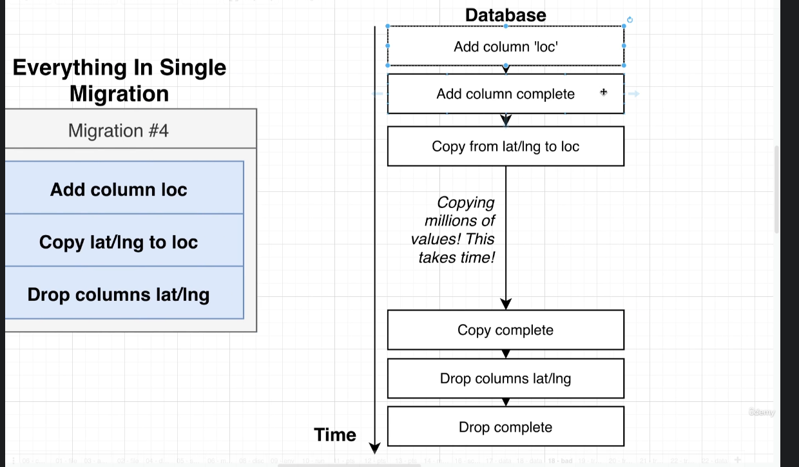
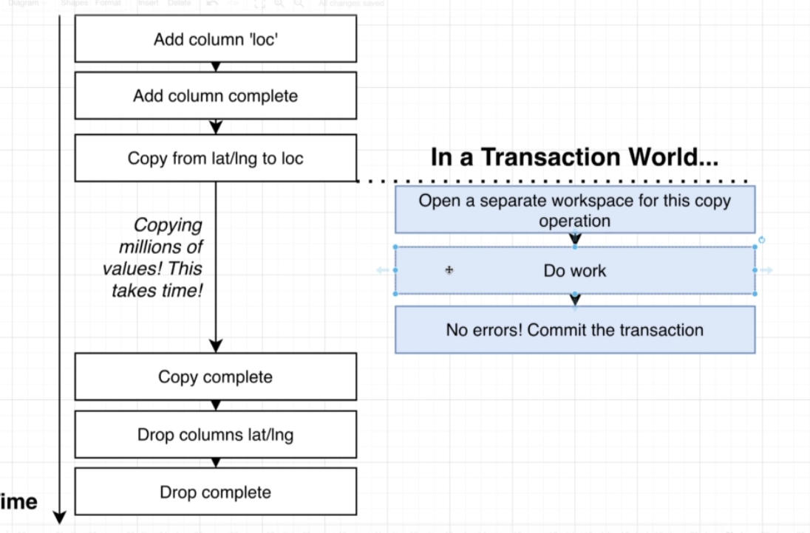
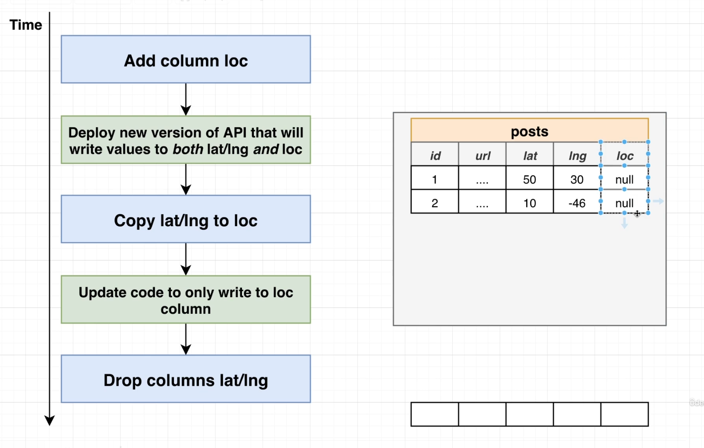
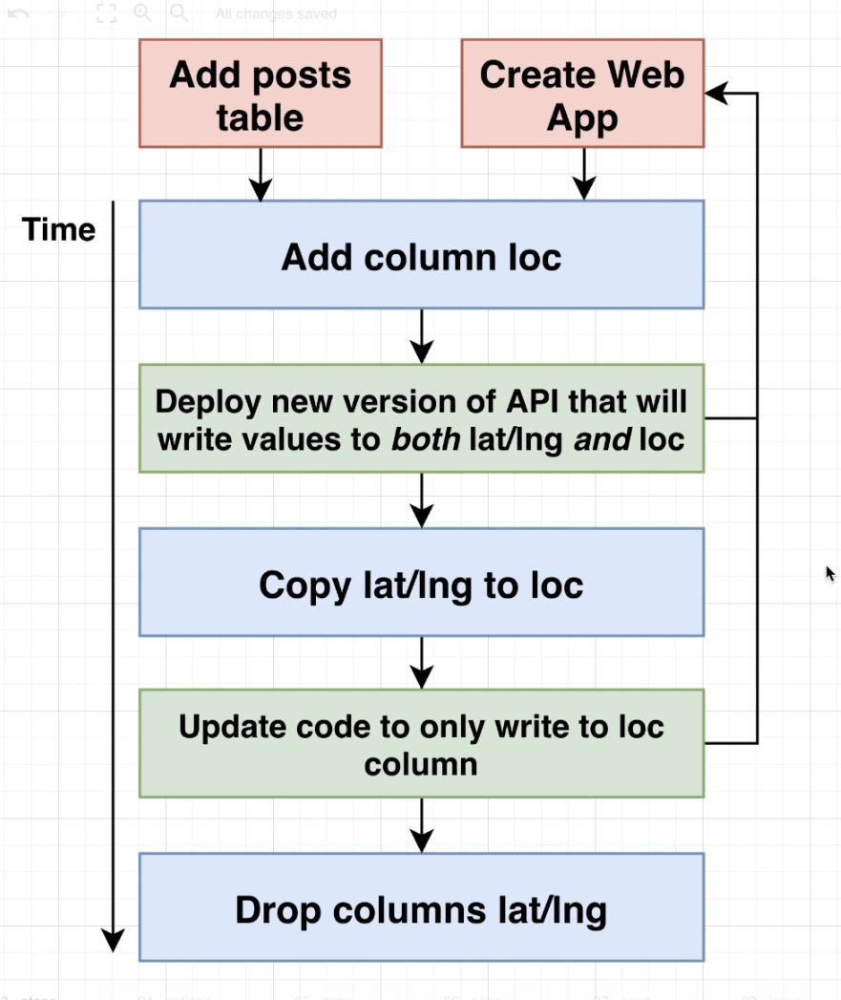

# Migrations 

Migrations solve the following issues:

1. Changes to the DB structure and changes to clients need to be made at precisely the same time.
2. When working with other engineers, we need a really easy way to tie the structure of our DB to our code.

Migrations can be of two types: 
1. Schema Migrations 
2. Data Migrations

There are several reasons NOT to run Data migrations at the same time as Schema migrations. (One of the reasons discussed below)

Consider the example below: 

The problem is running a single migration with lot of data takes time, and in this time, new data may come in, leaving the data in a bad shape.

(The migration below is run in a Transaction)

For the above migration, the data is copied at the time the migration is first created, and by the time the migration is done, that data may already be outdated.

Correct way to carry out the above migration is: 

Further explanation of the above process: 

