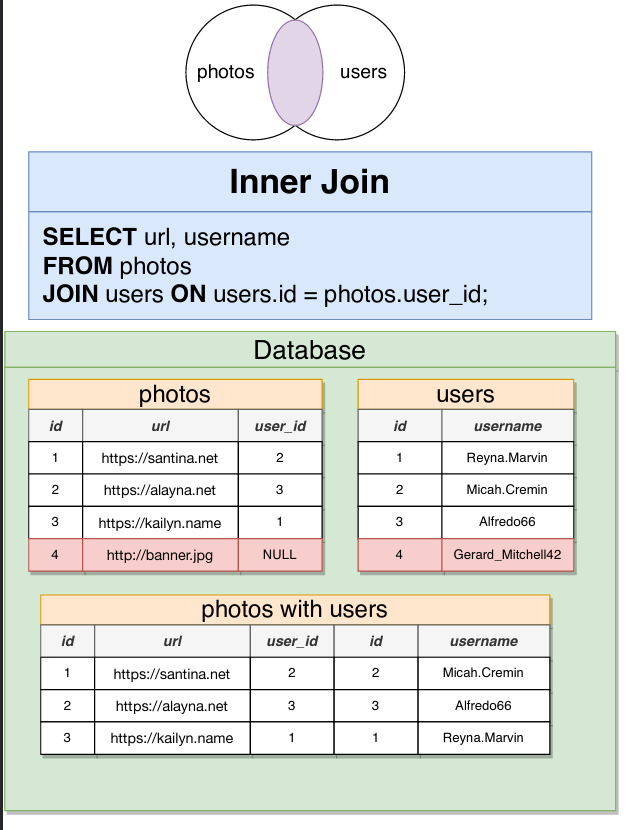
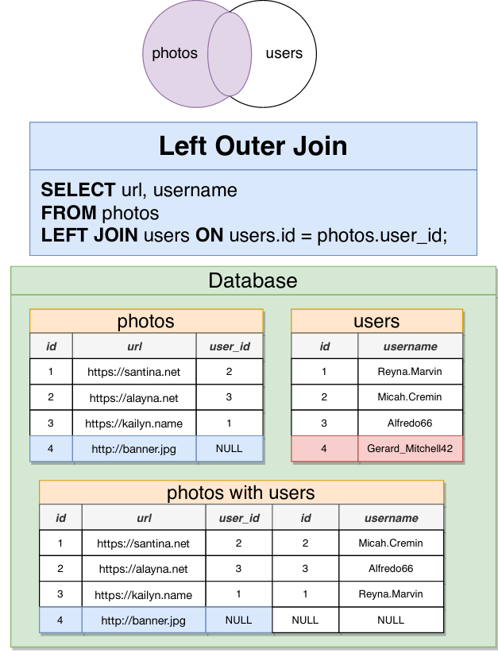
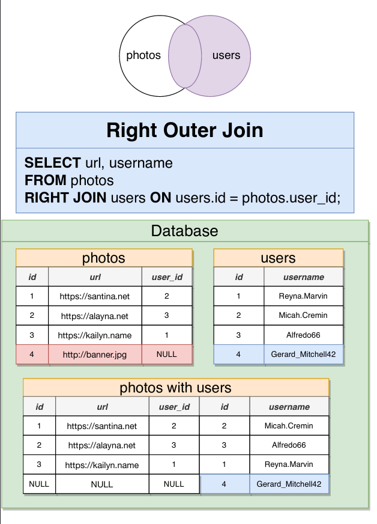

# SQL 

## Many-to-One & One-to-Many relationships 

Whenever we say, x has many y's, that indicates a one-to-many relationship.

Whenever we say, y belongs to an x, or y has one x, that indicates a many-to-one relationship.

Example: 

Imagine you are building a database for a large company.  The company has multiple offices around the country, and each employee must be assigned to work at a single office.

You decide to create a table of `offices` and table of `employees` .

From the perspective of the office, how would you describe the relationship between an office and an employee?

Answer:
    An Office has many employees (One-to-Many)
    An Employee has one office (Many-to-One)

## Many-to-Many & One-to-One relationships 

These relationships do not exist directly in a SQL database.

**One-to-One**
Examples: 
    A Boat has only one Captain, and a Captain can only operate one Boat
    CEO-Company
    Capital City - Country 
    Student - Desk 
    Person - Driver's License
    
**Many-to-Many**
Examples: 
    Students - Classes 
    Tasks - Engineers 
    Players - Football Matches 
    Movies - Actors
    Conference Calls - Employees
   
## Foreign Keys 
 
In one-to-many relationships, the "many" side holds the foreign key to the "one" side. 

Example: An Office has many Employees
    - In the Employees table, we will put the Foreign Key of OfficeId

In postgres, we define foreign keys like this: 

`user_id INTEGER REFERENCES users(id)`
 
### Deleting a record that is Foreign Key to another record - DELETE constraints

We set these Delete constraints like this 

`user_id INTEGER REFERENCES users(id) ON DELETE CASCADE`

Example: `photos` table has a `user_id` column which references `users`

| On Delete Option      | What happens when you try to delete a user when a photo is still referencing it |
|-----------------------|---------------------------------------------------------------------------------|
| ON DELETE RESTRICT    | Throw an error                                                                  |
| ON DELETE NO ACTION   | Throw an error                                                                  |
| ON DELETE CASCADE     | Delete the photo too!                                                           |
| ON DELETE SET NULL    | Set the `user_id` of the photo to NULL                                          |
| ON DELETE SET DEFAULT | Set the `user_id` of the photo to a default value, if one is provided           |

## Primary Keys

Postgres has `SERIAL` datatype to indicate to the database that we need a unique Foreign Keys. 

We use `id SERIAL PRIMARY KEY` to define Primary keys

*** 

## Joins & Aggregates 

### Joins 

- Produces vales by merging together rows from different related tables 
- Use a join most times that you're asked to find data that involves multiple resources

### Aggregation 

- Looks at many rows and calculates a single value 
- Words like 'most', 'average', 'least' are a sign that we need to use aggregation

### Different Joins

#### Inner Join

#### Left Outer Join 

#### Right Outer Join

#### Full Join

