# SQL 

## Many-to-One & One-to-Many relationships 

Whenever we say, x has many y's, that indicates a one-to-many relationship.

Whenever we say, y belongs to an x, or y has one x, that indicates a many-to-one relationship.

Example: 

Imagine you are building a database for a large company.  The company has multiple offices around the country, and each employee must be assigned to work at a single office.

You decide to create a table of `offices` and table of `employees` .

From the perspective of the office, how would you describe the relationship between an office and an employee?

Answer:
    An Office has many employees (One-to-Many)
    An Employee has one office (Many-to-One)

## Many-to-Many & One-to-One relationships 

These relationships do not exist directly in a SQL database.

**One-to-One**
Examples: 
    A Boat has only one Captain, and a Captain can only operate one Boat
    CEO-Company
    Capital City - Country 
    Student - Desk 
    Person - Driver's License
    
**Many-to-Many**
Examples: 
    Students - Classes 
    Tasks - Engineers 
    Players - Football Matches 
    Movies - Actors
    Conference Calls - Employees
   
## Foreign Keys 
 
In one-to-many relationships, the "many" side holds the foreign key to the "one" side. 

Example: An Office has many Employees
    - In the Employees table, we will put the Foreign Key of OfficeId

In postgres, we define foreign keys like this: 

`user_id INTEGER REFERENCES users(id)`
 
### Deleting a record that is Foreign Key to another record - DELETE constraints

We set these Delete constraints like this 

`user_id INTEGER REFERENCES users(id) ON DELETE CASCADE`

Example: `photos` table has a `user_id` column which references `users`


| On Delete Option      | What happens when you try to delete a user when a photo is still referencing it |
|-----------------------|---------------------------------------------------------------------------------|
| ON DELETE RESTRICT    | Throw an error                                                                  |
| ON DELETE NO ACTION   | Throw an error                                                                  |
| ON DELETE CASCADE     | Delete the photo too!                                                           |
| ON DELETE SET NULL    | Set the `user_id` of the photo to NULL                                          |
| ON DELETE SET DEFAULT | Set the `user_id` of the photo to a default value, if one is provided           |


## Primary Keys

Postgres has `SERIAL` datatype to indicate to the database that we need a unique Foreign Keys. 

We use `id SERIAL PRIMARY KEY` to define Primary keys


*** 

## Joins & Aggregates 

### Joins 

- Produces vales by merging together rows from different related tables 
- Use a join most times that you're asked to find data that involves multiple resources

### Aggregation 

- Looks at many rows and calculates a single value 
- Words like 'most', 'average', 'least' are a sign that we need to use aggregation

### Different Joins

#### Inner Join


#### Left Outer Join 


#### Right Outer Join


#### Full Join

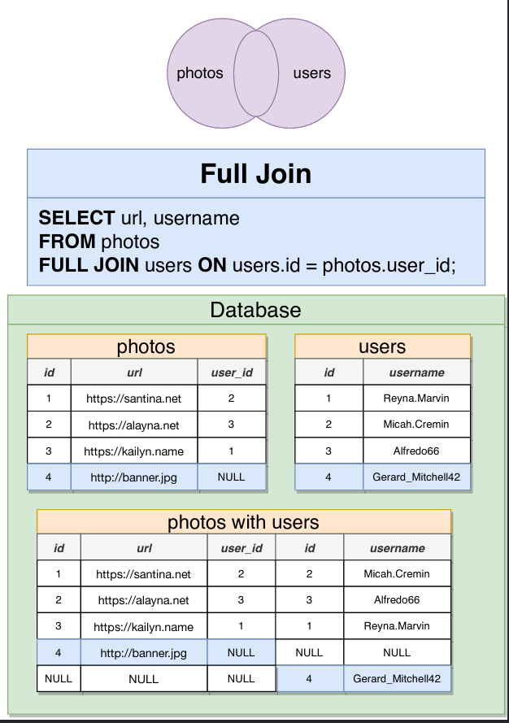


### A gotcha with `COUNT`

`COUNT` does not count null values

For Example: 

`SELECT COUNT(user_id) FROM photos`, if there is a photo without a `user_id` (where the user_id is NULL), it will not be counted.

However, if we do `SELECT COUNT(*) FROM photos`, it will then count all rows.


*** 

## Data Types 

### Numeric Types 

| Numeric Types Fast Rules                                      |                  |                                                      |
|---------------------------------------------------------------|------------------|------------------------------------------------------|
| "id" column of any table                                      | serial           |                                                      |
| Need to store a number without a decimal                      | Integer          |                                                      |
| Need to store a number with decimal, but HIGH ACCURACY needed | numeric          | Bank Balance, grams of gold, scientific calculations |
| Need to store a decimal number, LOW accuracy                  | double precision | kilograms of trash, liters of water, air pressure    |

### Character Types 

In postgres, Character types DO NOT hamper/enhance performance, therefore, use the best type suited for your needs without worrying about optimization.

|             |                                                                                      |
|-------------|--------------------------------------------------------------------------------------|
| CHAR(5)     | Store some characters, length will always be 5, even if PG has to insert spaces      |
| VARCHAR     | Store any length of string                                                           |
| VARCHAR(40) | Store a string up to 40 characters, auto remove extra characters, no spaces inserted |
| TEXT        | Store any length of string                                                           |

### Boolean Types 


|                                                          |       |
|----------------------------------------------------------|-------|
| 'true', 'yes', 'on', 1, 't', 'y'  (strings and a number) | true  |
| 'false', 'no', 'off', 0, 'f', 'n'                        | false |
| null                                                     | null  |


### Times, Dates & Timestamps


#### Date

Given in almost any format, Postgres can successfully parse most date strings, examples: 

All these will be parsed as `1980-11-20` type date

- '1980-11-20'
- 'Nov-20-1980'
- '20-Nov-1980'
- '1980-November-20'
- 'November 20, 1980'
- 'Nov 20 1980'
- '20 NOv 1980'

#### Time, with or without timezone

Postgres stores `time without timezone` in 24-hour format.

Examples: 

- '05:23 PM'  - stored as `17:23:00` (type: time without time zone) 
- '05:23PM'
- '20:34'

Postgres can also store `time with time zone`

Examples

- '01:23 AM MDT' = `01:23:00-06:00` (type: time with time zone)
- '01:23 AM z' OR '01:23 AM UTC' = `01:23:00+00:00`


#### Timestamps

Full DateTime along with OR without Time zone offset information

Example:

- 'June 30 2021 10:00 AM MDT' (type: TIMESTAMP WITH TIME ZONE) = "2021-06-30 10:00:00-06"

### Intervals

Think of an interval as a duration of time 

- `1 day` or `1 D`represented as `1 day`
- `1D 1M 1S` = `1 day 00:01:01`

We can add/subtract intervals 

- `1 D 20 H 30 M 45 S :: Interval - 1 D :: Interval` = `20:30:45` (type interval)


We can add/subtract intervals from timestamps

- `July 1 2021 9:15 AM MDT :: TIMESTAMP with time zone` - `1 D' :: interval` = `2021-06-30 09:15:00-06`


If we addd/substract two timestamps, we get the difference back in interval

- `July 1 2021 9:15 AM MDT'::TIMESTAMP with time zone` - `June 30 2021 10:15 AM MDT' :: TIMESTAMP with time zone` = `23:00:00`


---

## DB Structure Design patterns

1. One way to implement a "Like" system - (a user can like multiple posts, a post can be liked by multiple users)

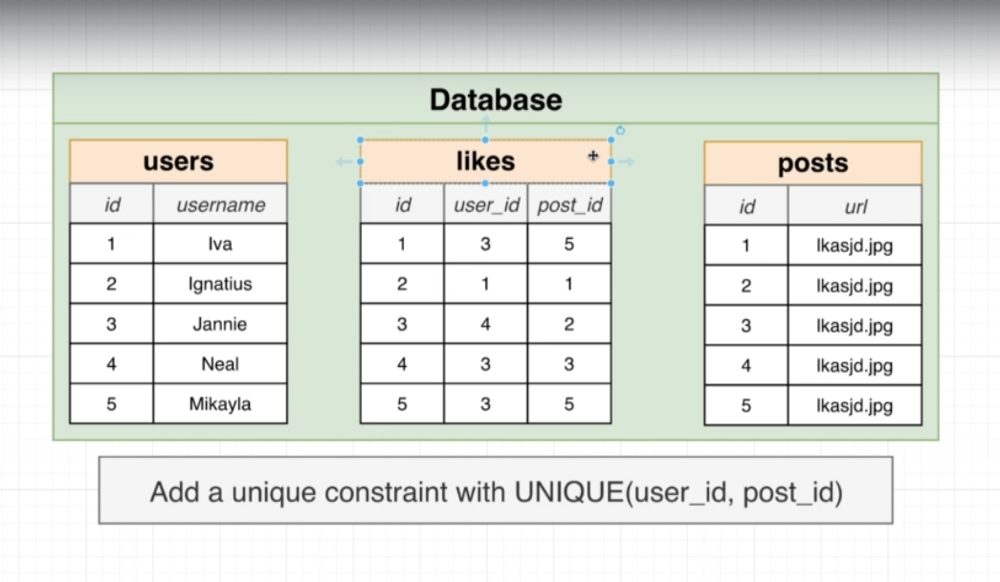

2. However, if we have more than one "Reaction" type (e.g. "Like", "Frown", "love", "care" etc.), then a technique called `polymorphic associations` is used.

The major problem with polymorphic associations is that we cannot use "foreign keys" for each entry in the polymorphic table, this data consistency becomes difficult.


3. Alternate way to implement `polymorphic associations`

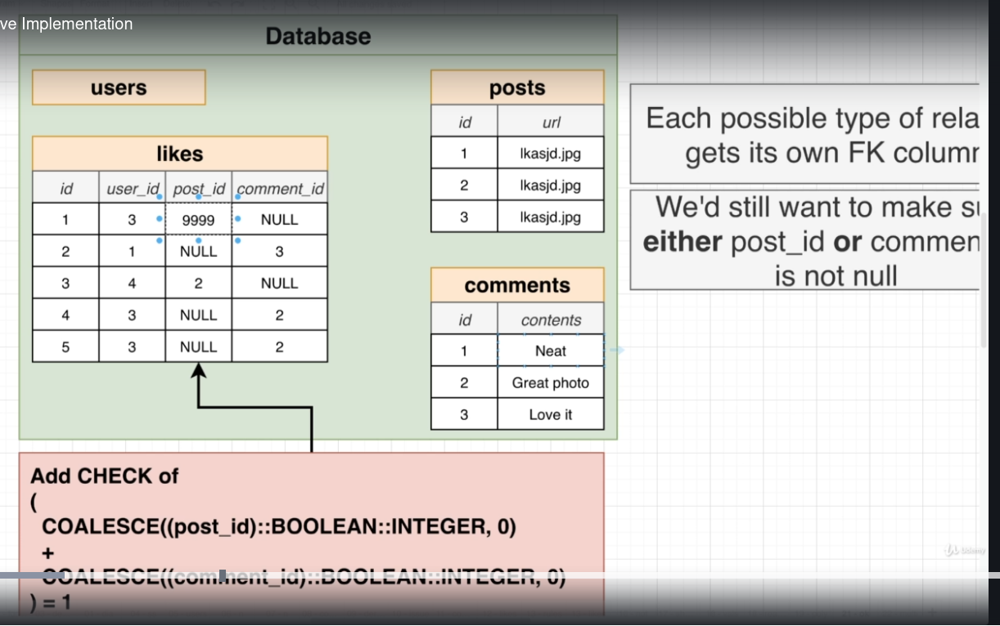

We can now use foriegn keys.

The main problem here is that for each reaction type, we have to add a new column and initiate with null values.

Plus, the check/validation must be modified so that no more than 1 column has a non-null value at any given row.

4. Simplest alternative is to have an xref table for each reaction type.

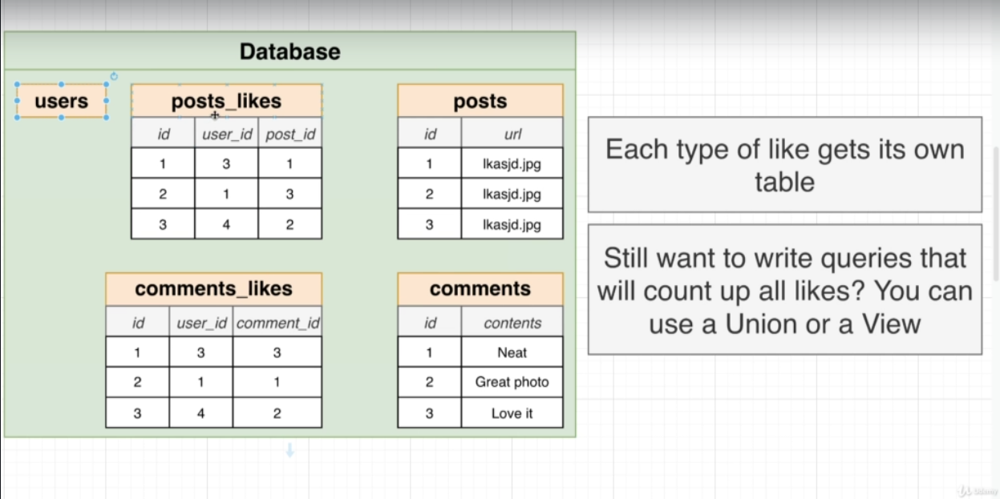

The main drawback here is that the number of table increases, and querying becomes difficult.

---

## Postgres Internals 

- Query: `SHOW data_directory;` will show the directory where postgres is installed. (e.g. `var/lib/postgresql/12/main`)

Inside the above directory, there is a `/base` directory, where each database is stored in individual folders with unique number indentifiers.

- Query: `SELECT oid, datname FROM pg_database;` will show the list of the database with their ids


- Inside each database folders, there are tons of files storing raw data stored inside the database.

Query: `SELECT * FROM pg_class;` shows all these files.


### Heaps, Blocks and Tuples

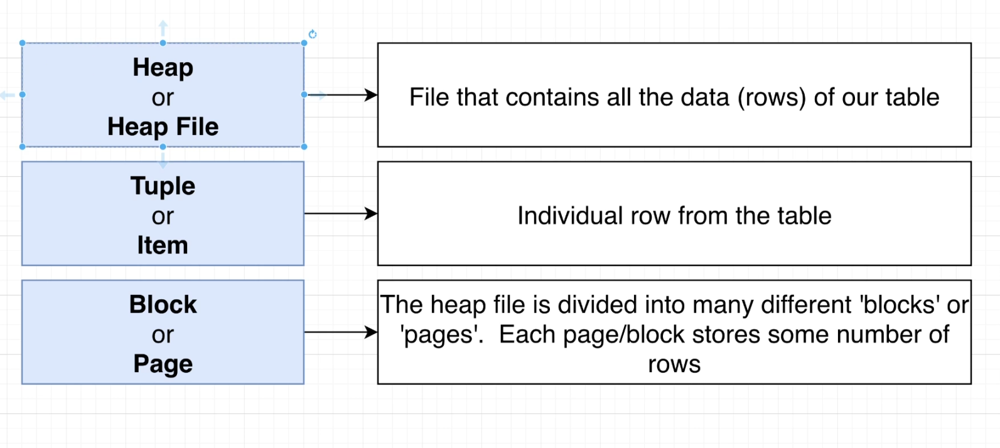

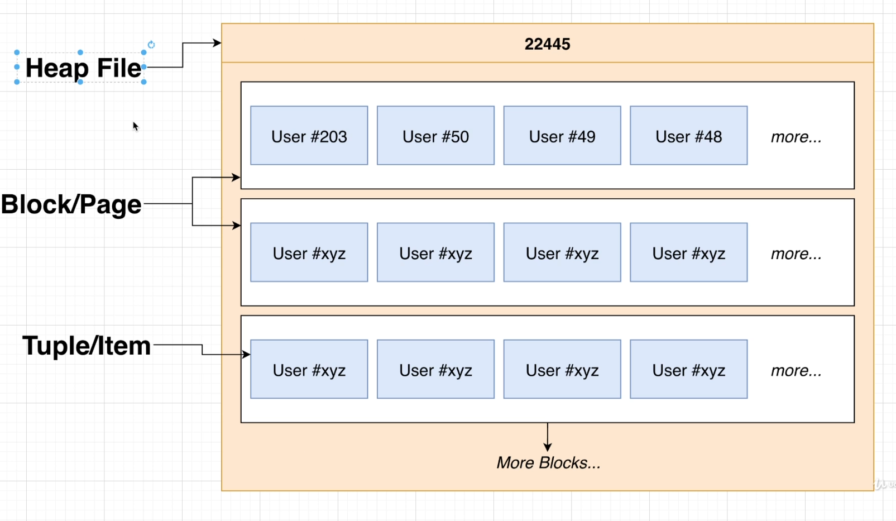

Each Block/Page can store 0 or more Items.

Each Block is 8kb large.

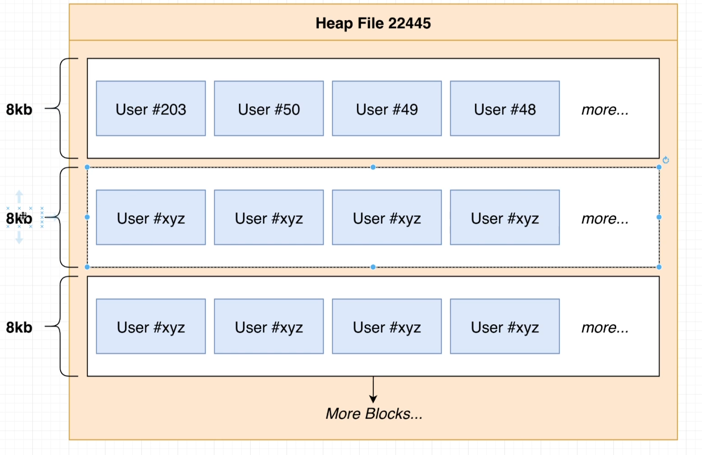


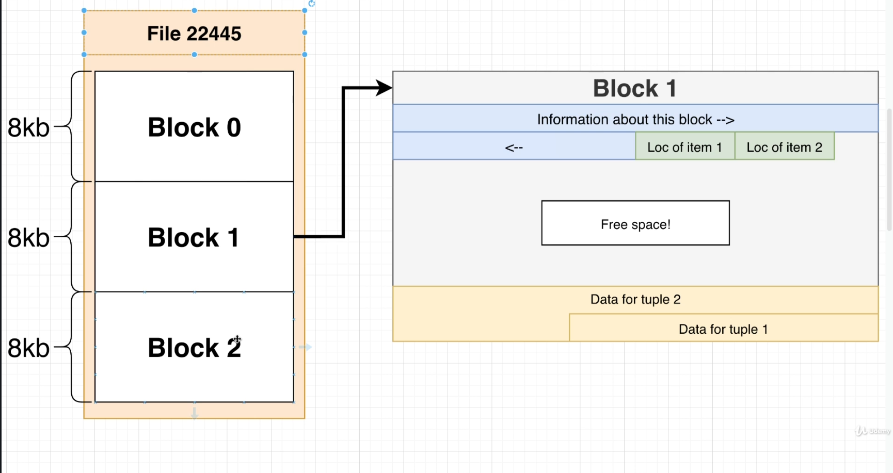
The right hand side shows the byte map (a representation for actual bits stored on the hard drive) for each block as shown below.

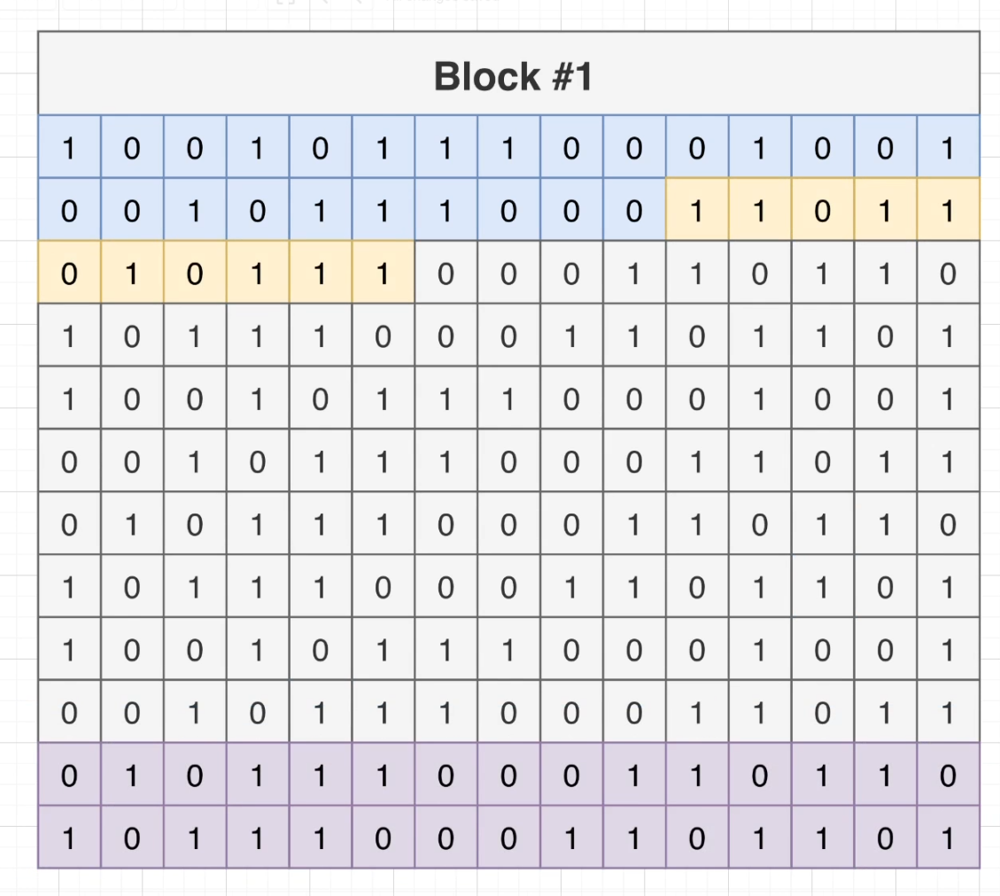

Documentation on the above page format: https://www.postgresql.org/docs/current/storage-page-layout.html

### Full Table Scans 

Full Table Scans occur when Postgres has to load many (or all) rows from the heap file (stored on HD) in to Memory. 

Full Table scans, frequently, but not always, result in poor performance, and whenever we find a FTS, we should investigate further to find an alternative way of querying data.

Example FTS Query:

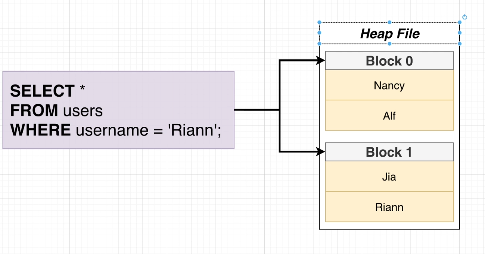

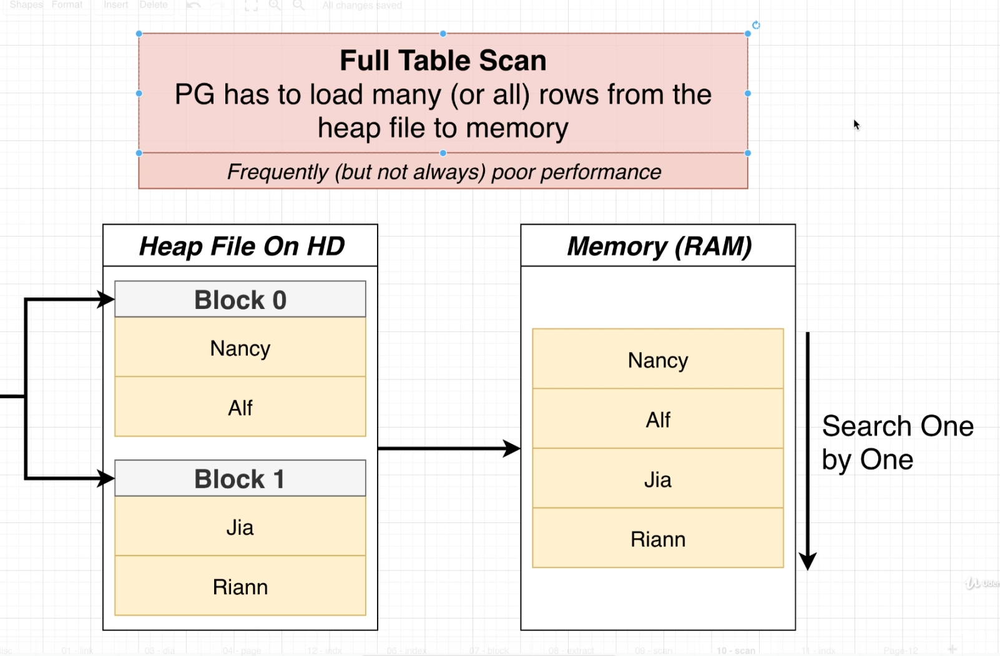


### Index

Indexes are one way to avoid FTS.

Index are a Data Structure (a B-Tree) that efficiently tells us what block/index a record is stored at.


We can create an index with query: `CREATE INDEX ON users (username);`, this creates an index on `username` column of `users` table.

By default, the index is named in this format: `name of table_name of column_ idx`, e.g `users_username_idx`

To delete an index, we query: `DROP INDEX users_username_idx;`

Postgres creates the following indexes automatically
- Postgres automatically creates an index for the Primary Key column of every table.
- Postgres automatically creates an index for any `unique` constraints.

Note: these auto indexes don't get listed under the `indexes` menu item in PGAdmin. We can use the following query to list all indexes: 

`SELECT relname, relkind FROM pg_class WHERE relkind = 'i';`

Indexing on a column can greatly increase performance, but it comes with its own cost.

1. Since index store a tree data structure for speed, the memory footprint of the database increases. 
2. Indexing slows down insert/update/delete - since the index needs to be updated everytime
3. Index might not actually get used after all - just because an index exist, does not mean the Postgres is actually going to use it. 
4. Some queries are faster without indexes.

Index are of several different types in Postgres (Just be aware of this fact).


#### Index under the hood

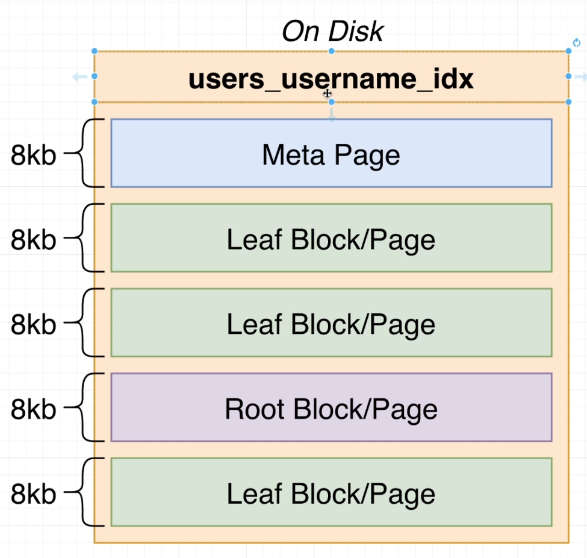

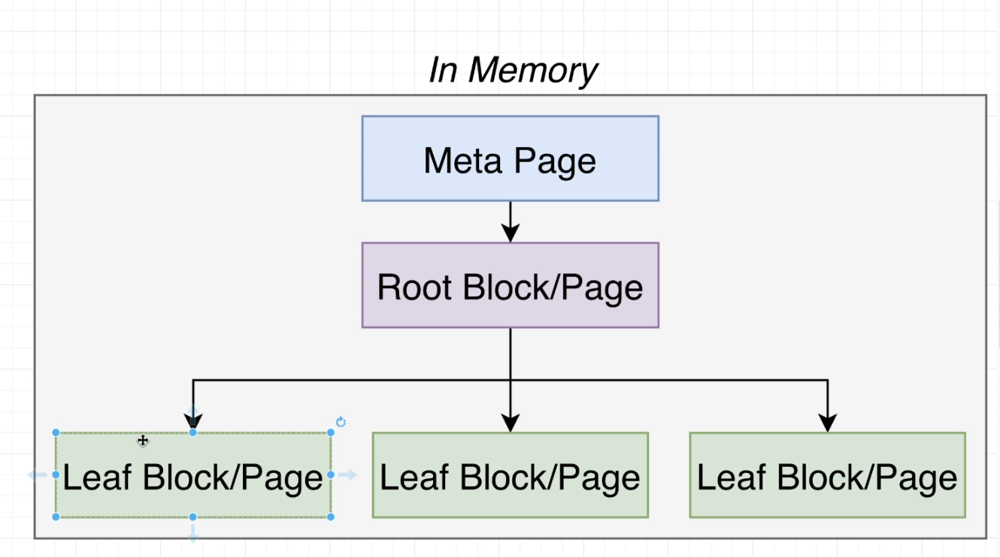

Index files are indentical in structure to the Heap files.

---

### The Query processing pipeline


- Parser: figuring out the meaning of the query, and validate that the query is valid. This step builds a Query Tree.
- Rewrite: Decompose views into underlying table references. This checks the Query Tree and modifies it to speeden things.
- Planner: Important piece: takes a look at Query Tree and come up with different plans to fetch that data.
- Execute: Run the plan given by the planner.

### EXPLAIN and EXPLAIN ANALYZE

EXPLAIN shows a query plan without executing it.
EXPLAIN ANALYZE shows a query plan, executes it and shows statistics about the execution.


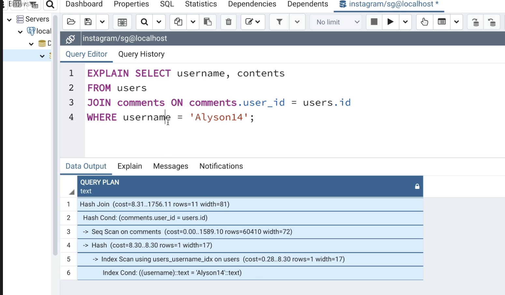

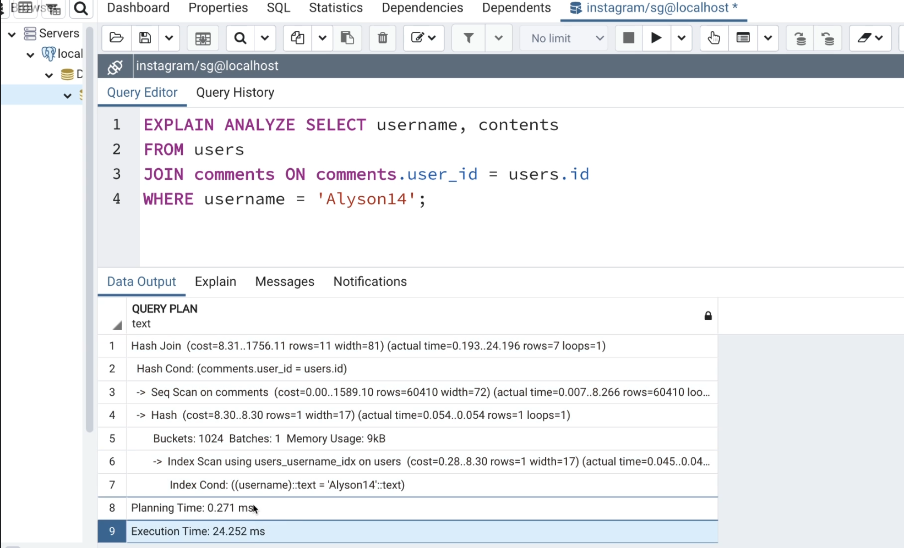


The two numbers for the cost (8.31 .. 1756.11) are not a range.

The first number is the Cost for this step to produce the first row. **Startup Cost**

The second number is the Cost for this step to produce all rows. **Total Cost**

The reason is that in case of multiple processing steps, sometimes, as soon as the first row is processed, its result is passed to the next step (kinda like a stream).


Another point to note about costs in the second diagram below is that the costs flow up, i.e. a parent's cost is the sum of the cost of all its children + its own cost.

That is why the last HashJoin (blue) has a cost of 8.3, when in fact its own cost is close to zero. That cost is coming from the child Hash.


### How query cost is calculated 

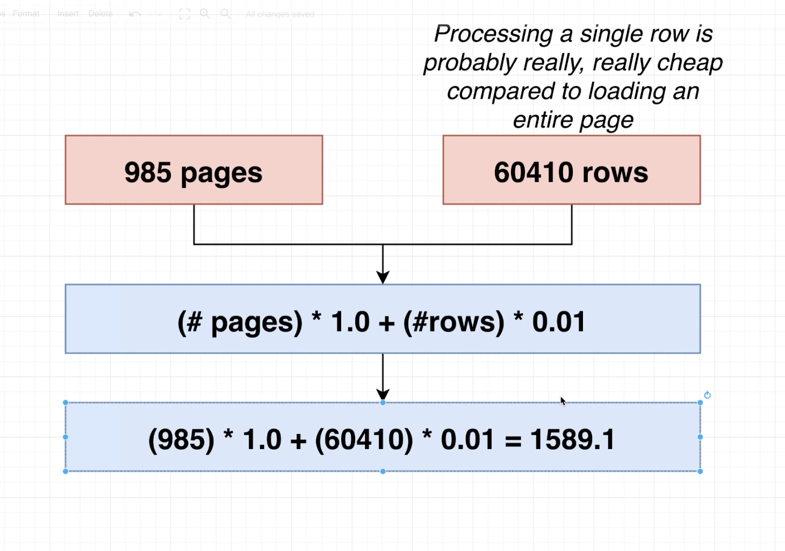

More detailed: 


Official docs for each of these costs: https://www.postgresql.org/docs/9.5/runtime-config-query.html

These costs are all comapred to the baseline cost `seq_page_cost`

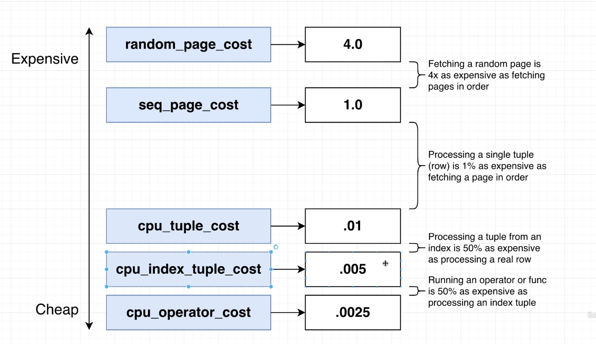

#### Quiz 

The formula for calculating the cost of a processing step in a query plan is: 

```
COST = (# pages read sequentially) * seq_page_cost
            + (# pages read at random) * random_page_cost
            + (# rows scanned) * cpu_tuple_cost 
            + (# index entries scanned) * cpu_index_tuple_cost 
            + (# times function/operator evalutated) * cpu_operator_cost

where 

seq_page_cost = 1.0 
random_page_cost = 4.0 
cpu_tuple_cost = 0.01 
cpu_index_tuple_cost = 0.005 
cpu_operator_cost = 0.0025
```

1. What is the cost for a query node that has to open 5 pages of data sequentially and then process 100 rows total? 

Answer: 5 x 1 + 100 x 0.01 = 6

2. What is the cost for a query node that has to open 4 pages of an index (probably at random), process 75 tuples from the index, then open 20 different pages from a heap file (also at random) and process 214 tuples?

Answer: 4 x 4 + 75 x 0.005 + 20 x 4 + 214 x 0.01 = 98.515