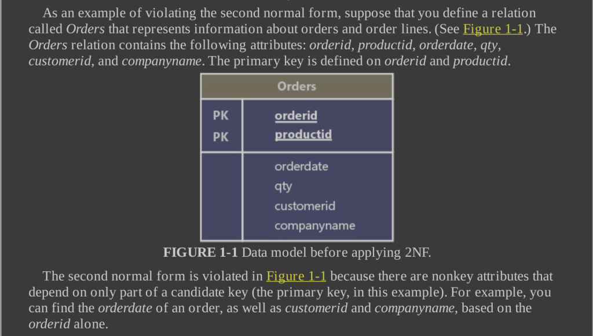
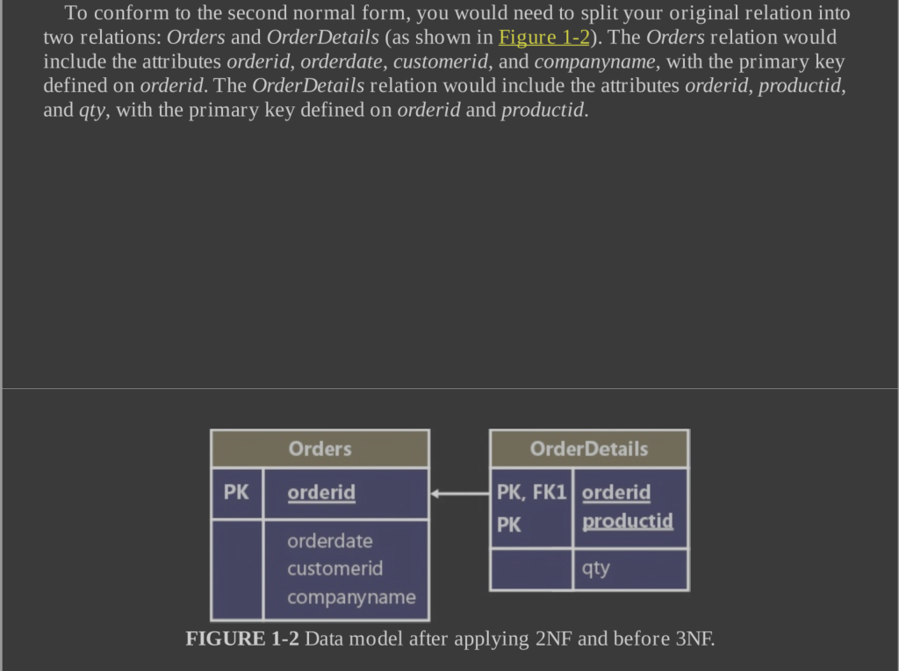
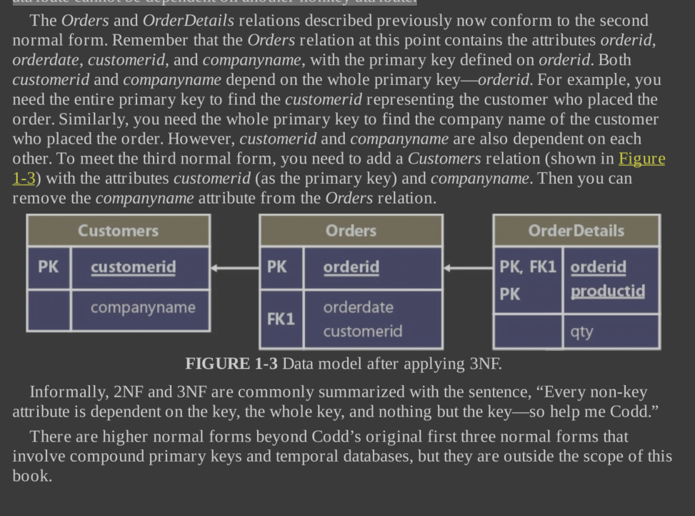

# T-SQL

- The common belief that the term relational stems from relationships between tables is
  incorrect. “Relational” actually pertains to the mathematical term relation. In set theory, a
  relation is a representation of a set. In the relational model, a relation is a set of related
  information, with the counterpart in SQL being a table—albeit not an exact counterpart. A key
  point in the relational model is that a single relation should represent a single set (for
  example, Customers). Note that operations on relations (based on relational algebra) result in
  a relation (for example, a join between two relations).

- a relation is made of a heading and a body. The heading consists of a
  set of attributes (called columns in SQL), where each element is identified by an
  attribute name and a type name. The body consists of a set of tuples (called rows in
  SQL), where each element is identified by a key.

- SQL implements three-valued predicate logic by supporting the NULL marker to signify the generic concept of a missing value.

### Candidate Keys vs Foreign Keys

- Candidate Keys and Foreign keys are examples of **Constraints**.

- A candidate key is a key defined on one or more attributes that prevents more than one occurrence of the same tuple (row in SQL) in a relation.

  - A predicate based on a candidate key can uniquely identify a row (such as an
    employee).
  - You can define multiple candidate keys in a relation. For example, in an
    Employees relation, you can define candidate keys on employeeid, on SSN (Social Security
    number), and others.
  - Typically, you arbitrarily choose one of the candidate keys as the
    **_primary key_** (for example, employeeid in the Employees relation) and use that as the preferred
    way to identify a row. All other candidate keys are known as **_alternate keys_**.

- Foreign keys are used to enforce referential integrity. A foreign key is defined on one or
  more attributes of a relation (known as the referencing relation) and references a candidate
  key in another (or possibly the same) relation.
  - This constraint restricts the values in the
    referencing relation’s foreign-key attributes to the values that appear in the referenced
    relation’s candidate-key attributes.

### Normalization

- The relational model also defines normalization rules (also known as normal forms).

- Normalization is a formal mathematical process to guarantee that each entity will be
  represented by a single relation.

- In a normalized database, you avoid anomalies during data
  modification and keep redundancy to a minimum without sacrificing completeness.

The following are the first three normal forms (1NF, 2NF, and 3NF) introduced by Codd.

#### 1NF

The first normal form says that the tuples (rows) in the relation (table) must be unique and
attributes should be atomic. This is a redundant definition of a relation; in other words, if a
table truly represents a relation, it is already in first normal form.

You achieve unique rows in SQL by defining a unique key for the table.

Atomicity of attributes is subjective in the same way that the definition of a set is
subjective. As an example, should an employee name in an Employees relation be expressed
with one attribute (fullname), two (firstname and lastname), or three (firstname, middlename,
and lastname)? The answer depends on the application. If the application needs to manipulate
the parts of the employee’s name separately (such as for search purposes), it makes sense to
break them apart; otherwise, it doesn’t.

#### 2NF

The second normal form involves two rules.

- One rule is that the data must meet the first normal form.
- The other rule addresses the relationship between nonkey and candidate-key attributes.

For every candidate key, every nonkey attribute has to be fully functionally
dependent on the entire candidate key.

In other words, a nonkey attribute cannot be fully functionally dependent on part of a candidate key.

To put it more informally, if you need to obtain any nonkey attribute value, you need to provide the values of all attributes of a candidate key from the same tuple. You can find any value of any attribute of any tuple if you
know all the attribute values of a candidate key.





#### 3NF

The third normal form also has two rules.

- The data must meet the second normal form.
- Also, all nonkey attributes must be dependent on candidate keys nontransitively.

Informally, this rule means that all nonkey attributes must be mutually independent. In other words, one nonkey
attribute cannot be dependent on another nonkey attribute.



### CHECK Constraint

You can use a check constraint to define a predicate that a row must meet to be entered into the
table or to be modified.

```sql
ALTER TABLE dbo.Employees
ADD CONSTRAINT CHK_Employees_salary
CHECK(salary > 0.00);
```

After the above, salary -5000 will be rejected, while salary 50,000 and NULL will both be excepted (if the column allows NULLs that is).

### DEFAULT Constraint

A default constraint is associated with a particular attribute. It’s an expression that is used as
the default value when an explicit value is not specified for the attribute when you insert a row.

```sql
ALTER TABLE dbo.Orders
ADD CONSTRAINT DFT_Orders_orderts
DEFAULT(SYSDATETIME()) FOR orderts;
```

---

### Logical Query Processing

which simply means how the sql query is actually performed by the DB engine (as opposed to how it is actually written)

Sample Query

```sql
USE TSQLV4;

SELECT empid, YEAR(orderdate) AS orderyear, COUNT(*) AS numorders
FROM Sales.Orders
WHERE custid = 71
GROUP BY empid, YEAR(orderdate)
HAVING COUNT(*) > 1
ORDER BY empid, orderyear;
```

- The code starts with a USE statement that ensures that the database context of your session
  is the TSQLV4 sample database. If your session is already in the context of the database you
  need to query, the USE statement is not required.

- The clauses are logically processed in the following order
  1. FROM
  2. WHERE
  3. GROUP BY
  4. HAVING
  5. SELECT
  6. ORDER BY

#### FROM Clause

The FROM clause is the very first query clause that is logically processed. In this clause, you
specify the names of the tables you want to query and table operators that operate on those
tables.

#### WHERE Clause

In the WHERE clause, you specify a predicate or logical expression to filter the rows returned
by the FROM phase.

Only rows for which the logical expression evaluates to TRUE are returned by the WHERE phase to the subsequent logical query processing phase.

The WHERE phase returns rows for which the logical expression evaluates to TRUE, and it doesn’t return rows for which the logical expression evaluates to FALSE or UNKNOWN.

#### GROUP BY Clause

```sql
FROM Sales.Orders
WHERE custid = 71
GROUP BY empid, YEAR(orderdate)
```

This means that the GROUP BY phase produces a group for each **unique combination** of employee-ID and order-year values that appears in the data returned by the WHERE phase.

If the query involves grouping, all phases subsequent to the GROUP BY phase—including HAVING, SELECT, and ORDER BY—must operate on groups as opposed to operating on individual rows.

Each group is ultimately represented by a single row in the final result of the query. This implies that all expressions you specify in clauses that are processed in phases subsequent to the GROUP BY phase are required to guarantee returning a scalar (single value) per group.

Expressions based on elements that participate in the GROUP BY clause meet the requirement because, by definition, each group has only one unique occurrence of each GROUP BY element.

For example, in the group for employee ID 8 and order year 2015, there’s only one unique employee-ID value and only one unique order-year value. Therefore, you’re allowed to refer to the expressions empid and YEAR(orderdate) in clauses that are processed in phases subsequent to the GROUP BY phase, such as the SELECT clause.

Elements that do not participate in the GROUP BY clause are allowed only as inputs to an aggregate function such as COUNT, SUM, AVG, MIN, or MAX.

**Note**: that all aggregate functions ignore NULLs, with one exception—COUNT(\*). For example, consider a group of five rows with the values 30, 10, NULL, 10, 10 in a column called qty. The expression COUNT(\*) returns 5 because there are five rows in the group, whereas COUNT(qty) returns 4 because there are four known values. If you want to handle
only distinct occurrences of known values, specify the DISTINCT keyword before the input
expression to the aggregate function.

#### HAVING clause

Whereas the WHERE clause is a row filter, the HAVING clause is a group filter. Only groups
for which the HAVING predicate evaluates to TRUE are returned by the HAVING phase to the
next logical query processing phase. Groups for which the predicate evaluates to FALSE or
UNKNOWN are discarded.

#### SELECT clause

The SELECT clause is where you specify the attributes (columns) you want to return in the
result table of the query. You can base the expressions in the SELECT list on attributes from
the queried tables, with or without further manipulation.

Remember that the SELECT clause is processed after the FROM, WHERE, GROUP BY, and
HAVING clauses. This means that aliases assigned to expressions in the SELECT clause do not
exist as far as clauses that are processed before the SELECT clause are concerned.

It’s a typical mistake to try and refer to expression aliases in clauses that are processed before the
SELECT clause.

Curiously, you are not allowed to refer to column aliases created in the SELECT clause in
other expressions within the same SELECT clause. That’s the case even if the expression that
tries to use the alias appears to the right of the expression that created it. For example, below is invalid

```sql
SELECT orderid,
YEAR(orderdate) AS orderyear,
orderyear + 1 AS nextyear
FROM Sales.Orders;
```

#### ORDER BY clause

You use the ORDER BY clause to sort the rows in the output for presentation purposes. In
terms of logical query processing, ORDER BY is the very last clause to be processed.

**NOTE:**

One of the most important points to understand about SQL is that a table — be it an existing
table in the database or a table result returned by a query—has no guaranteed order. That’s
because a table is supposed to represent a set of rows (or multiset, if it has duplicates), and a
set has no order. This means that when you query a table without specifying an ORDER BY
clause, SQL Server is free to return the rows in the output in any order. The only way for you
to guarantee the presentation order in the result is with an ORDER BY clause. However, you
should realize that if you do specify an ORDER BY clause, the result can’t qualify as a table
because it is ordered. Standard SQL calls such a result a **cursor**.

The ORDER BY phase is the only phase in which you can refer to column aliases created in the SELECT phase, because it is the only phase processed after the SELECT phase.

Note that if you define a column alias that is the same as an underlying column name, as in 1 - col1 AS col1, and refer to that alias in the ORDER BY clause, the new column is the one considered for ordering.

With T-SQL, you also can specify elements in the ORDER BY clause that do not appear in
the SELECT clause, meaning you can sort by something you don’t necessarily want to return.
The big drawback for this is that you can’t check your sorted results by looking at the query
output.
