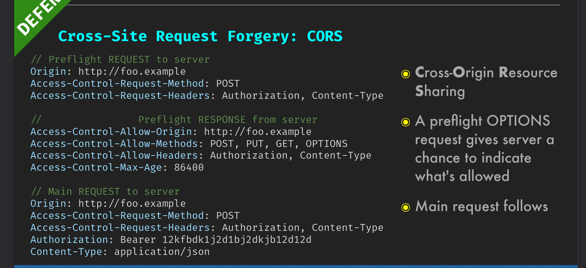

# Cross Site Request Forgery

Takes advantage of the fact that cookies (or Basic Authentication creds) are passed along with requests.

One of the several good reasons to align with REST conventions.
    - i.e. non-mutating GET requests

- Only Basic or cookie Auth schemes are vulnerable
    - Exception: "Client side cookie"
        - For example: If something is required to be read from the cookie and put into a request header, then that scheme is not susceptible to CSRF attacks
        - Because, in order to read that cookie, we need to be running code in the domain that can access that cookie.
        - So, as soon as authentication depends on some code that can only be run on the same domain, CSRF is averted.
    - KEY CONCEPT - using cookies does not require the ability to read cookies
- localStorage / SessionStorage - alternatives that don't have this problem (but they are susceptible to XSS)

## CSRF Tokens 

- Changed with each request in an unpredictable way
- KEY CONCEPT: 
    - It's a value that is **not** in a cookie, which something with access to the frame can use/see (i.e. your JS app)
    - Kind of like 2-factor 
        - something proving that you're authenticated (cookie)
        - something proving that you're sending a request from an appropriate place (CSRF Token)
- For server rendered apps, meta tags are fine

## Validate Request Origin

- Modern browsers send an `Origin` header, which cannot be altered by client-side code, with each request (IE-11 does not in some cases)
- In cases where there is no `Origin` header, there's almost always a `Referer` header (YES IT IS MISPELLED)
- When behind a proxy, you can get some information from `Host` and `X-Forwarded-Host` headers.

## CORS - Cross Origin Resource Sharing

This is what permits browser to send one origin to another.

