# HTTPS Downgrade

Most of the world is moving to HTTPs, but what happens if a user clicks on a plain http link?

initial Request sent is over HTTP.

Server responds with a 301 redirect to HTTPS

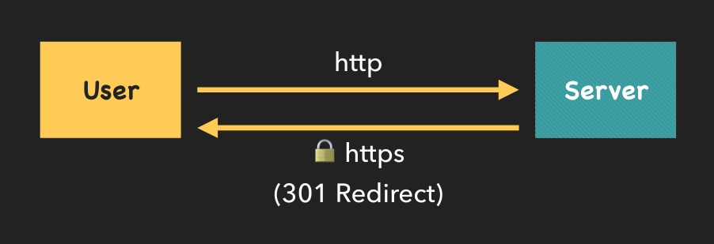

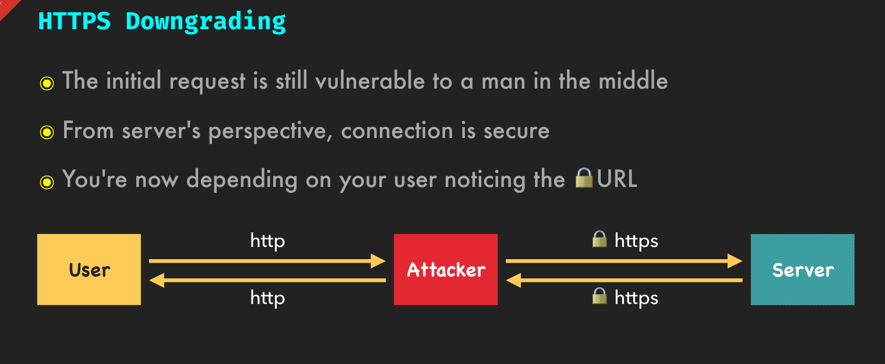

### Defense 
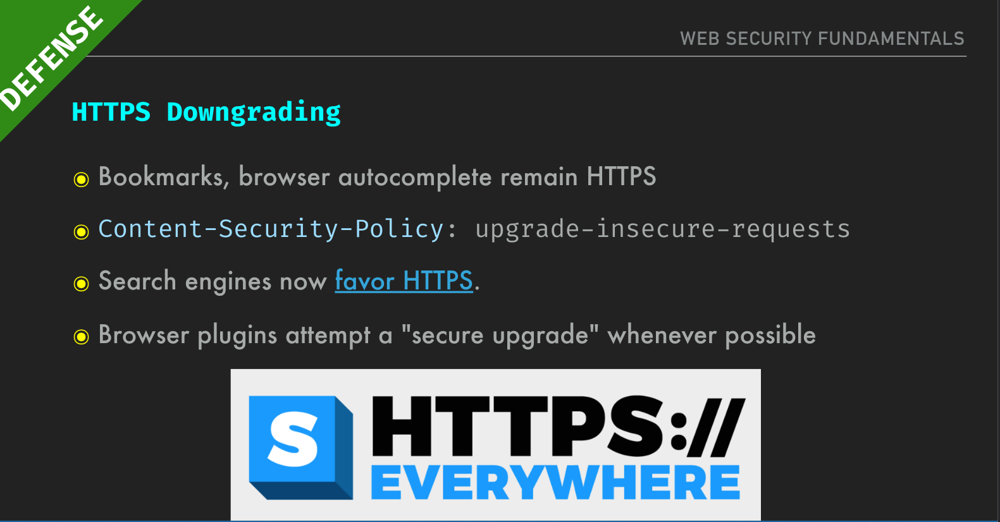

### HTTPS Downgrading with a Bad Cert

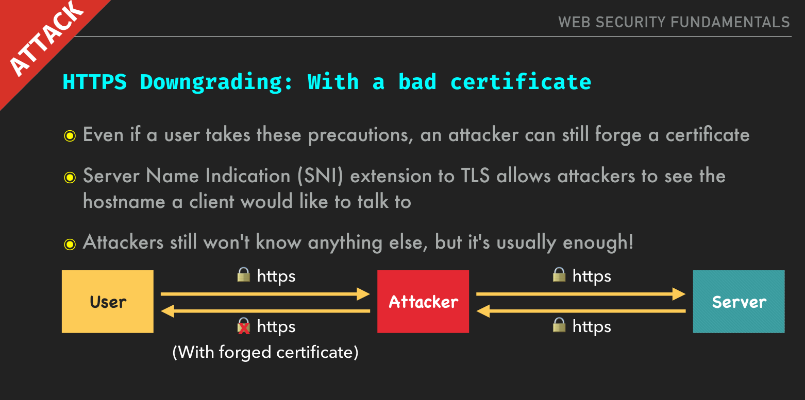

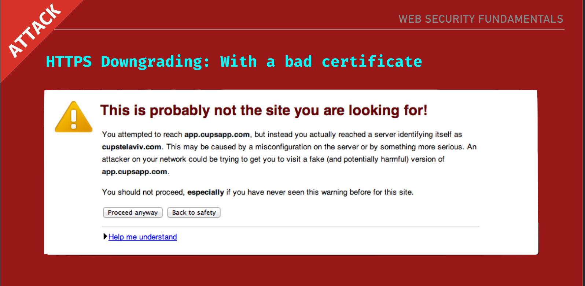

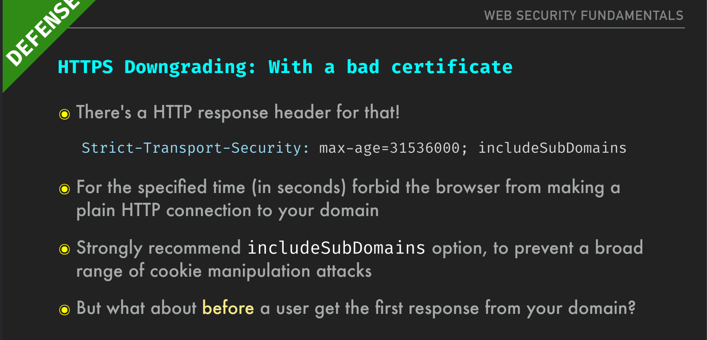

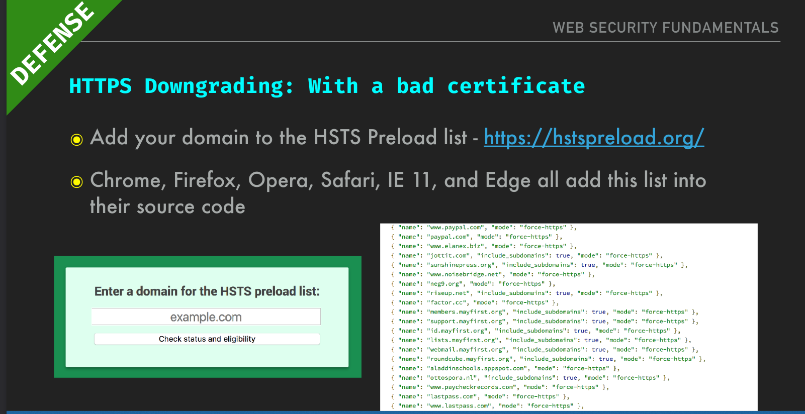

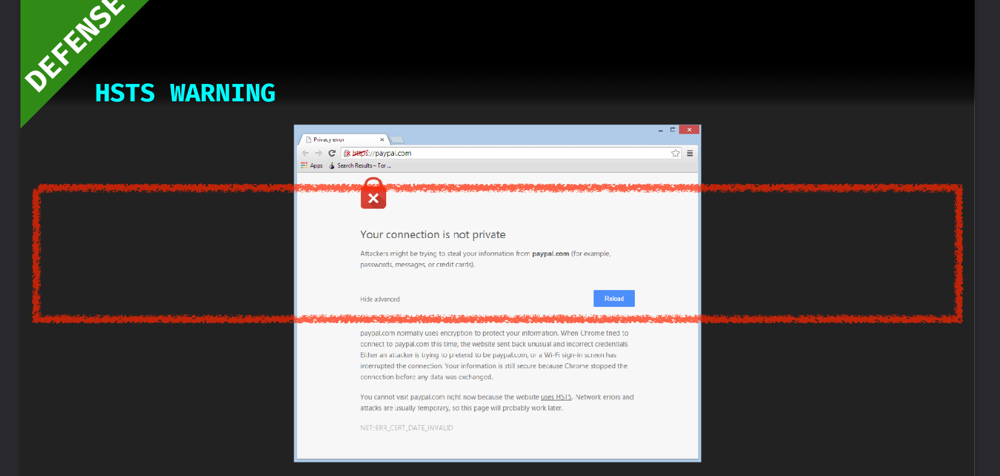

### Certificate Authority Compromise

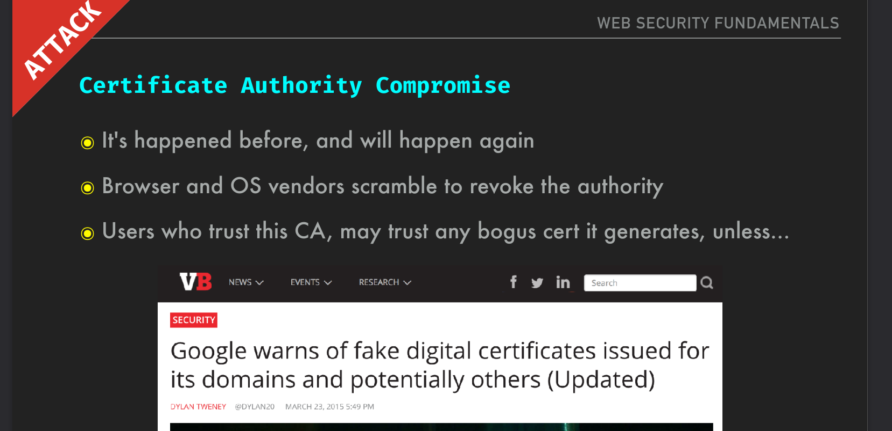

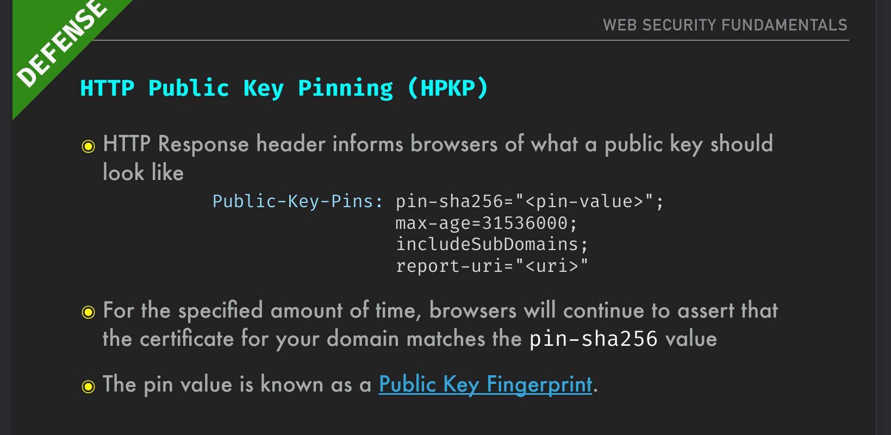

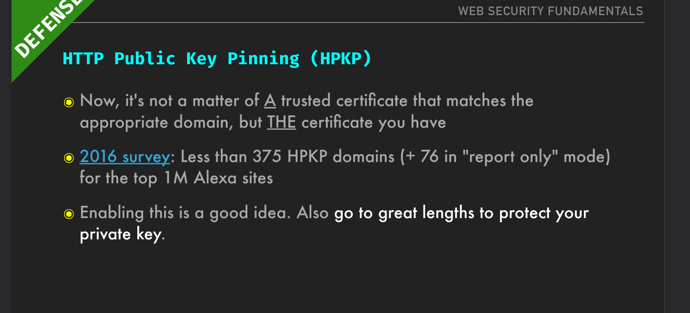

