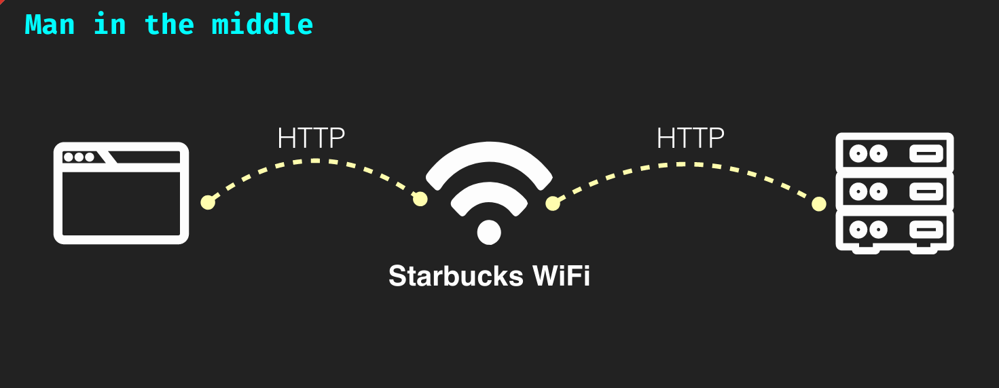
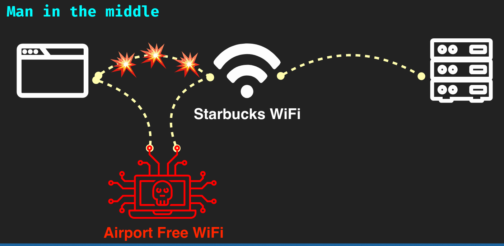
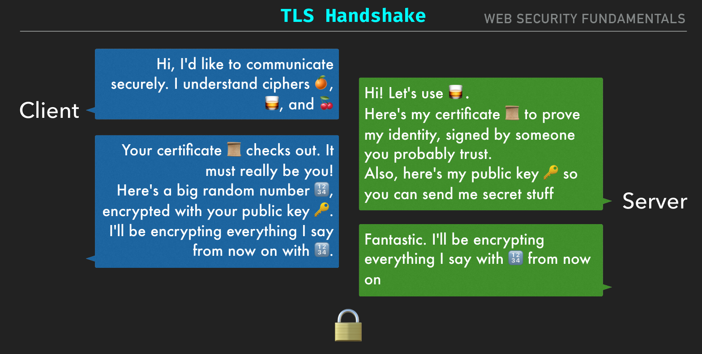

# Man In the Middle Attacks

Normal Connection: 

Man in the middle: 

These attacks happen often because: 
- Public Wifi are trusted by our devices, foreever.
    - Devices constantly try to search for networks they have previously connected and remembered.
- Trusting public Routers as DNS 
    - DNS is what translates hostnames to IP addresses.

What can an attacker do: 
- Eavesdrop on and tamper with communication between you and one or more servers.
- XSS at will
- Capture your creds and mess up your stuff later.
    - Try your creds on other sites.

### Defense

- Encrypt data in flight
    - TLS
    - A secret key needed to alter or read request/response
    - Certificates identify domains and require "Domain Validation"
    - "Enhanced Validation" often requires Govt Id, but that's just issuer policy
- HTTPS
    - 1990 - HTTP
    - 1993 - Secure Mosaic implements Secure HTTP (S-HTTP)
    - 1994 - Netscape invents and implements SSL, and HTTPS on top of it.
    - 1999 - IETF adopts SSL 3.1  known as Transport Layer Security 1.0 
    - 2008 - TLS 1.2 (SSL 3.3)
    
### HTTPS Cryptography

- Two types of encryption involved: Symmetric encryption and Public Key encryption  
- Symmetric encryption is WAY faster, has no practical limit on size of content. If you've ever locked a file with a password, you've probably used this. 
- If an encryption key were generated on a per-connection basis, we'd almost have what we need, except...
- One catch: how do we safely share the key?

- We begin with public key encryption, just for the key exchange.  
- This is slow, but necessary in that a system can receive encrypted messages without divulging how to SEND them.
- Server sends its public key 🔑 and certificate 📜 to the client  
- Client and server then compare "cipher suites" 🍊🥃🍒  
- Finally a session key 🔢 is generated by the client, encrypted with the server's public key 🔑 so only the server can read it.
- The session key 🔢 is what's used for encrypted data exchange.

- Public key for WRITING messages  
- Private key for READING messages  
- RSA algorithm: product of two huge prime numbers  
- Because exponential math is involved,  practical limit on size of message  
- Private keys can be used to SIGN messages

#### TLS Handshake

#### Open SSL 

- Industry standard library for crypto  
- DON'T implement your own algorithm, handshake, protocol, etc...  
- OpenSSL is not user friendly  
- You won't need it all that often