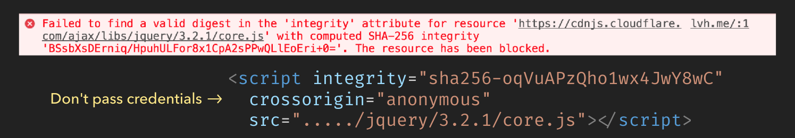

# Vulnerabilities in using Third party assets

3rd party asserts may include: 
1. libraries imported using `script` tags from CDNs
2. libraries like `expess: "^4.15.2"`
3. scripts that are embedded in our apps (like Google Analytics script)

1. Version changes in dependencies

- The people who write your dependencies make mistakes. 
- RECOMMENDATIONS: 
    - Reproducible builds, with a lockfile
    - use LTS versions where you care less about bleeding edge featues.
    - support BUG Bounties in important open source projects
    - Tests that assert only expected requests are sent out.

2. CDN Aassets 
    - If you must use a CDN, be aware that you're trusting the owners a lot.
    - Use Subresource Integrity attributes on `script` and `link` tags
    
    
