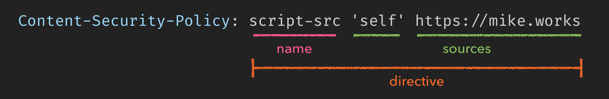
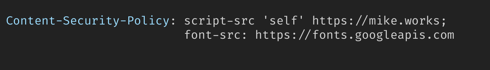
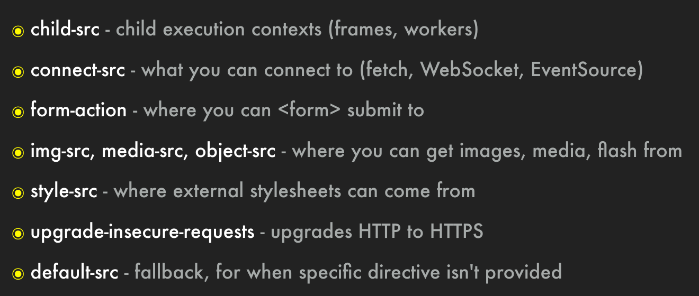
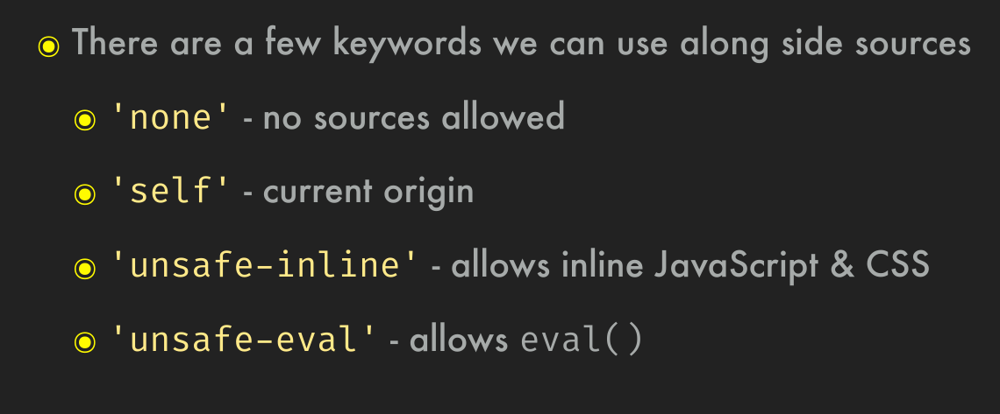

# Cross-Site Scripting 

An Injection Attack

Cross-site scripting (XSS) is a security exploit which allows an attacker to inject into a website malicious client-side code. This code is executed by the victims and lets the attackers bypass access controls and impersonate users. According to the Open Web Application Security Project, XSS was the [seventh most common Web app vulnerability](https://owasp.org/www-project-top-ten/OWASP_Top_Ten_2017/Top_10-2017_A7-Cross-Site_Scripting_%28XSS%29) in 2017.

These attacks succeed if the Web app does not employ enough validation or encoding. The user's browser cannot detect the malicious script is untrustworthy, and so gives it access to any cookies, session tokens, or other sensitive site-specific information, or lets the malicious script rewrite the [HTML](https://developer.mozilla.org/en-US/docs/Glossary/HTML) content.

Example: 

```html
<h1>Welcome, <%- name %></h1>
    
all great when name = Ali    
    
But, when converted to 

    name = "Ali<script>terrible()</script>"
    
    <h1>Welcome, %< Mike<script>terrible()</script> %></h1> 
```

## Types of XSS 

1. Stored XSS 
    - Code that executes attacker's script is persisted
    - The injected script is stored permanently on the target servers. 
    - The victim then retrieves this malicious script from the server when the browser sends a request for data. 
    - e.g. something stored in the database, e.g. that `name` field above.
2. Reflected XSS 
    - Transient from server causes script to execute 
    - When a user is tricked into clicking a malicious link, submitting a specially crafted form, or browsing to a malicious site, the injected code travels to the vulnerable website. The Web server reflects the injected script back to the user's browser, such as in an error message, search result, or any other response that includes data sent to the server as part of the request. The browser executes the code because it assumes the response is from a "trusted" server which the user has already interacted with.
    - (i.e., a validation error)
3. DOM based XSS 
    - No Server involvement is required 
    - The payload is executed as a result of modifying the DOM environment (in the victim’s browser) used by the original client-side script. That is, the page itself does not change, but the client side code contained in the page runs in an unexpected manner because of the malicious modifications to the DOM environment.
    - i.e. pass dangerous code in via query params
4. Blind XSS - Exploits vulnerability in another app (i.e. log-reader, or any internal app) that attacker can't see or access under normal means. 
    - Since internal apps have far less scrutiny
    - Example: Tricking our logging app to write some log entry that contains dangerous code. 

## Locations for XSS attacks 

Cross-Site Scripting: XSS - Danger Zones  
- User-generated rich text (i.e., WYSIWYG)  
- Embedded content  
    - an iframe
    - flash embeds
- Anywhere users have control over a URL  
    - in older browsers URLS could begin with `javascript:` which was an attack vector
- Anywhere user input is reflected back (i.e., "couldn't find __")  
- Query Parameters rendered into DOM  
- `element.innerHTML` = ???


## XSS Defenses 


NEVER TRUST USER DATA

Never put untrusted data in these places
- Directly in a script
    - <script> <%= userData %> </script>
- In an HTML comment 
    - <!-- <%= userData %> -->
    - A dangerous script could begin like `--> <script>` to first uncomment the commeng block and execute the script
- In an attribute name 
    - <iframe <%= userData %>="myvalue" />
- in a tag name 
    - <<%= userData %> class="myElement">
- Directly in a `style` block
    - <style> <%= userData %> </style>
    - e.g. `background-image: url(<script>danger()</script>);`

### Sanitizing User Data 

Escape data before you put it in HTML 

<script>alert('hi')!</script>  
"%3Cscript%3Ealert('hi')%3C%2Fscript%3E"

Every view library you've heard of does this automatically.

If you use UnEscape test, sanitize it first.
 - Ember, Vue -> `{{{ "unescaped" }}}`
 - React -> return `div dangerouslySetInnerHTML={createMarkUp()} />`
 - Ejs -> `<%- "Unescaped" %>`
 
 
### Content Security Policy (CSP)

- Browsers can't tell the difference between scripts downloaded from your origin vs another. It is a single execution context.  
- CSP allows us to tell modern browsers which sources they should trust, and for what types of resources  
- This information comes via a HTTP response header or meta tag



CSP as meta tag: 

    <meta http-equiv="Content-Security-Policy"
          content="default-src 'self'; img-src https://*; child-src 'none';">

- CSP header tells browser to only run code from the allowed domains
    - e.g. github.com and googleAnalytics.com, and nothing else.

- Multiple directives are separated by semicolon  
- Re-defining a directive with the same name has no effect  
- By default, directives are permissive



Selection of useful CSP directives: (Some should be added to meta tag in HTML to work)





### XSS Attack - Malicious Attachment 

XSS may also be carried out by malicious attachments.

Suppose we allow users to upload images, and give them the ability to rename those uploaded files.

The problem then is that users can rename that image file to `xyz.html`, and hide malicious HTML/JS inside image metadata. 

The browser would then try to execute that code.

#### Defense

- The more restrictive you are on file upload types and ability to access those types, the less of a XSS vector your app becomes  
- IMAGES: Generally, things that compress files drop non-visible data  
- Before allowing other attachment types, research capabilities thoroughly