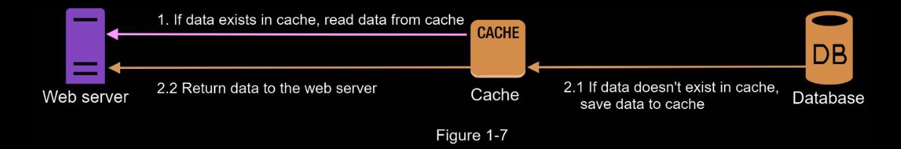

# Cache 

A cache is a temporary storage area that stores the result of expensive responses or frequently
accessed data in memory so that subsequent requests are served more quickly

### Cache tier
The cache tier is a temporary data store layer, much faster than the database. The benefits of
having a separate cache tier include better system performance, ability to reduce database
workloads, and the ability to scale the cache tier independently.

## Cache Strategy

### Read through

After receiving a request, a web server first checks if the cache has the available response. If
it has, it sends data back to the client. If not, it queries the database, stores the response in
cache, and sends it back to the client. This caching strategy is called a read-through cache.

--- 

### Expiration policy

It is a good practice to implement an expiration policy. Once cached
data is expired, it is removed from the cache. When there is no expiration policy, cached
data will be stored in the memory permanently. It is advisable not to make the expiration
date too short as this will cause the system to reload data from the database too frequently.
Meanwhile, it is advisable not to make the expiration date too long as the data can become
stale.

### Consistency

This involves keeping the data store and the cache in sync. Inconsistency
can happen because data-modifying operations on the data store and cache are not in a
single transaction. When scaling across multiple regions, maintaining consistency betweenthe data store and cache is challenging

## Eviction Policy

Once the cache is full, any requests to add items to the cache might
cause existing items to be removed. This is called cache eviction. 

Least-recently-used (LRU) is the most popular cache eviction policy. 

Other eviction policies, such as the Least Frequently Used (LFU) or First in First Out (FIFO), can be adopted to satisfy different use cases.
