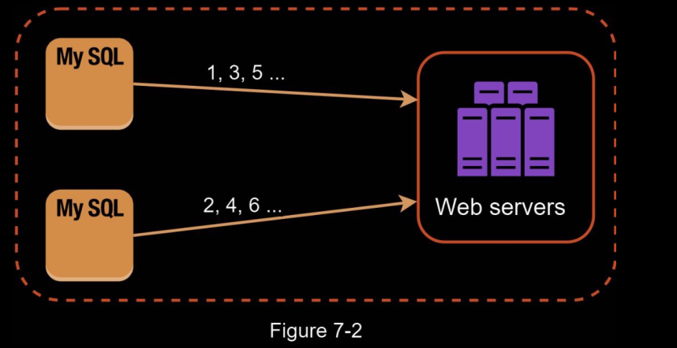
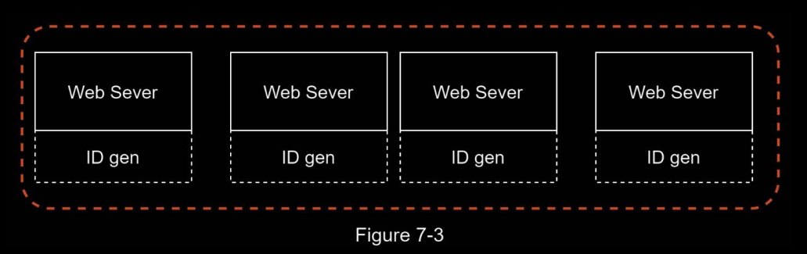
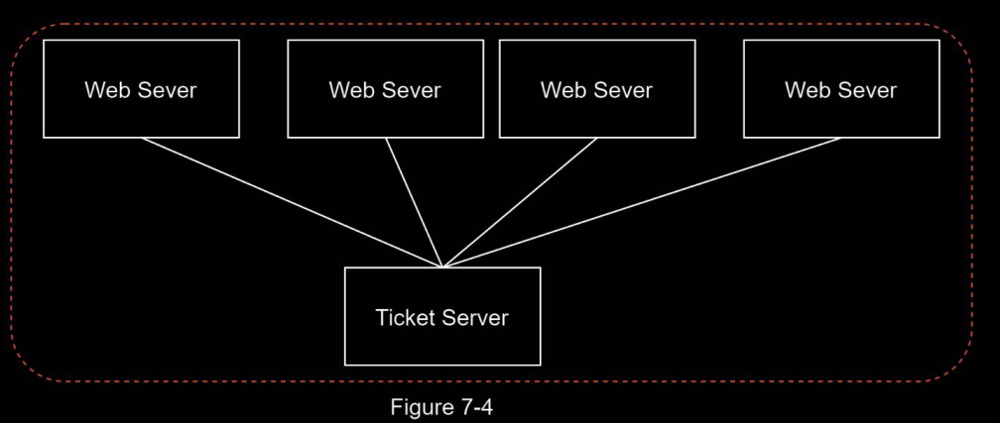
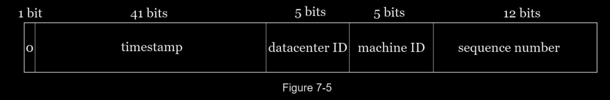
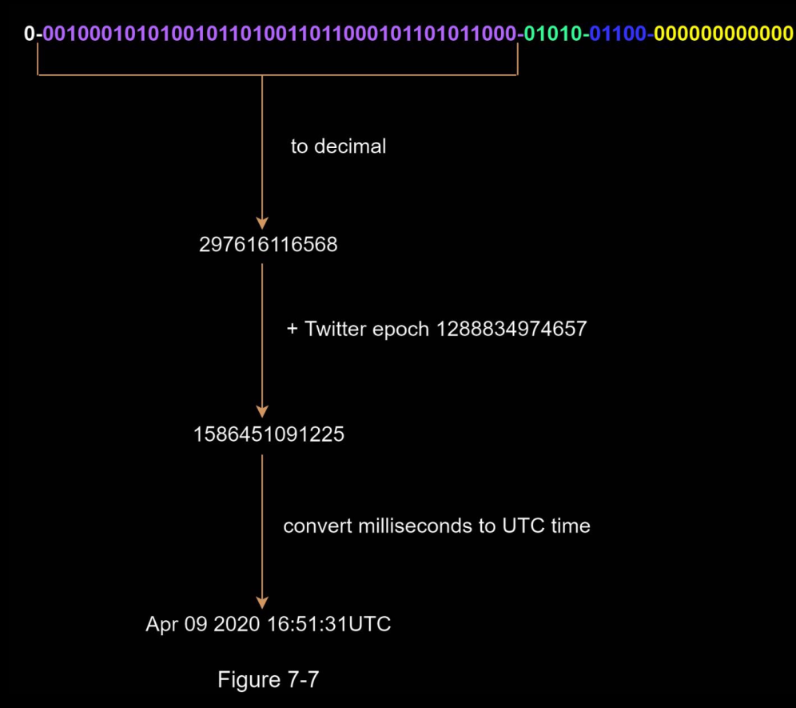

# Design Unique ID Generator

You are asked to design a unique ID generator in distributed systems. 

Your first thought might be to use a primary key with the `auto_increment` attribute in a traditional database.

However, auto_increment does not work in a distributed environment because a single database server is not large enough and generating unique IDs across multiple databases with minimal delay is challenging.

### Requirements 

• IDs must be unique.
• IDs are numerical values only.
• IDs fit into 64-bit.
• IDs are ordered by date.
• Ability to generate over 10,000 unique IDs per second.

## High level design

Multiple options can be used to generate unique IDs in distributed systems. The options we
considered are:
• Multi-master replication
• Universally unique identifier (UUID)
• Ticket server
• Twitter snowflake approach

### Multi-master replication

This approach uses the databases’ `auto_increment` feature. 

Instead of increasing the next ID by 1, we increase it by `k`, where `k` is the number of database servers in use. 

As illustrated in Figure 7-2, next ID to be generated is equal to the previous ID in the same server plus 2. 

This solves some scalability issues because IDs can scale with the number of database servers.

However, this strategy has some major drawbacks:
• Hard to scale with multiple data centers
• IDs do not go up with time across multiple servers. (Our requirement)
• It does not scale well when a server is added or removed.

### UUID 

UUID - Universally Unique Identifier

A UUID is another easy way to obtain unique IDs. 

UUID is a 128-bit number used to identify information in computer systems. 

UUID has a very low probability of getting collusion.

Quoted from Wikipedia, “after generating 1 billion UUIDs every second for approximately
100 years would the probability of creating a single duplicate reach 50%”

Here is an example of UUID: `09c93e62-50b4-468d-bf8a-c07e1040bfb2`

In this design, each web server contains an ID generator, and a web server is responsible for generating IDs independently.

#### Pros & Cons

Pros:
• Generating UUID is simple. No coordination between servers is needed so there will not be any synchronization issues.
• The system is easy to scale because each web server is responsible for generating IDs they consume. ID generator can easily scale with web servers.

Cons:
• IDs are 128 bits long, but our requirement is 64 bits.
• IDs do not go up with time.
• IDs could be non-numeric.

### Ticket Server

Ticket servers are another interesting way to generate unique IDs. 

The idea is to use a centralized auto_increment feature in a single database server (Ticket
Server). 

To learn more about this: https://code.flickr.net/2010/02/08/ticket-servers-distributed-unique-primary-keys-on-the-cheap/

#### Pros & Cons 

Pros:
• Numeric IDs.
• It is easy to implement, and it works for small to medium-scale applications.

Cons:
• Single point of failure. Single ticket server means if the ticket server goes down, all 
systems that depend on it will face issues. To avoid a single point of failure, we can set up
multiple ticket servers. However, this will introduce new challenges such as data
synchronization.

### Twitter Snowflake approach

Instead of generating an ID directly, we divide an ID into different sections. 

Figure 7-5 shows the layout of a 64-bit ID.

Explanation of each section: 

- Sign bit: 1 bit. It will always be 0. 
    - This is reserved for future uses. 
    - It can potentially be used to distinguish between signed and unsigned numbers.
- Timestamp: 41 bits. Milliseconds since the epoch or custom epoch. 
    - We use Twitter snowflake default epoch 1288834974657, equivalent to Nov 04, 2010, 01:42:54 UTC.
- Datacenter ID: 5 bits, which gives us 2 ^ 5 = 32 datacenters.
- Machine ID: 5 bits, which gives us 2 ^ 5 = 32 machines per datacenter.
- Sequence number: 12 bits. 
    - For every ID generated on that machine/process, the sequence number is incremented by 1. 
    - The number is reset to 0 every millisecond.

- Datacenter IDs and machine IDs are chosen at the startup time, generally fixed once the system is up running. 
    - Any changes in datacenter IDs and machine IDs require careful review since an accidental change in those values can lead to ID conflicts. 
- Timestamp and sequence numbers are generated when the ID generator is running.

##### Timestamp

- The most important 41 bits make up the timestamp section. 
- As timestamps grow with time, IDs are sortable by time. 
- Figure 7-7 shows an example of how binary representation is converted to UTC. 
- You can also convert UTC back to binary representation using a similar method

The maximum timestamp that can be represented in 41 bits is
- 2 ^ 41 - 1 = 2199023255551 milliseconds (ms), 
- which gives us: ~ 69 years = 2199023255551 ms / 1000 seconds / 365 days / 24 hours/ 3600 seconds. 

This means the ID generator will work for 69 years and having a custom epoch time close to today’s date delays the overflow time. 

After 69 years, we will need a new epoch time or adopt other techniques to migrate IDs.

##### Sequence number

- Sequence number is 12 bits, which give us 2 ^ 12 = 4096 combinations. 
- This field is 0 unless more than one ID is generated in a millisecond on the same server. 
- In theory, a machine can support a maximum of 4096 new IDs per millisecond.

--- 

## Summary 

Some Challenges: 

- Clock synchronization. In our design, we assume ID generation servers have the same clock. 
    - This assumption might not be true when a server is running on multiple cores. 
    - The same challenge exists in multi-machine scenarios. 
    - It is important to understand the problem exists. 
    - Network Time Protocol is the most popular solution to this problem. 
    - More: https://en.wikipedia.org/wiki/Network_Time_Protocol
- Section length tuning. For example, fewer sequence numbers but more timestamp bits are effective for low concurrency and long-term applications.
- High availability. Since an ID generator is a mission-critical system, it must be highly available.