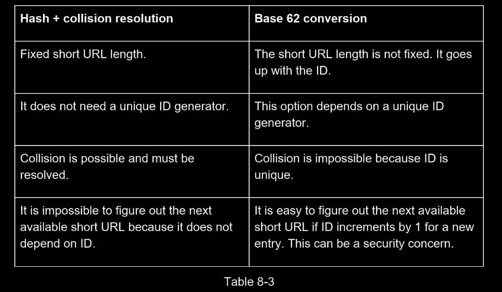
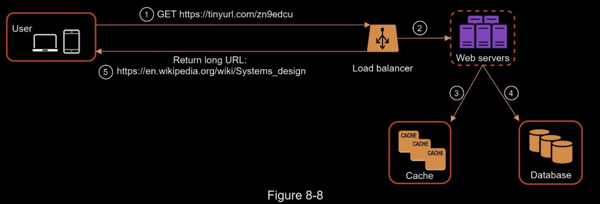

# Design a URL shortener

### Requirements

- Assume URL https://www.systeminterview.com/q=chatsystem&c=loggedin&v=v3&l=long is the original URL. 
    - Your service creates an alias with shorter length: https://tinyurl.com/ y7keocwj. 
    - If you click the alias, it redirects you to the original URL.
- URL must be as short as  possible.
- 100 million URLs are generated per day.
- Shortened URL can be a combination of numbers (0-9) and characters (a-z, A-Z).
- short urls cannot be deleted or updated.
- High availablility, scalability, and fault tolerance

### Back of the envelop estimation

• Write operation: 100 million URLs are generated per day.
• Write operation per second: 100 million / 24 /3600 = 1160
• Read operation: Assuming ratio of read operation to write operation is 10:1, read operation per second: 1160 * 10 = 11,600
• Assuming the URL shortener service will run for 10 years, this means we must support 100 million * 365 * 10 = 365 billion records.
• Assume average URL length is 100.
• Storage requirement over 10 years: 365 billion * 100 bytes * 10 years = 365 TB

##  High level design

### API 

1. URL shortening. To create a new short URL, a client sends a POST request, 
    - which contains one parameter: 
    - the original long URL. 
        - The API looks like this: `POST api/v1/data/shorten`
    - request parameter: {longUrl: longURLString}
    - return shortURL
2. URL redirecting. To redirect a short URL to the corresponding long URL, a client sends a GET request. 
    - The API looks like this: `GET api/v1/shortUrl`
• Return longURL for HTTP redirection

### URL Redirecting 

One thing worth discussing here is 301 redirect vs 302 redirect.

- **301 redirect**:  
    - A 301 redirect shows that the requested URL is “permanently” moved to the long URL. 
    - Since it is permanently redirected, the browser caches the response, and subsequent requests for the same URL will not be sent to the URL shortening service.
    - Instead, requests are redirected to the long URL server directly.
- **302 redirect**:  
    - A 302 redirect means that the URL is “temporarily” moved to the long URL, meaning that subsequent requests for the same URL will be sent to the URL shortening service first. 
    - Then, they are redirected to the long URL server.

Each redirection method has its pros and cons. 

If the priority is to reduce the server load, using 301 redirect makes sense as only the first request of the same URL is sent to URL shortening servers. 

However, if analytics is important, 302 redirect is a better choice as it can track click rate and source of the click more easily.

### URL Shortening

Let us assume the short URL looks like this: www.tinyurl.com/{hashValue}. 

To support the URL shortening use case, we must find a hash function fx that maps a long URL to the
hashValue, as shown in Figure 8-3.

The hash function must satisfy the following requirements:
• Each longURL must be hashed to one hashValue.
• Each hashValue can be mapped back to the longURL.

## Design deep dive

### Data model

In the high-level design, everything is stored in a hash table. 

This is a good starting point; however, this approach is not feasible for real-world systems as memory resources are limited and expensive. 

A better option is to store <shortURL, longURL> mapping in a relational database. 

Figure 8-4 shows a simple database table design. The simplified version of the table contains 3 columns: `id`, `shortURL`, `longURL`.

### Hash function & Hash Value Length

Hash function is used to hash a long URL to a short URL, also known as hashValue.

The hashValue consists of characters from [0-9, a-z, A-Z], containing 10 + 26 + 26 = 62 possible characters. 

To figure out the length of hashValue, find the smallest n such that 62^n ≥ 365 billion. 

The system must support up to 365 billion URLs based on the back of the envelope estimation. 

Table 8-1 shows the length of hashValue and the corresponding maximal number of URLs it can support.

When n = 7, 62 ^ n = ~3.5 trillion, 3.5 trillion is more than enough to hold 365 billion URLs, so the length of hashValue is 7.

We will explore two types of hash functions for a URL shortener. 
1. The first one is “hash +collision resolution”, 
2. and the second one is “base 62 conversion.” 

### Hash + Collision resolution

To shorten a long URL, we should implement a hash function that hashes a long URL to a 7- character string. 

A straightforward solution is to use well-known hash functions like CRC32, MD5, or SHA-1. 

The following table compares the hash results after applying different hash functions on this URL: https://en.wikipedia.org/wiki/Systems_design.

As shown in Table 8-2, even the shortest hash value (from CRC32) is too long (more than 7 characters). How can we make it shorter?

The first approach is to collect the first 7 characters of a hash value; however, this method can lead to hash collisions. 

To resolve hash collisions, we can recursively append a new predefined string until no more collision is discovered. This process is explained in Figure 8-5

This method can eliminate collision; however, it is expensive to query the database to check if a shortURL exists for every request. 

A technique called bloom filters [2] can improve performance. 

A bloom filter is a space-efficient probabilistic technique to test if an element is a member of a set.

### Base 62 Conversion

Base conversion is another approach commonly used for URL shorteners. 

Base conversion helps to convert the same number between its different number representation systems. 

Base 62 conversion is used as there are 62 possible characters for hashValue. 

Let us use an example to explain how the conversion works: convert 11157 to base 62 representation

(11157 represents 11157 in a base 10 system): 

- From its name, base 62 is a way of using 62 characters for encoding. 
- The mappings are:
    - 0-0, ..., 9-9, 10-a, 11-b, ..., 35-z, 36-A, ..., 61-Z, where ‘a’ stands for 10, ‘Z’ stands for 61, etc.
- 11157 = $2 \times 62^2 + 55 \times 62^1 + 59 \times 62^0$ = [2, 55, 59] -> [2, T, X] in base 62 representation. 
- Thus, the short URL is https://tinyurl.com /2TX
- Figure 8-6 shows the conversation process.

### Comparison of the two approaches

1. longURL is the input.
2. The system checks if the longURL is in the database.
3. If it is, it means the longURL was converted to shortURL before. In this case, fetch the
shortURL from the database and return it to the client.
4. If not, the longURL is new. A new unique ID (primary key) Is generated by the unique
ID generator.
5. Convert the ID to shortURL with base 62 conversion.
6. Create a new database row with the ID, shortURL, and longURL.

To make the flow easier to understand, let us look at a concrete example.
• Assuming the input longURL is: https://en.wikipedia.org/wiki/Systems_design
• Unique ID generator returns ID: 2009215674938.
• Convert the ID to shortURL using the base 62 conversion. ID (2009215674938) is
converted to “zn9edcu”.
• Save ID, shortURL, and longURL to the database as shown in Table 8-4.

The flow of URL redirecting is summarized as follows:
1. A user clicks a short URL link: https://tinyurl.com/zn9edcu
2. The load balancer forwards the request to web servers.
3. If a shortURL is already in the cache, return the longURL directly.
4. If a shortURL is not in the cache, fetch the longURL from the database. If it is not in the
database, it is likely a user entered an invalid shortURL.
5. The longURL is returned to the user.