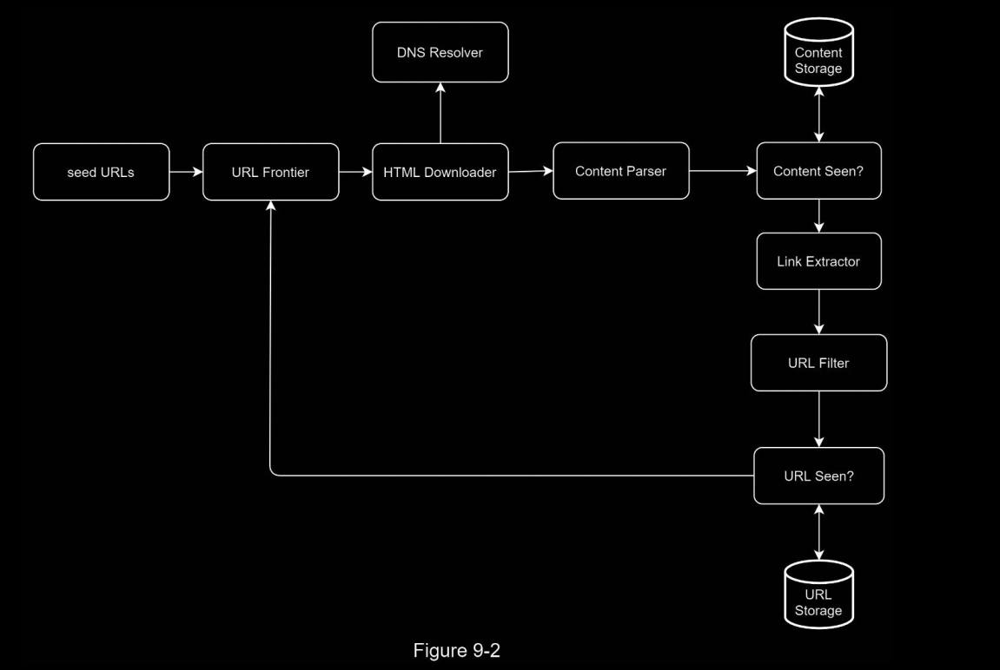
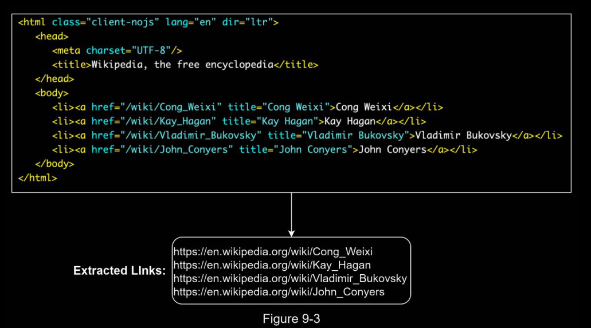
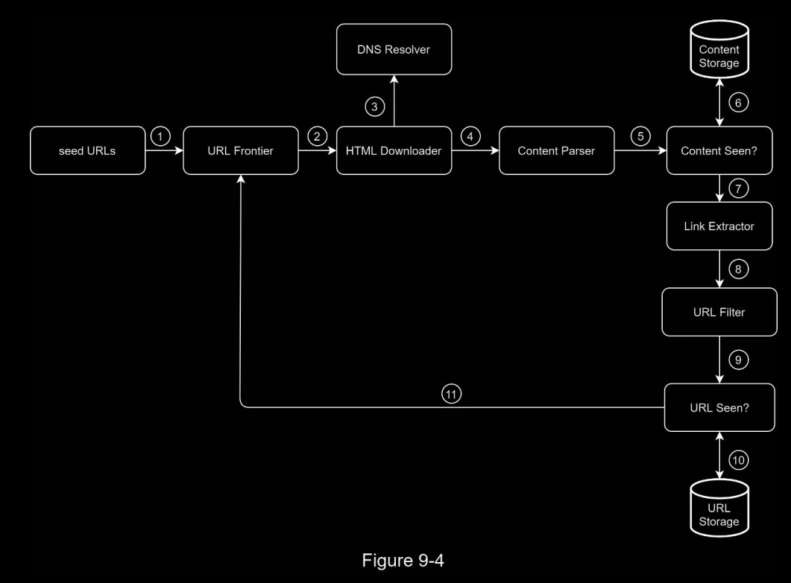
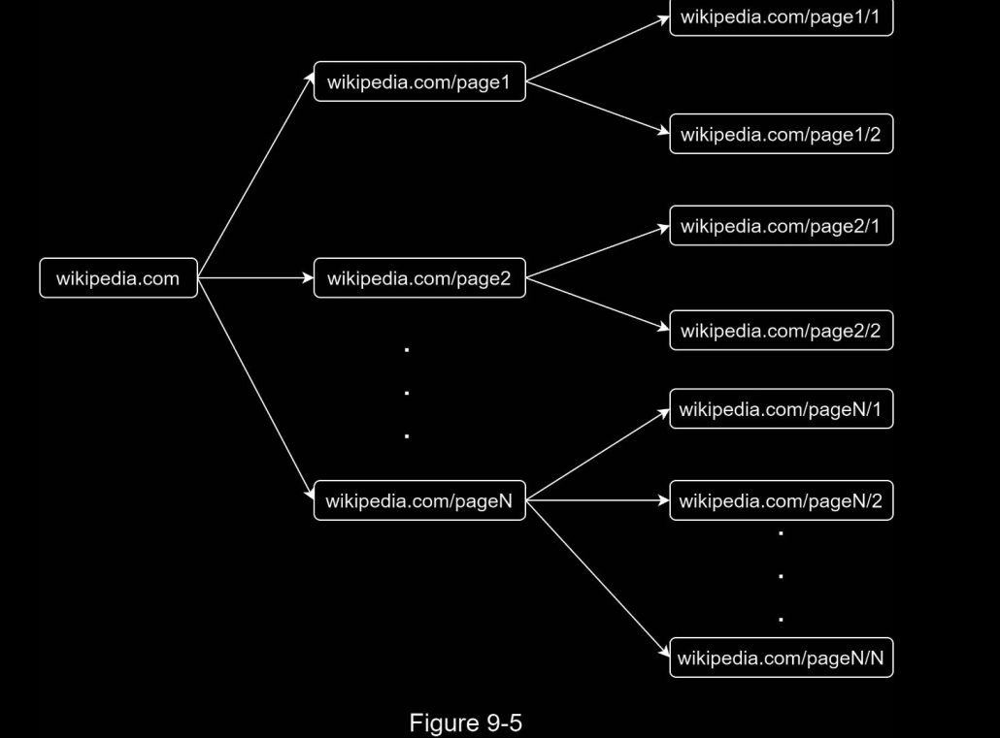
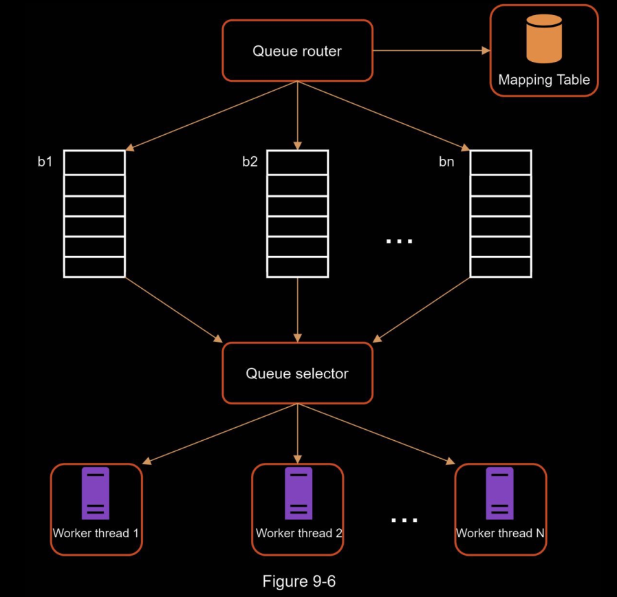
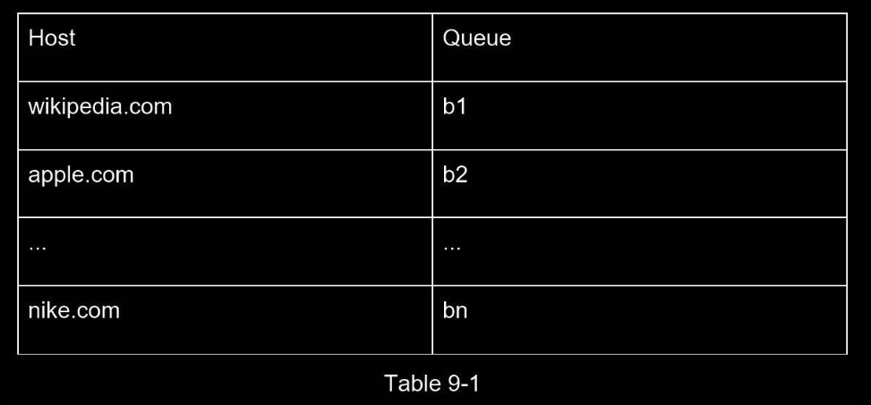
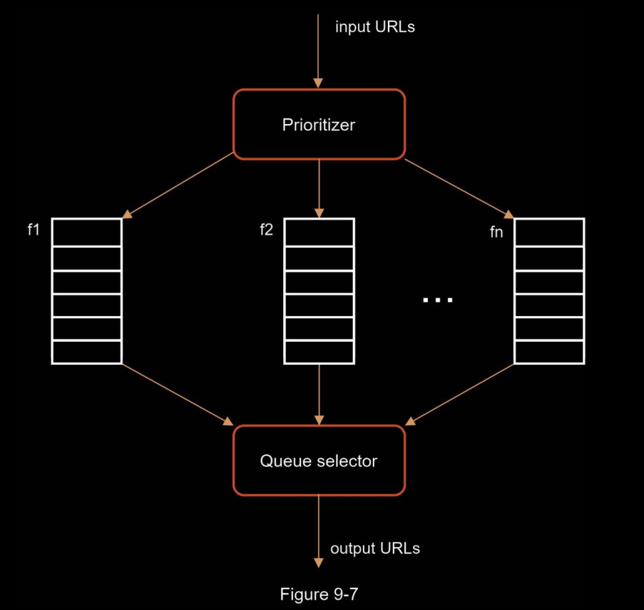
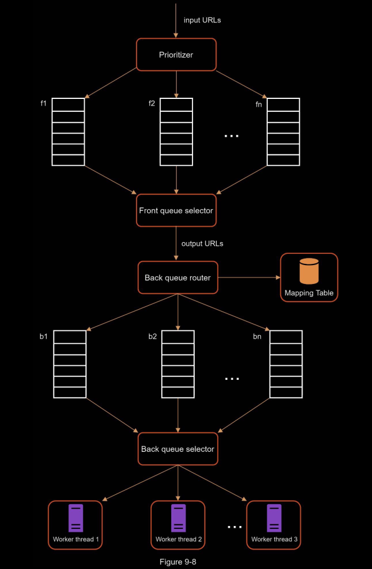
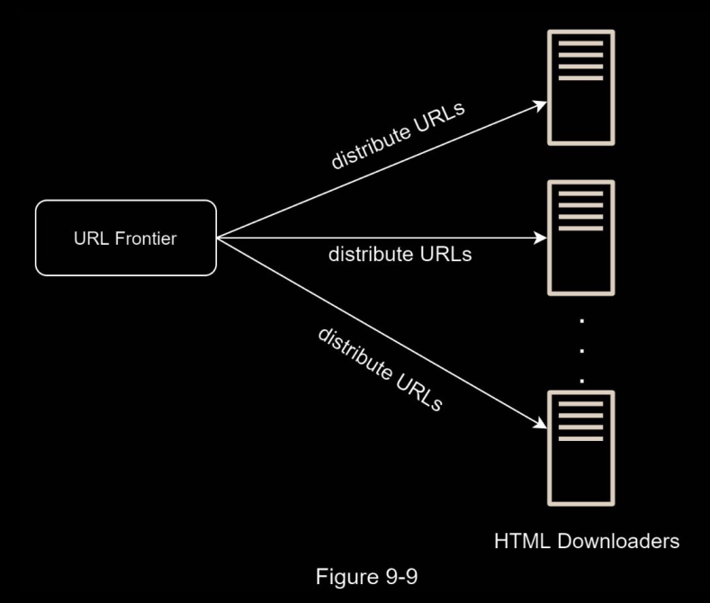
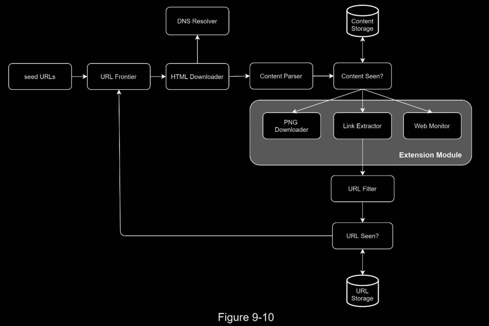

# Design a Web Crawler

A web crawler is known as a robot or spider. 

It is widely used by search engines to discover new or updated content on the web. 

Content can be a web page, an image, a video, a PDF file, etc. 

A web crawler starts by collecting a few web pages and then follows links on those pages to collect new content. Figure 9-1 shows a visual example of the crawl process.


A crawler is used for many purposes:

1. Search engine indexing: 
    - This is the most common use case. 
    - A crawler collects web pages to create a local index for search engines.
    - For example, Googlebot is the web crawler behind the Google search engine.
2. Web archiving: 
    - This is the process of collecting information from the web to preserve data for future uses. 
    - For instance, many national libraries run crawlers to archive web sites. 
    - Notable examples are the US Library of Congress and the EU web archive.
3. Web mining: 
    - The explosive growth of the web presents an unprecedented opportunity fordata mining. 
    - Web mining helps to discover useful knowledge from the internet. 
    - For example, top financial firms use crawlers to download shareholder meetings and annual reports to learn key company initiatives.
4. Web monitoring. 
    - The crawlers help to monitor copyright and trademark infringements over the Internet. 
    - For example, Digimarc utilizes crawlers to discover pirated works and reports.


## Establishing design scope

The basic algorithm of a web crawler is simple:
1. Given a set of URLs, download all the web pages addressed by the URLs.
2. Extract URLs from these web pages
3. Add new URLs to the list of URLs to be downloaded. Repeat these 3 steps.

Does a web crawler work truly as simple as this basic algorithm? Not exactly. 

Designing a vastly scalable web crawler is an extremely complex task. 

It is unlikely for anyone to design a massive web crawler within the interview duration. 

Requirements: 
1. Used for search engine indexing 
2. collect 1 Billion pages per month
3. HTML content only
4. It also considers newly added or edited pages
5. we store the HTML pages for 5 years
6. Pages with duplicated content should be ignored.

Characteristics of a good web crawler: 
1. Scalability 
    - Web crawling should be extremely efficient using parallelization
2. Robustness
    - The web is full of bad HTML, unresponsive servers, crashed, malicious links etc.
    - The crawler must handle all these cases
3. Politeness
    - The crawler should not make too many requests to a website withing a short time interval.
4. Extensibility
    - The system should be flexible so that minimal changes are needed to support new content types.
    - E.g. If we want to crawl images in the future, we should not have to redesign the entire system

 
---

## Back of the envelop estimation

1. Assume 1 billion web pages are downloaded every month
2. QPS : 1,000,000,000 / 30 days / 24 hours / 3600 seconds = ~400 pages / second
3. Peak QPS = 2 * QPS = 800
4. Assume the avg web page size is 500k
5. 1 Billion pages x 500k = 500TB storage per month.
6. Assume data are stored for 5 years, we need 500TB * 12 * 5 = 30 PB storage to store five year content


---

## High Level design

Some previous studies on web crawling: 
 - [4] Heydon A., Najork M. Mercator: A scalable, extensible web crawler World Wide Web, 2 (4) (1999), pp. 219-229
- [5] By Christopher Olston, Marc Najork: Web Crawling.
http://infolab.stanford.edu/~olston/publications/crawling_survey.pdf



### Seed URLs

A web crawler uses seed URLs as a starting point for the crawl process. 
- For example, to crawl all web pages from a university’s website, an intuitive way to select seed URLs is to use the university’s domain name.

To crawl the entire web, we need to be creative in selecting seed URLs. 

A good seed URL serves as a good starting point that a crawler can utilize to traverse as many links as possible.

The general strategy is to divide the entire URL space into smaller ones. 

The first proposed approach is based on locality as different countries may have different popular websites.

Another way is to choose seed URLs based on topics; 
- for example, we can divide URL space into shopping, sports, healthcare, etc.
- Seed URL selection is an open-ended question.

### URL Frontier

Most modern web crawlers split the crawl state into two: 
    - to be downloaded and
    -  already downloaded. 

The component that stores URLs to be downloaded is called the URL Frontier.

You can refer to this as a First-in-First-out (FIFO) queue. 


### HTML Downloader 

The HTML downloader downloads web pages from the internet. 

Those URLs are provided by the URL Frontier.


### DNS Resolver

To download a web page, a URL must be translated into an IP address. 

The HTML Downloader calls the DNS Resolver to get the corresponding IP address for the URL. 

For instance, URL www.wikipedia.org is converted to IP address 198.35.26.96 as of 3/5/2019.


### Content Parser

After a web page is downloaded, it must be parsed and validated because malformed web pages could provoke problems and waste storage space. 

Implementing a content parser in a crawl server will slow down the crawling process. 

Thus, the content parser is a separate component.


### Content Seen?

Online research [6] reveals that 29% of the web pages are duplicated contents, which may cause the same content to be stored multiple times. 

We introduce the “Content Seen?” data structure to eliminate data redundancy and shorten processing time. 

It helps to detect new content previously stored in the system. 

To compare two HTML documents, we can compare them character by character. 

However, this method is slow and time-consuming, especially when billions of web pages are involved. 

An efficient way to accomplish this task is to compare the hash values of the two web pages [7].


### Content Storage

It is a storage system for storing HTML content. 

The choice of storage system depends on factors such as data type, data size, access frequency, life span, etc. 

Both disk and memory are used.
- Most of the content is stored on disk because the data set is too big to fit in memory.
- Popular content is kept in memory to reduce latency.


### URL Extractor

URL Extractor parses and extracts links from HTML pages. Figure 9-3 shows an example of a link extraction process. 

Relative paths are converted to absolute URLs by adding the “https://en.wikipedia.org” prefix.




### URL Filter

The URL filter excludes certain content types, file extensions, error links and URLs in “blacklisted” sites.


### URL Seen?

“URL Seen?” is a data structure that keeps track of URLs that are visited before or already in the Frontier. 

“URL Seen?” helps to avoid adding the same URL multiple times as this can increase server load and cause potential infinite loops.


Bloom filter and hash table are common techniques to implement the “URL Seen?” component. 


### URL Storage

URL Storage stores already visited URLs.


--- 


## Web Crawler Workflow




Steps: 
1. Add seed URLs to the URL Frontier
2. HTML Downloader fetches a list of URLs from URL Frontier
3. HTML Downloader gets IP addresses of URLs from DNS resolver and starts downloading.
4. Content Parser parses HTML pages and checks if pages are malformed. 
5. After content is parsed and validated, it is passed to the “Content Seen?” component.
6. “Content Seen” component checks if a HTML page is already in the storage.
    - If it is in the storage, this means the same content in a different URL has already been processed. 
        - In this case, the HTML page is discarded.
    - If it is not in the storage, the system has not processed the same content before. 
    - The content is passed to Link Extractor.
7. Link extractor extracts links from HTML pages.
8. Extracted links are passed to the URL filter.
9. After links are filtered, they are passed to the “URL Seen?” component.
10. “URL Seen” component checks if a URL is already in the storage, if yes, it is processed before, and nothing needs to be done.
11. If a URL has not been processed before, it is added to the URL Frontier.

---

## Design Deep dive

• Depth-first search (DFS) vs Breadth-first search (BFS)
• URL frontier
• HTML Downloader
• Robustness
• Extensibility
• Detect and avoid problematic content


### DFS vs BFS

In web crawlers, DFS is usually not a good choice because the depth of DFS can be very deep.

BFS is commonly used by web crawlers and is implemented by a first-in-first-out (FIFO) queue. 

In a FIFO queue, URLs are dequeued in the order they are enqueued. 

However, this implementation has two problems:

- Most links from the same web page are linked back to the same host. 
    - In Figure 9-5, all the links in wikipedia.com are internal links, making the crawler busy processing URLs from the same host (wikipedia.com). 
    - When the crawler tries to download web pages in parallel, Wikipedia servers will be flooded with requests. 
    - This is considered as “impolite”.



- Standard BFS does not take the priority of a URL into consideration. 
    - The web is large and not every page has the same level of quality and importance. 
    - Therefore, we may want to prioritize URLs according to their page ranks, web traffic, update frequency, etc.


### URL Frontier

URL frontier helps to address these problems. (politeness and prioritization). 

A URL frontier is a data structure that stores URLs to be downloaded. 

The URL frontier is an important component to ensure politeness, URL prioritization, and freshness. 

#### Politeness

Generally, a web crawler should avoid sending too many requests to the same hosting server within a short period. 

Sending too many requests is considered as “impolite” or even treated as denial-of-service (DOS) attack. 

For example, without any constraint, the crawler can send thousands of requests every second to the same website.  This can overwhelm the web servers.

The general idea of enforcing politeness is to download one page at a time from the same host. 

A delay can be added between two download tasks. 

The politeness constraint is implemented by maintain a mapping from website hostnames to download (worker) threads.

Each downloader thread has a separate FIFO queue and only downloads URLs obtained from that queue. Figure 9-6 shows the design that manages politeness.



• Queue router: It ensures that each queue (b1, b2, … bn) only contains URLs from the same host.
• Mapping table: It maps each host to a queue.



• FIFO queues b1, b2 to bn: Each queue contains URLs from the same host.
• Queue selector: 
    - Each worker thread is mapped to a FIFO queue, and it only downloads URLs from that queue. 
    - The queue selection logic is done by the Queue selector.
• Worker thread 1 to N. 
    - A worker thread downloads web pages one by one from the same host. 
    - A delay can be added between two download tasks.

#### Priority

A random post from a discussion forum about Apple products carries very different weight than posts on the Apple home page. Even though they both have the “Apple” keyword, it is sensible for a crawler to crawl the Apple home page first.

We prioritize URLs based on usefulness, which can be measured by PageRank, website traffic, update frequency, etc. 

“Prioritizer” is the component that handles URL prioritization. 

Figure 9-7 shows the design that manages URL priority.



• Prioritizer: It takes URLs as input and computes the priorities.
• Queue f1 to fn: Each queue has an assigned priority. Queues with high priority are selected with higher probability.
• Queue selector: Randomly choose a queue with a bias towards queues with higher priority.

Figure 9-8 presents the URL frontier design, and it contains two modules:
• Front queues: manage prioritization
• Back queues: manage politeness



#### Freshness

Web pages are constantly being added, deleted, and edited. A web crawler must periodically recrawl downloaded pages to keep our data set fresh. 

Recrawling all the URLs is time-consuming and resource intensive. 

Few strategies to optimize freshness are listed as follows:
- Recrawl based on web pages’ update history.
- Prioritize URLs and recrawl important pages first and more frequently.

#### Storage for URL Frontier

In real-world crawl for search engines, the number of URLs in the frontier could be hundreds of millions. 

Putting everything in memory is neither durable nor scalable. Keeping everything in the disk is undesirable also because the disk is slow; and it can easily become a bottleneck for the crawl.

We adopted a hybrid approach. The majority of URLs are stored on disk, so the storage space is not a problem. 

To reduce the cost of reading from the disk and writing to the disk, we maintain buffers in memory for enqueue/dequeue operations.

Data in the buffer is periodically written to the disk.


### HTML Downloader

The HTML Downloader downloads web pages from the internet using the HTTP protocol.

Before discussing the HTML Downloader, we look at Robots Exclusion Protocol first.

#### Robots.txt

Robots.txt, called Robots Exclusion Protocol, is a standard used by websites to communicate with crawlers. 

It specifies what pages crawlers are allowed to download. 

Before attempting to crawl a web site, a crawler should check its corresponding robots.txt first and follow its rules.

To avoid repeat downloads of robots.txt file, we cache the results of the file. 
    - The file is downloaded and saved to cache periodically. 

Here is a piece of robots.txt file taken from https://www.amazon.com/robots.txt. Some of the directories like creatorhub are disallowed

```
for Google bot.
User-agent: Googlebot
Disallow: /creatorhub/*
Disallow: /rss/people/*/reviews
Disallow: /gp/pdp/rss/*/reviews
Disallow: /gp/cdp/member-reviews/
Disallow: /gp/aw/cr/
```

#### Performance optimization

Below is a list of performance optimizations for HTML downloader.

1. Distributed crawl

To achieve high performance, crawl jobs are distributed into multiple servers, and each server runs multiple threads. 

The URL space is partitioned into smaller pieces; so, each downloader is responsible for a subset of the URLs. Figure 9-9 shows an example of a distributed crawl.




2. Cache DNS Resolver

DNS Resolver is a bottleneck for crawlers because DNS requests might take time due to the synchronous nature of many DNS interfaces. 

DNS response time ranges from 10ms to 200ms. 

Once a request to DNS is carried out by a crawler thread, other threads are blocked until the first request is completed. 

Maintaining our DNS cache to avoid calling DNS frequently is an effective technique for speed optimization. 

Our DNS cache keeps the domain name to IP address mapping and is updated periodically by cron jobs.

3. Locality

Distribute crawl servers geographically. 

When crawl servers are closer to website hosts, crawlers experience faster download time. 

Design locality applies to most of the system components: crawl servers, cache, queue, storage, etc.

4. Short timeout

Some web servers respond slowly or may not respond at all. 

To avoid long wait time, a maximal wait time is specified. If a host does not respond within a predefined time, the crawler will stop the job and crawl some other pages.


### Robustness

Besides performance optimization, robustness is also an important consideration. 

We present a few approaches to improve the system robustness:
• Consistent hashing: This helps to distribute loads among downloaders. A new downloader server can be added or removed using consistent hashing.
• Save crawl states and data: To guard against failures, crawl states and data are written to a storage system. A disrupted crawl can be restarted easily by loading saved states and data.
• Exception handling: Errors are inevitable and common in a large-scale system. The crawler must handle exceptions gracefully without crashing the system.
• Data validation: This is an important measure to prevent system errors.


### Extensibility

As almost every system evolves, one of the design goals is to make the system flexible enough to support new content types. 

The crawler can be extended by plugging in new modules. Figure 9-10 shows how to add new modules.



• PNG Downloader module is plugged-in to download PNG files.
• Web Monitor module is added to monitor the web and prevent copyright and trademark
infringements.


---


### Detect and avoid problematic content

This section discusses the detection and prevention of redundant, meaningless, or harmful
content.

1. Redundant content
As discussed previously, nearly 30% of the web pages are duplicates. Hashes or checksums
help to detect duplication.

2. Spider traps

A spider trap is a web page that causes a crawler in an infinite loop. For instance, an infinite
deep directory structure is listed as follows:

www.spidertrapexample.com/foo/bar/foo/bar/foo/bar/…

Such spider traps can be avoided by setting a maximal length for URLs. 

However, no one- size-fits-all solution exists to detect spider traps. 

Websites containing spider traps are easy to identify due to an unusually large number of web pages discovered on such websites. 

It is hard to develop automatic algorithms to avoid spider traps; however, a user can manually verify and identify a spider trap, and either exclude those websites from the crawler or apply
some customized URL filters.

3. Data noise

Some of the contents have little or no value, such as advertisements, code snippets, spam
URLs, etc. Those contents are not useful for crawlers and should be excluded if possible.

--- 


## Wrap up 

Some more relevant talking points

• Server-side rendering: Numerous websites use scripts like JavaScript, AJAX, etc to generate links on the fly. If we download and parse web pages directly, we will not be able to retrieve dynamically generated links. To solve this problem, we perform server-side rendering (also called dynamic rendering) first before parsing a page.

• Filter out unwanted pages: With finite storage capacity and crawl resources, an anti-spam
component is beneficial in filtering out low quality and spam pages.

• Database replication and sharding: Techniques like replication and sharding are used to
improve the data layer availability, scalability, and reliability.

• Horizontal scaling: For large scale crawl, hundreds or even thousands of servers are
needed to perform download tasks. The key is to keep servers stateless.

• Availability, consistency, and reliability: These concepts are at the core of any large
system’s success.

• Analytics: Collecting and analyzing data are important parts of any system because data
is key ingredient for fine-tuning.