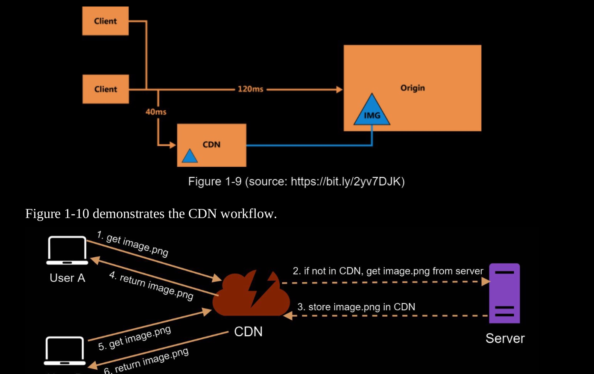

# CDN

A CDN is a network of geographically dispersed servers used to deliver static content. CDN
servers cache static content like images, videos, CSS, JavaScript files, etc

Here is how CDN works at the high-level: when a user visits a website, a CDN server closest
to the user will deliver static content. Intuitively, the further users are from CDN servers, the
slower the website loads

## Considerations of using a CDN 

1. Cost 
2. Setting an appropriate cache expiry
      - For time-sensitive content, setting a cache expiry time is important. 
      - The cache expiry time should neither be too long nor too short
3. CDN fallback: 
      - You should consider how your website/application copes with CDN failure. 
      - If there is a temporary CDN outage, clients should be able to detect the problem and request resources from the origin.
4. Invalidating Files 
      - either invalidate the CDN object using APIs provided by CDN vendors
      - or use object versioning to send a different version.
      