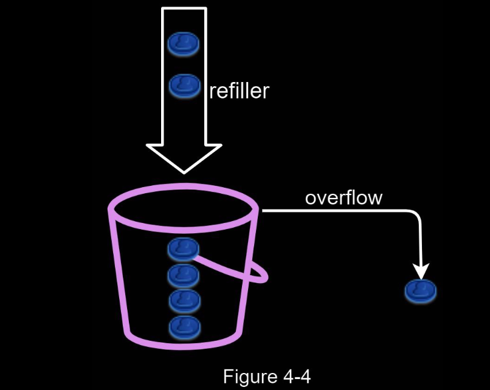
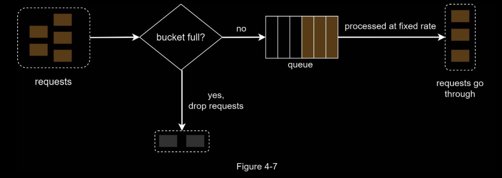
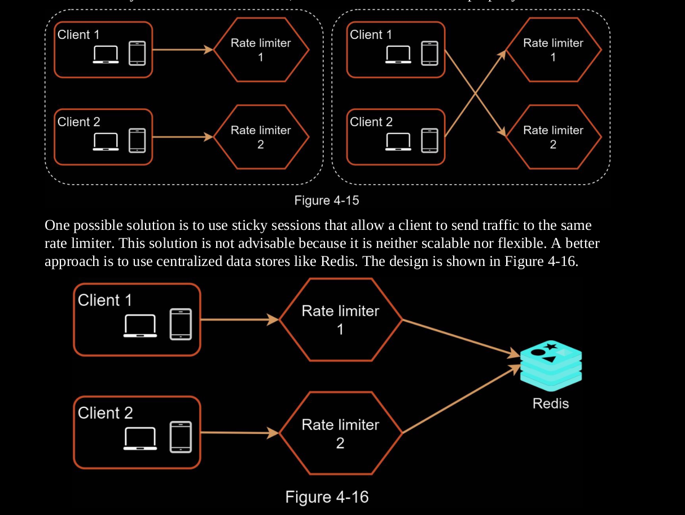

# Design an API Rate Limitter

Rate Limiters block extra requests that are above a particular threshold, and returh `429` HTTP status, with a __ header.

Benefits: 
1. Prevent resource starvation caused by Denial of Service (DoS) attacks
2. Reduce cost: 
    - Limiting excess requests means fewer servers and allocating more resources to high priority APIs. 
    - Rate limiting is extremely important for companies that use paid third party APIs. 
    - For example, you are charged on a per-call basis for the following external APIs: check credit, make a payment, retrieve health records, etc.
3. Prevent servers from being overloaded.

### Where to put the Rate Limitter

- Client side: Generally speaking, client is an unreliable place to enforce rate limiting because client requests can easily be forged by malicious actors.
- Server-side: 
    - As part of the server
        - 
    - In Front of the server as a middleware: 
        - 
    - Cloud Rate-limiting Microservices: 
        - Cloud microservices have become widely popular and rate limiting is usually implemented within a component called API gateway. 
        - API gateway is a fully managed service that supports rate limiting, SSL termination, authentication, IP whitelisting, servicing static content, etc.


---


## Algorithms

• Token bucket
• Leaking bucket
• Fixed window counter
• Sliding window log
• Sliding window counter


### Token Bucket

- Widely used
- Simple
- Well understood

**Algorithm**

- A token bucket is a container that has predefined capacity
- Tokens are placed in the bucket periodically at preset rate
- Once the bucket is full, no more tokens are added
- Each request consumes 1 token
- When a request arrives, we check if there are enough tokens
    - If there >= 1 token, the request goes through
    - If not, the request is dropped




The token bucket algo takes two parameters: 
1. Bucket size: the max number of tokens allowed in the bucket.
2. Refill rate: Number of tokens put into the bucket every second

#### How many buckets do we need

Varies and depends on rate-limiting rules. Examples: 

- It is usually necessary to have different buckets for different API endpoints.
    - For instance, 
     - if a user is allowed to make 1 post per second, add 150 friends per day, and like 5 posts per second, 3 buckets are required for each user.
- If we need to throttle requests based on IP addresses, each IP address requires a bucket.
- If the system allows a maximum of 10,000 requests per second, it makes sense to have a global bucket shared by all requests

#### Pros & Cons

Pros:
- The algorithm is easy to implement.
- Memory efficient.
- Token bucket allows a burst of traffic for short periods. A request can go through as long as there are tokens left.

Cons:
- Two parameters in the algorithm are bucket size and token refill rate. However, it might be challenging to tune them properly.

---


### Leaking Bucket

The leaking bucket algorithm is similar to the token bucket except that requests are processed
at a fixed rate.

It is usually implemented with a first-in-first-out (FIFO) queue.

Algo: 

- When a request arrives, the system checks if the queue is full. 
- If it is not full, the request is added to the queue.
- Otherwise, the request is dropped.
- Requests are pulled from the queue and processed at regular intervals.



Parameters: 

1. Bucket size
    - queue size
3. Outflow Rate: 
    - it defines how many requests can be processed at a fixed rate, usually in seconds. 

#### Pros & Cons 

Pros:
- Memory efficient given the limited queue size.
- Requests are processed at a fixed rate therefore it is suitable for use cases that a stable outflow rate is needed.

Cons:
- A burst of traffic fills up the queue with old requests, and if they are not processed in time, recent requests will be rate limited.
- There are two parameters in the algorithm. It might not be easy to tune them properly.

---

### Fixed Window Counter 

- The algorithm divides the timeline into fix-sized time windows and assign a counter for each window.
- Each request increments the counter by one.
- Once the counter reaches the pre-defined threshold, new requests are dropped until a new time window starts.


A major problem with this algorithm is that a burst of traffic at the edges of time windows
could cause more requests than allowed quota to go through.


#### Pros & Cons 

Pros: 
- Memory Efficient
- Easy to understand
- Resetting available quota at the end of a unit time window fits certain use cases.

Cons: 
- Spike in traffic at the edges of a window could cause more requests than the allowed
quota to go through.

---

### Sliding Window Log

As discussed previously, the fixed window counter algorithm has a major issue: it allows
more requests to go through at the edges of a window. The sliding window log algorithm
fixes the issue.

- The algorithm keeps track of request timestamps. Timestamp data is usually kept in cache, such as sorted sets of Redis. (https://engineering.classdojo.com/blog/2015/02/06/rolling-rate-limiter/)
- When a new request comes in, remove all the outdated timestamps. Outdated timestamps are defined as those older than the start of the current time window.
- Add timestamp of the new request to the log.
- If the log size is the same or lower than the allowed count, a request is accepted. Otherwise, it is rejected.


(NOTE: POSIX timestamps are used in real life, but here showing time in human readable format)

- The log is empty when a new request arrives at 1:00:01. Thus, the request is allowed.
- A new request arrives at 1:00:30, the timestamp 1:00:30 is inserted into the log.
- After the insertion, the log size is 2, not larger than the allowed count. Thus, the request is allowed.
- A new request arrives at 1:00:50, and the timestamp is inserted into the log. 
- After the insertion, the log size is 3, larger than the allowed size 2. Therefore, this request is rejected
even though the timestamp remains in the log.
- A new request arrives at 1:01:40. 
- Requests in the range `[1:00:40,1:01:40)` are within the latest time frame, but requests sent before 1:00:40 are outdated. Two outdated timestamps, 1:00:01 and 1:00:30, are removed from the log.
- After the remove operation, the log size becomes 2; therefore, the request is accepted.

#### Pros & Cons

Pros:

• Rate limiting implemented by this algorithm is very accurate. In any rolling window,
requests will not exceed the rate limit.

Cons:
• The algorithm consumes a lot of memory because even if a request is rejected, its
timestamp might still be stored in memory.

---

### Sliding Window Counter

The sliding window counter algorithm is a hybrid approach that combines the fixed window
counter and sliding window log.

(Note: 2 ways to implement this algo, one shown below).


Using the formula, we get

$3 + 5 \times 0.7\%$ = 6.5 requests (which rouned down to 6 request).

Hence, 1 more reqeust is allowed.

#### Pros & Cons

Pros
• It smooths out spikes in traffic because the rate is based on the average rate of the
previous window.
• Memory efficient.

Cons
• It only works for not-so-strict look back window. It is an approximation of the actual rate
because it assumes requests in the previous window are evenly distributed. However, this
problem may not be as bad as it seems. According to experiments done by Cloudflare [10],
only 0.003% of requests are wrongly allowed or rate limited among 400 million requests.


--- 

## High-level architecture

The basic idea of rate limiting algorithms is simple. 

At the high-level, we need a counter to keep track of how many requests are sent from the same user, IP address, etc. 

If the counter is larger than the limit, the request is disallowed.

Where shall we store counters? Using the database is not a good idea due to slowness of disk access. 

In-memory cache is chosen because it is fast and supports time-based expiration strategy. 

For instance, Redis is a popular option to implement rate limiting. It is an in-memory store that offers two commands: INCR and EXPIRE.
• INCR: It increases the stored counter by 1.
• EXPIRE: It sets a timeout for the counter. If the timeout expires, the counter is automatically deleted.


---

## Rate Limiting Rules

 Rules are generally written in configuration files and saved on disk.

Lyft uses YAML for writing and storing rules, for example: 

```yaml
domain: messaging
descriptors:
- key: message_type
Value: marketing
rate_limit:
unit: day
requests_per_unit: 5

# In the above example, the system is configured to allow a maximum of 5 marketing messages per day. Here is another example:

domain: auth
descriptors:
- key: auth_type
Value: login
rate_limit:
unit: minute
requests_per_unit: 5

# This rule shows that clients are not allowed to login more than 5 times in 1 minute.
```

---

## Exceeding the rate limit

In case a request is rate limited, APIs return a HTTP response code 429 (too many requests) to the client. 

Depending on the use cases, we may enqueue the rate-limited requests to be processed later. For example, if some orders are rate limited due to system overload, we may keep those orders to be processed later.

### Rate limiter headers

How does a client know whether it is being throttled? And how does a client know the number of allowed remaining requests before being throttled? 

The answer lies in HTTP response headers. 

The rate limiter returns the following HTTP headers to clients:
- `X-Ratelimit-Remaining`: The remaining number of allowed requests within the window.
- `X-Ratelimit-Limit`: It indicates how many calls the client can make per time window.
- `X-Ratelimit-Retry-After`: The number of seconds to wait until you can make a request again without being throttled.

Usually, When a user has sent too many requests, a `429` too many requests error and `X-Ratelimit-Retry-After` header are returned to the client.


---

## Detailed Design 


---

## Rate limiter in a distributed environment
Building a rate limiter that works in a single server environment is not difficult. However,
scaling the system to support multiple servers and concurrent threads is a different story.
There are two challenges:
• Race condition
• Synchronization issue

### Race Condition

Race conditions can happen in a highly concurrent environment.


Locks are the most obvious solution for solving race condition. However, locks will significantly slow down the system. Two strategies are commonly used to solve the problem:

- Lua script
- and sorted sets data structure in Redis.

### Synchronization issue

Synchronization is another important factor to consider in a distributed environment. 

To support millions of users, one rate limiter server might not be enough to handle the traffic.

When multiple rate limiter servers are used, synchronization is required.



--- 

## Performance optimization

First, multi-data center setup is crucial for a rate limiter because latency is high for users
located far away from the data center.

Second, synchronize data with an eventual consistency model.

--- 

## Monitoring

After the rate limiter is put in place, it is important to gather analytics data to check whether the rate limiter is effective. Primarily, we want to make sure:

• The rate limiting algorithm is effective.
• The rate limiting rules are effective.

For example, if rate limiting rules are too strict, many valid requests are dropped. In this case, we want to relax the rules a little bit. 

In another example, we notice our rate limiter becomes ineffective when there is a sudden increase in traffic like flash sales. In this scenario, we may replace the algorithm to support burst traffic. Token bucket is a good fit here.