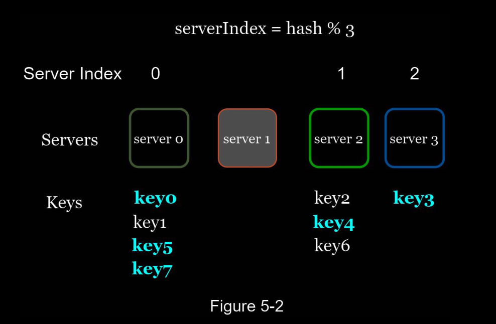

# Design Consistent Hashing

To achieve horizontal scaling, it is important to distribute requests/data efficiently and evenly
across servers.

Consistent hashing is a commonly used technique to achieve this goal.

### Why? The Rehashing Problem

If you have n cache servers, a common way to balance the load is to use the following hash
method:

serverIndex = hash(key) % N, where N is the size of the server pool.

Let us use an example to illustrate how it works. As shown in Table 5-1, we have 4 servers
and 8 string keys with their hashes.

To fetch the server where a key is stored, we perform the modular operation f(key) % 4. For
instance, hash(key0) % 4 = 1 means a client must contact server 1 to fetch the cached data.
Figure 5-1 shows the distribution of keys based on Table 5-1.

This approach works well when the size of the server pool is fixed, and the data distribution
is even.

However, problems arise when new servers are added, or existing servers are removed. 

For example, if server 1 goes offline, the size of the server pool becomes 3. 

Using the same hash function, we get the same hash value for a key. 

But applying modular operation gives us different server indexes because the number of servers is reduced by 1. We get the results as shown in Table 5-2 by applying hash % 3:

As shown in Figure 5-2, most keys are redistributed, not just the ones originally stored in the offline server (server 1). 

This means that when server 1 goes offline, most cache clients will connect to the wrong servers to fetch data. This causes a storm of cache misses. 

Consistent hashing is an effective technique to mitigate this problem.

## Consistent Hashing in Action

Consistent hashing is a special kind of hashing such that when a hash table is re-sized and consistent hashing is used, only k/n keys need to be remapped on average, where k is the number of keys, and n is the number of slots. 

In contrast, in most traditional hash tables, a change in the number of array slots causes nearly all keys to be
remapped.

### Hash Space & Hash Ring

Assume SHA-1 is used as the hash function f, and the output range of the hash function is: x0, x1, x2,
x3, …, xn. 

In cryptography, SHA-1’s hash space goes from 0 to 2^160 - 1. 

That means x0 corresponds to 0, xn corresponds to 2^160 – 1, and all the other hash values in the middle fall
between 0 and 2^160 - 1. Figure 5-3 shows the hash space.

By collecting both ends, we get a hash ring as shown in Figure 5-4:

#### Hash Servers

Using the same hash function f, we map servers based on server IP or name onto the ring.
Figure 5-5 shows that 4 servers are mapped on the hash ring.

#### Hash Keys

4 cache keys (key0, key1, key2, and key3) are hashed onto the hash ring using the same hash function f

#### Server lookup 

To determine which server a key is stored on, we go clockwise from the key position on the ring until a server is found. 

Figure 5-7 explains this process. 
    - Going clockwise, key0 is stored on server 0; 
    - key1 is stored on server 1; 
    - key2 is stored on server 2 and 
    - key3 is stored on server 3.

#### Add a Server

Using the logic described above, adding a new server will only require redistribution of a
fraction of keys.

In Figure 5-8, after a new server 4 is added, only key0 needs to be redistributed. 
    - k1, k2, and k3 remain on the same servers. 

Let us take a close look at the logic. 
    - Before server 4 is added, key0 is stored on server 0. 
    - Now, key0 will be stored on server 4 because server 4 is the first server it encounters by going clockwise from key0’s position on the ring. 
    - The other keys are not redistributed based on consistent hashing algorithm.

#### Removing a Server

When a server is removed, only a small fraction of keys require redistribution with consistent
hashing. In Figure 5-9, when server 1 is removed, only key1 must be remapped to server 2.
The rest of the keys are unaffected.

### Two Problems in the approach above

Two problems are identified with this approach. 

1. First, it is impossible to keep the same size of partitions on the ring for all servers considering a server can be added or removed. 
    - A partition is the hash space between adjacent servers. 
    - It is possible that the size of the partitions on the ring assigned to each server is very small or fairly large.
    - In Figure 5-10, if s1 is removed, s2’s partition (highlighted with the bidirectional arrows) is twice as large as s0 and s3’s partition.

2. Second, it is possible to have a non-uniform key distribution on the ring. 
    - For instance, if servers are mapped to positions listed in Figure 5-11, most of the keys are stored on server 2.
    - However, server 1 and server 3 have no data.

### Solution: Virtual Nodes: 

A technique called virtual nodes or replicas is used to solve these problems.

A virtual node is like a pseudo/phantom node, not really existing in the structure, and each server is represented by multiple virtual nodes on the ring.

In Figure 5-12, both server 0 and server 1 have 3 virtual nodes. 
- The 3 is arbitrarily chosen; and in real-world systems, the number of virtual nodes is much larger.
- Instead of using s0, we have s0_0, s0_1, and s0_2 to represent server 0 on the ring. 
- Similarly, s1_0, s1_1, and s1_2 represent server 1 on the ring. 

With virtual nodes, each server is responsible for multiple partitions. 

Partitions (edges) with label s0 are managed by server 0. 

On the other hand, partitions with label s1 are managed by server 1.

To find which server a key is stored on, we go clockwise from the key’s location and find the
first virtual node encountered on the ring. 
    - In Figure 5-13, to find out which server k0 is stored on, we go clockwise from k0’s location and find virtual node s1_1, which refers to server 1.

As the number of virtual nodes increases, the distribution of keys becomes more balanced.
This is because the standard deviation gets smaller with more virtual nodes, leading to
balanced data distribution.

### Find affected keys

When a server is added or removed, a fraction of data needs to be redistributed. How can we find the affected range to redistribute the keys?

In Figure 5-14, server 4 is added onto the ring. The affected range starts from s4 (newly
added node) and moves anticlockwise around the ring until a server is found (s3). Thus, keys
located between s3 and s4 need to be redistributed to s4.

When a server (s1) is removed as shown in Figure 5-15, the affected range starts from s1
(removed node) and moves anticlockwise around the ring until a server is found (s0). Thus,
keys located between s0 and s1 must be redistributed to s2.

---

## Summary

The benefits of consistent hashing include:
- Minimized keys are redistributed when servers are added or removed.
- It is easy to scale horizontally because data are more evenly distributed.
- Mitigate hotspot key problem. Excessive access to a specific shard could cause server overload. 
    - Imagine data for Katy Perry, Justin Bieber, and Lady Gaga all end up on the same shard. 
    - Consistent hashing helps to mitigate the problem by distributing the data more evenly.

Consistent hashing is widely used in real-world systems, including some notable ones:
• Partitioning component of Amazon’s Dynamo database
• Data partitioning across the cluster in Apache Cassandra
• Discord chat application
• Akamai content delivery network
• Maglev network load balancer
