# Design a Key-Value store

A key-value store, also referred to as a key-value database, is a non-relational database. Each
unique identifier is stored as a key with its associated value. This data pairing is known as a
“key-value” pair.

In a key-value pair, the key must be unique, and the value associated with the key can be accessed through the key. Keys can be plain text or hashed values. 

For performance reasons, a short key works better. 

Here are a few examples:
- Plain text key: “last_logged_in_at”
- Hashed key: 253DDEC4

The value in a key-value pair can be strings, lists, objects, etc. The value is usually treated as an opaque object in key-value stores, such as Amazon dynamo, Memcached, Redis, etc.

We are designing a key-value store with the following operations: 
1. `put(key, value)`
2. `get(key)`

### Requirements 

We design a key-value store that comprises of the following characteristics:
• The size of a key-value pair is small: less than 10 KB.
• Ability to store big data.
• High availability: The system responds quickly, even during failures.
• High scalability: The system can be scaled to support large data set.
• Automatic scaling: The addition/deletion of servers should be automatic based on traffic.
• Tunable consistency.
• Low latency.

---

## Single server key-value store

Developing a key-value store that resides in a single server is easy. 

An intuitive approach is to store key-value pairs in a hash table, which keeps everything in memory. 

Even though memory access is fast, fitting everything in memory may be impossible due to the space
constraint. 

Two optimizations can be done to fit more data in a single server:
• Data compression
• Store only frequently used data in memory and the rest on disk

Even with these optimizations, a single server can reach its capacity very quickly. 

A distributed key-value store is required to support big data.

## Distributed key-value store

A distributed key-value store is also called a distributed hash table, which distributes key- value pairs across many servers. 

When designing a distributed system, it is important to understand CAP (Consistency, Availability, Partition Tolerance) theorem.

---

## System components

In this section, we will discuss the following core components and techniques used to build a key-value store:
• Data partition
• Data replication
• Consistency
• Inconsistency resolution
• Handling failures
• System architecture diagram
• Write path
• Read path

### Data Partition

For large applications, it is infeasible to fit the complete data set in a single server. 

The simplest way to accomplish this is to split the data into smaller partitions and store them in multiple servers. 

There are two challenges while partitioning the data:
• Distribute data across multiple servers evenly.
• Minimize data movement when nodes are added or removed.

Consistent hashing is a great technique to solve these problems. 

Let us revisit how consistent hashing works at a high-level.
• First, servers are placed on a hash ring. In Figure 6-4, eight servers, represented by s0,
s1, …, s7, are placed on the hash ring.
• Next, a key is hashed onto the same ring, and it is stored on the first server encountered
while moving in the clockwise direction. For instance, key0 is stored in s1 using this logic.

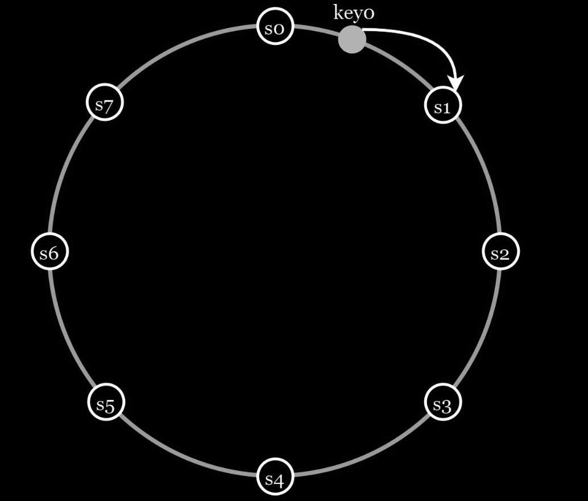

Using consistent hashing to partition data has the following advantages:

- **Automatic scaling**: servers could be added and removed automatically depending on the load.
- **Heterogeneity**: the number of virtual nodes for a server is proportional to the server capacity.
    - For example, servers with higher capacity are assigned with more virtual nodes.

### Data Replication

To achieve high availability and reliability, data must be replicated asynchronously over N servers, where N is a configurable parameter. 

These N servers are chosen using the following logic: 
    - after a key is mapped to a position on the hash ring, walk clockwise from that position 
    - choose the first N servers on the ring to store data copies. 
    - In Figure 6-5 (N = 3), key0 is replicated at s1, s2, and s3.

(With virtual nodes, the first N nodes on the ring may be owned by fewer than N physical
servers. To avoid this issue, we only choose unique servers while performing the clockwise
walk logic.)

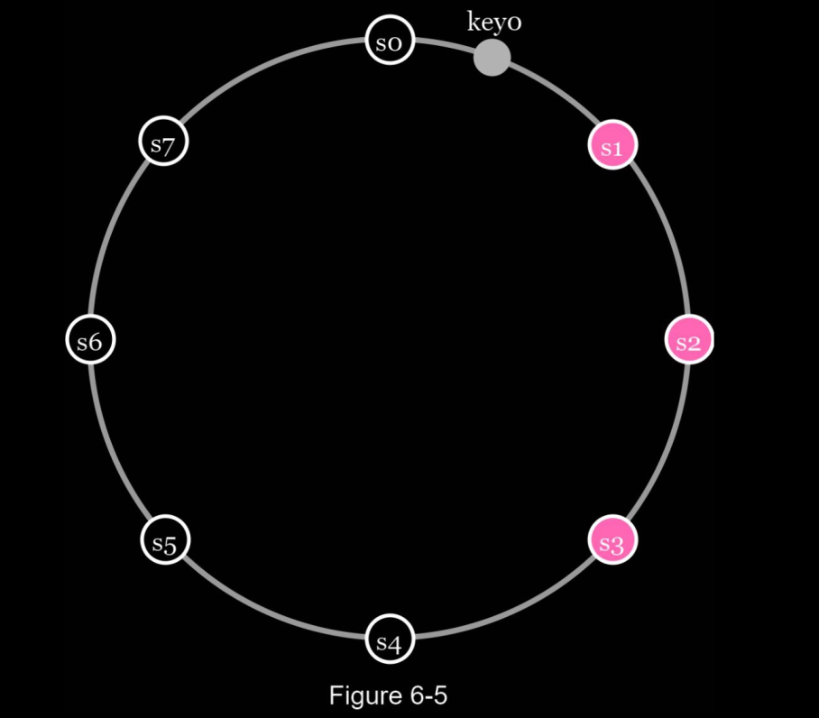

Nodes in the same data center often fail at the same time due to power outages, network
issues, natural disasters, etc. For better reliability, replicas are placed in distinct data centers,
and data centers are connected through high-speed networks.

### Consistency

Since data is replicated at multiple nodes, it must be synchronized across replicas. 

**Quorum consensus** can guarantee consistency for both read and write operations. 

Let us establish a few definitions first.
- N = The number of replicas
- W = A write quorum of size W. 
    - For a write operation to be considered as successful, write operation must be acknowledged from W replicas.
- R = A read quorum of size R. 
    - For a read operation to be considered as successful, read operation must wait for responses from at least R replicas.
   
Consider the following example shown in Figure 6-6 with N = 3.

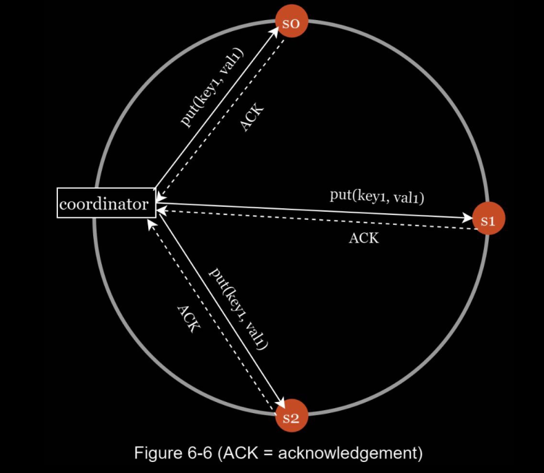

W = 1 does not mean data is written on one server. 

For instance, with the configuration in Figure 6-6, data is replicated at s0, s1, and s2. 

W = 1 means that the coordinator must receive at least one acknowledgment before the write operation is considered as successful. 
    - For instance, if we get an acknowledgment from s1, we no longer need to wait for acknowledgements from s0 and s2. 

A coordinator acts as a proxy between the client and the nodes.

#### Quorum consensus (WRN) configuration

The configuration of W, R and N is a typical tradeoff between latency and consistency. 
- If W = 1 or R = 1, an operation is returned quickly because a coordinator only needs to wait for a response from any of the replicas. 
- If W or R > 1, the system offers better consistency; however, the query will be slower because the coordinator must wait for the response from the slowest replica.
- If W + R > N, strong consistency is guaranteed because there must be at least oneoverlapping node that has the latest data to ensure consistency.

How to configure N, W, and R to fit our use cases? 

Here are some of the possible setups:
- If R = 1 and W = N, the system is optimized for a fast read.
- If W = 1 and R = N, the system is optimized for fast write.
- If W + R > N, strong consistency is guaranteed (Usually N = 3, W = R = 2).
- If W + R <= N, strong consistency is not guaranteed.

Depending on the requirement, we can tune the values of W, R, N to achieve the desired level of consistency.

#### Consistency Models

Consistency model is other important factor to consider when designing a key-value store. 

Dynamo and Cassandra adopt eventual consistency, which is our recommended consistency model for our key-value store.

### Inconsistency Resolution

Replication gives high availability but causes inconsistencies among replicas. 

**Versioning** and **vector locks** are used to solve inconsistency problems. Versioning means treating each data modification as a new immutable version of data.

#### How Incosistency happens: example

- As shown in Figure 6-7, both replica nodes n1 and n2 have the same value. 
- Let us call this value the original value.
- Server 1 and server 2 get the same value for get(“name”) operation.

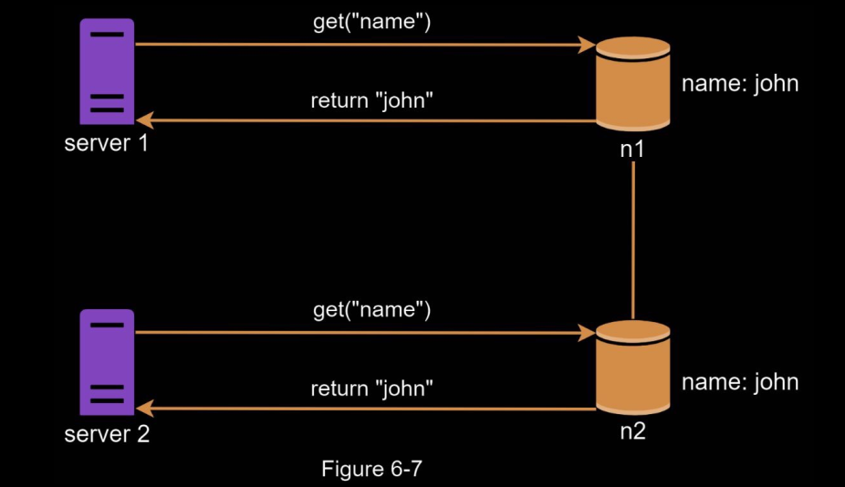

- Next, server 1 changes the name to “johnSanFrancisco” 
- and server 2 changes the name to “johnNewYork” as shown in Figure 6-8. 
- These two changes are performed simultaneously.
- Now, we have conflicting values, called versions v1 and v2.

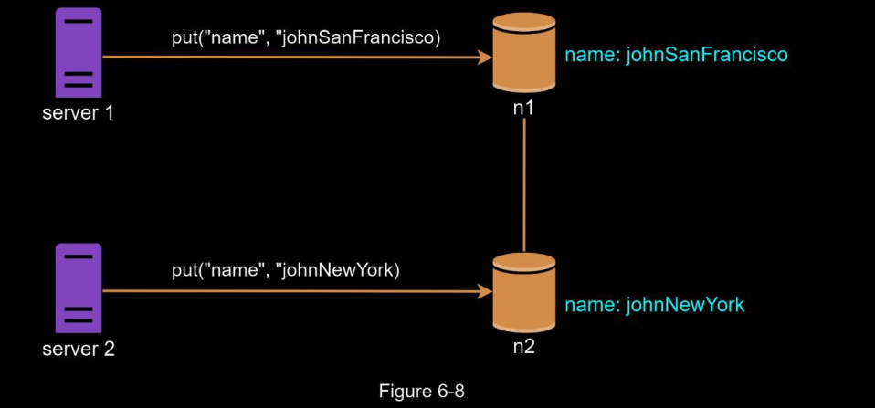

- In this example, the original value could be ignored because the modifications were based on it. 
- However, there is no clear way to resolve the conflict of the last two versions. 
- To resolve this issue, we need a versioning system that can detect conflicts and reconcile conflicts. 

A vector clock is a common technique to solve this problem. Let us examine how vector clocks work.

#### Vector Clock

A vector clock is a [server, version] pair associated with a data item. 

It can be used to check if one version precedes, succeeds, or in conflict with others.

Assume a vector clock is represented by D([S1, v1], [S2, v2], …, [Sn, vn]), 
    - where D is a data item, 
    - v1 is a version counter, 
    - and s1 is a server number, etc. 

If data item D is written to server Si, the system must perform one of the following tasks.
• Increment vi if [Si, vi] exists.
• Otherwise, create a new entry [Si, 1].

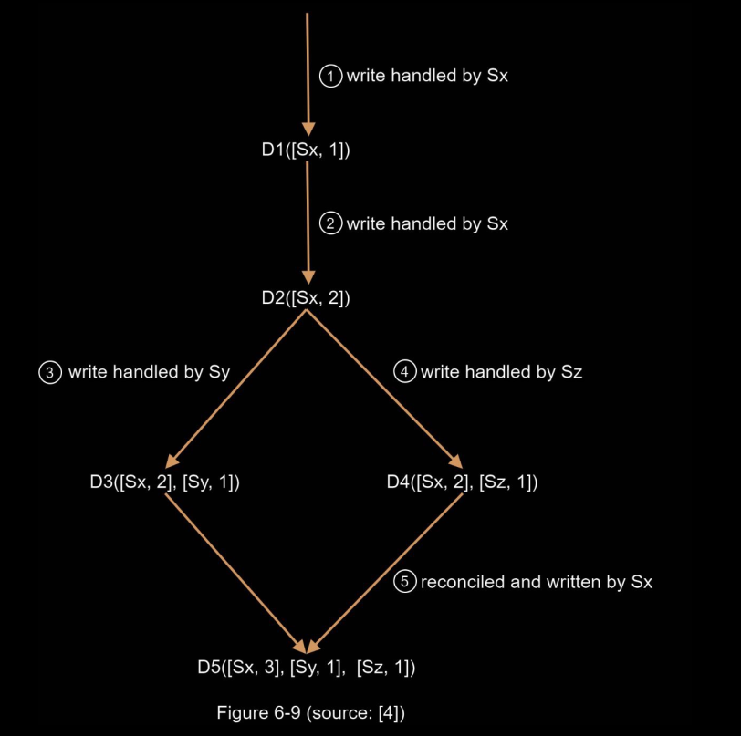

1. A client writes a data item D1 to the system, and the write is handled by server Sx, which now has the vector clock D1[(Sx, 1)].
2. Another client reads the latest D1, updates it to D2, and writes it back. D2 descends from D1 so it overwrites D1. Assume the write is handled by the same server Sx, which now has vector clock D2([Sx, 2]).
3. Another client reads the latest D2, updates it to D3, and writes it back. Assume the write is handled by server Sy, which now has vector clock D3([Sx, 2], [Sy, 1])).
4. Another client reads the latest D2, updates it to D4, and writes it back. Assume the writeis handled by server Sz, which now has D4([Sx, 2], [Sz, 1])).
5. When another client reads D3 and D4, it discovers a conflict, which is caused by data item D2 being modified by both Sy and Sz. 
6. The conflict is resolved by the client and updated data is sent to the server. 
7. Assume the write is handled by Sx, which now has D5([Sx, 3], [Sy, 1], [Sz, 1]).

Using vector clocks, it is easy to tell that a version X is an ancestor (i.e. no conflict) of version Y if the version counters for each participant in the vector clock of Y is greater than or equal to the ones in version X.
- For example, the vector clock D([s0, 1], [s1, 1])] is an ancestor of D([s0, 1], [s1, 2]). Therefore, no conflict is recorded.

Similarly, you can tell that a version X is a sibling (i.e., a conflict exists) of Y if there is any participant in Y's vector clock who has a counter that is less than its corresponding counter in X. 
- For example, the following two vector clocks indicate there is a conflict: 
    - D([s0, 1], [s1, 2]) and D([s0, 2], [s1, 1]).

Even though vector clocks can resolve conflicts, there are two notable downsides. 
1. First, vector clocks add complexity to the client because it needs to implement conflict resolution logic.
2. Second, the [server: version] pairs in the vector clock could grow rapidly. 
    - To fix this problem, we set a threshold for the length, and if it exceeds the limit, the oldest pairs are removed. 
    - This can lead to inefficiencies in reconciliation because the descendant relationship cannot be determined accurately. 
    - However, based on Dynamo paper [4], Amazon has not yet encountered this problem in production; therefore, it is probably an acceptable solution for most companies.

### Handling Failures

As with any large system at scale, failures are not only inevitable but common. Therefore, handling failure scenarios is very important.

#### Failure Detection

In a distributed system, it is insufficient to believe that a server is down because another server says so. Usually, it requires at least two independent sources of information to mark a server down.

##### All-to-All Multicasting

As shown in Figure 6-10, **all-to-all multicasting** is a straightforward solution. However, this is inefficient when many servers are in the system.

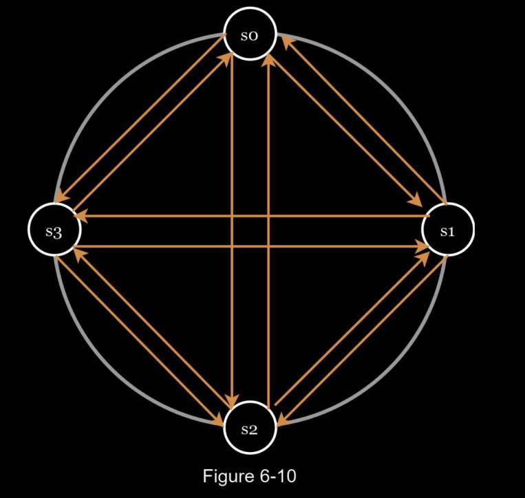

##### Gossip Control

A better solution is to use decentralized failure detection methods like **gossip protocol**.

Gossip protocol works as follows:
• Each node maintains a node membership list, which contains member IDs and heartbeat counters.
• Each node periodically increments its heartbeat counter.
• Each node periodically sends heartbeats to a set of random nodes, which in turn propagate to another set of nodes. 
• Once nodes receive heartbeats, membership list is updated to the latest info.
• If the heartbeat has not increased for more than predefined periods, the member is considered as offline.

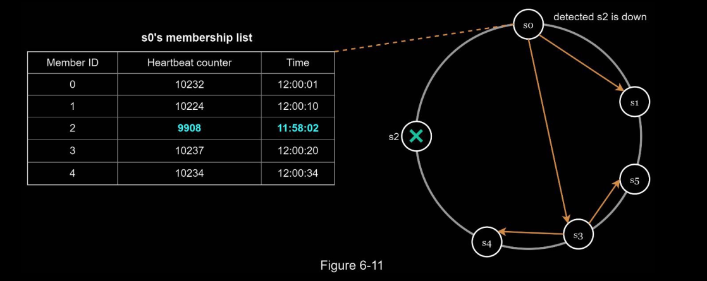

In the figure above:
• Node s0 maintains a node membership list shown on the left side.
• Node s0 notices that node s2’s (member ID = 2) heartbeat counter has not increased for a long time.
• Node s0 sends heartbeats that include s2’s info to a set of random nodes. 
    - Once other nodes confirm that s2’s heartbeat counter has not been updated for a long time, node s2 is marked down, and this information is propagated to other nodes.

#### Handling temporary failures

After failures have been detected through the gossip protocol, the system needs to deploy certain mechanisms to ensure availability. 

In the **strict quorum** approach, read and write operations could be blocked as illustrated in the quorum consensus section.

A technique called **“sloppy quorum”** is used to improve availability. Instead of enforcing the quorum requirement, the system chooses the first W healthy servers for writes and first R
healthy servers for reads on the hash ring. Offline servers are ignored.

If a server is unavailable due to network or server failures, another server will process requests temporarily.

When the down server is up, changes will be pushed back to achieve data consistency. 

This process is called **hinted handoff**. 

Since s2 is unavailable in Figure 6-12, reads and writes will be handled by s3 temporarily. When s2 comes back online, s3 will hand the data back to s2.

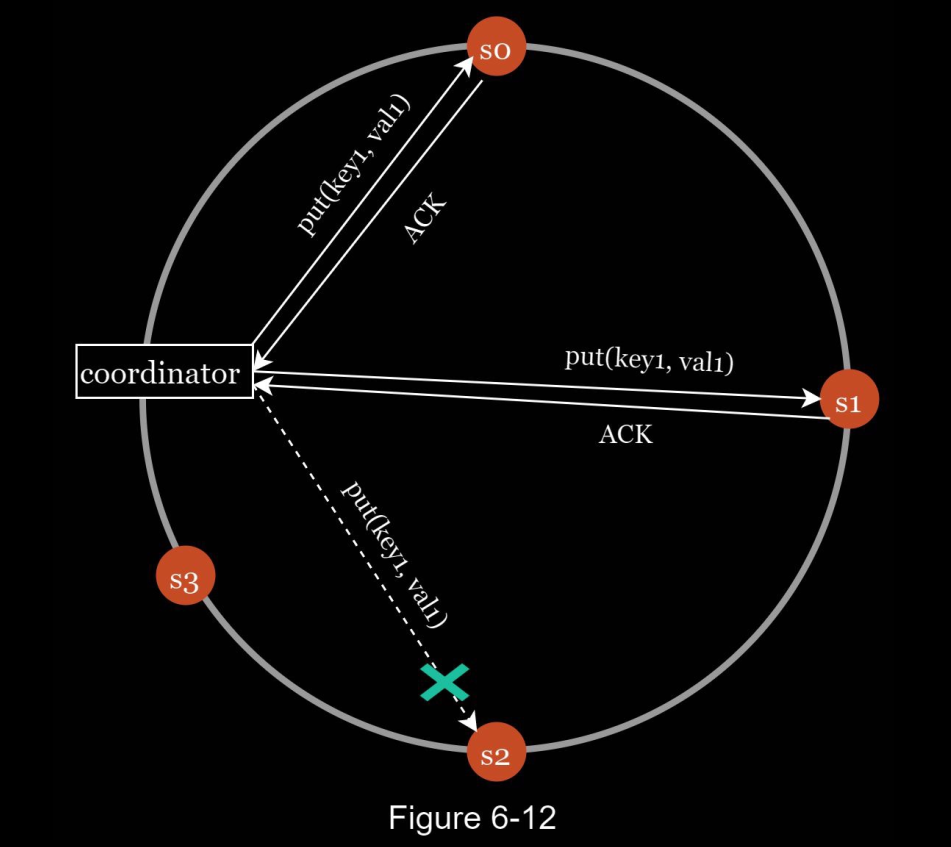

#### Handling permanent failures

Hinted handoff is used to handle temporary failures. 

What if a replica is permanently unavailable? To handle such a situation, we implement an **anti-entropy protocol** to keep replicas in sync. 

Anti-entropy involves comparing each piece of data on replicas and updating each replica to the newest version. 

#### Merkle Tree

A **Merkle tree** is used for inconsistency detection and minimizing the amount of data transferred.

Quoted from Wikipedia: “A hash tree or Merkle tree is a tree in which every non-leaf
node is labeled with the hash of the labels or values (in case of leaves) of its child nodes.
Hash trees allow efficient and secure verification of the contents of large data structures”.

##### Building a Merkle Tree

Assuming key space is from 1 to 12, the following steps show how to build a Merkle tree.

Highlighted boxes indicate inconsistency.
- Step 1: Divide key space into buckets (4 in our example) as shown in Figure 6-13. 
    - A bucket is used as the root level node to maintain a limited depth of the tree.

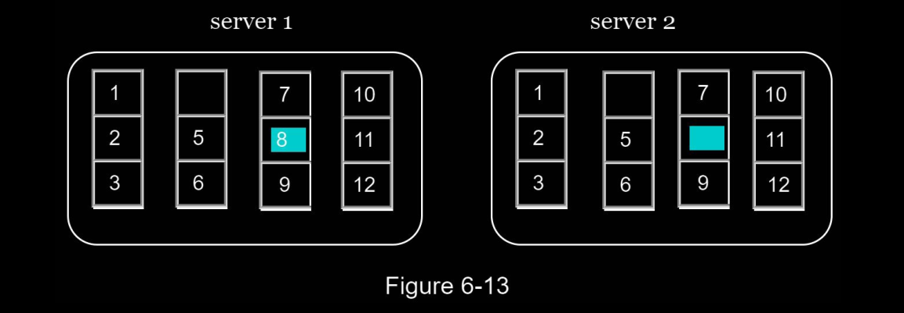

- Step 2: Once the buckets are created, hash each key in a bucket using a uniform hashing method (Figure 6-14).
 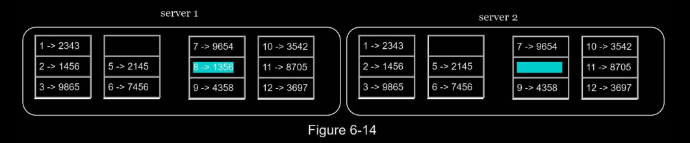

- Step 3: Create a single hash node per bucket (Figure 6-15).
 
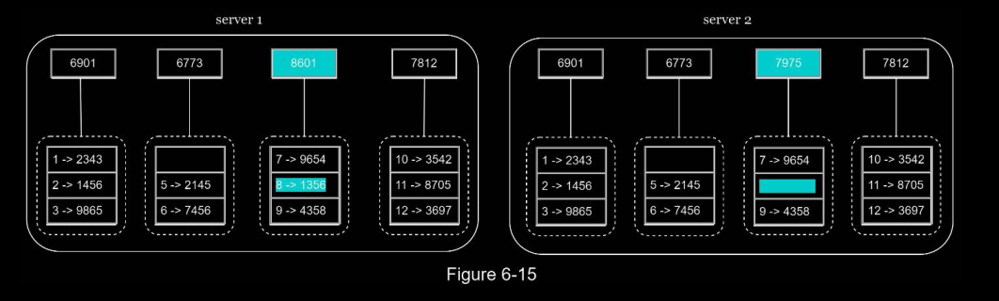

- Step 4: Build the tree upwards till root by calculating hashes of children (Figure 6-16).

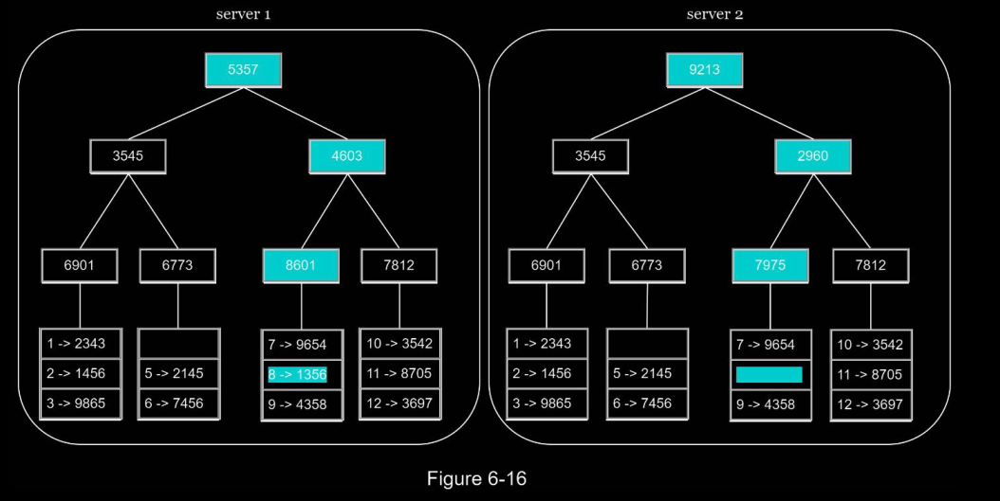

To compare two Merkle trees, start by comparing the root hashes. 

If root hashes match, both servers have the same data. 

If root hashes disagree, then the left child hashes are compared followed by right child hashes. 

You can traverse the tree to find which buckets are not synchronized and synchronize those buckets only.

Using Merkle trees, the amount of data needed to be synchronized is proportional to the differences between the two replicas , and not the amount of data they contain. 

In real-world systems, the bucket size is quite big. For instance, a possible configuration is one million
buckets per one billion keys, so each bucket only contains 1000 keys.

#### Handling data center outage

Data center outage could happen due to power outage, network outage, natural disaster, etc.
To build a system capable of handling data center outage, it is important to replicate data
across multiple data centers. Even if a data center is completely offline, users can still access
data through the other data centers.

### System architecture diagram

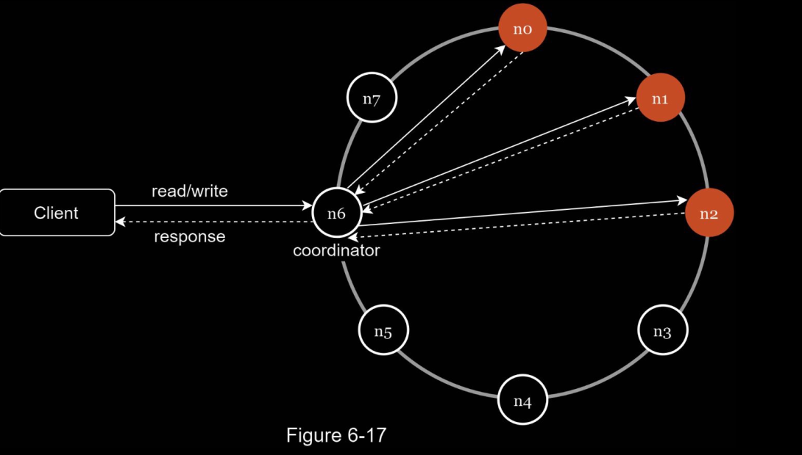

Main features of the architecture are listed as follows:
• Clients communicate with the key-value store through simple APIs: `get(key)` and `put(key,
value)`.
• A coordinator is a node that acts as a proxy between the client and the key-value store.
• Nodes are distributed on a ring using consistent hashing.
• The system is completely decentralized so adding and moving nodes can be automatic.
• Data is replicated at multiple nodes.
• There is no single point of failure as every node has the same set of responsibilities.

As the design is decentralized, each node performs many tasks as presented in Figure 6-18.

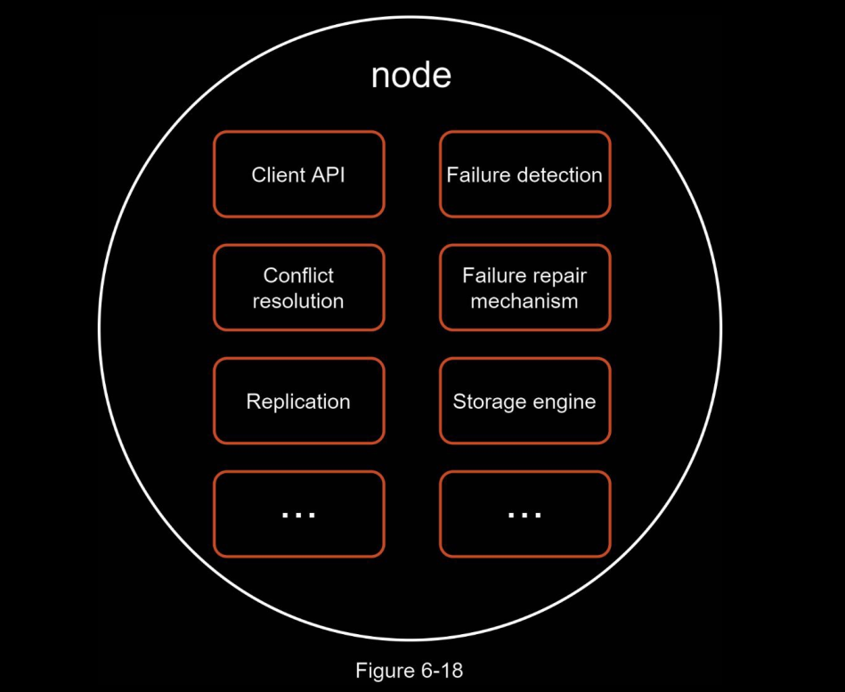

### Write Path

Figure 6-19 explains what happens after a write request is directed to a specific node. Please
note the proposed designs for write/read paths are primary based on the architecture of
Cassandra.

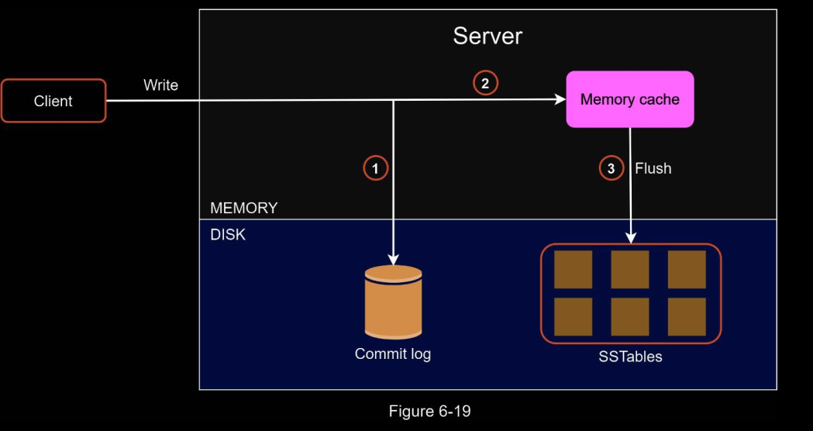

1. The write request is persisted on a commit log file.
2. Data is saved in the memory cache.3. When the memory cache is full or reaches a predefined threshold, data is flushed to SSTable on disk. Note: A sorted-string table (SSTable) is a sorted list of <key, value> pairs.

More on SSTable: https://www.igvita.com/2012/02/06/sstable-and-log-structured-storage-leveldb/

### Read Path

After a read request is directed to a specific node, it first checks if data is in the memory
cache. If so, the data is returned to the client as shown in Figure 6-20.

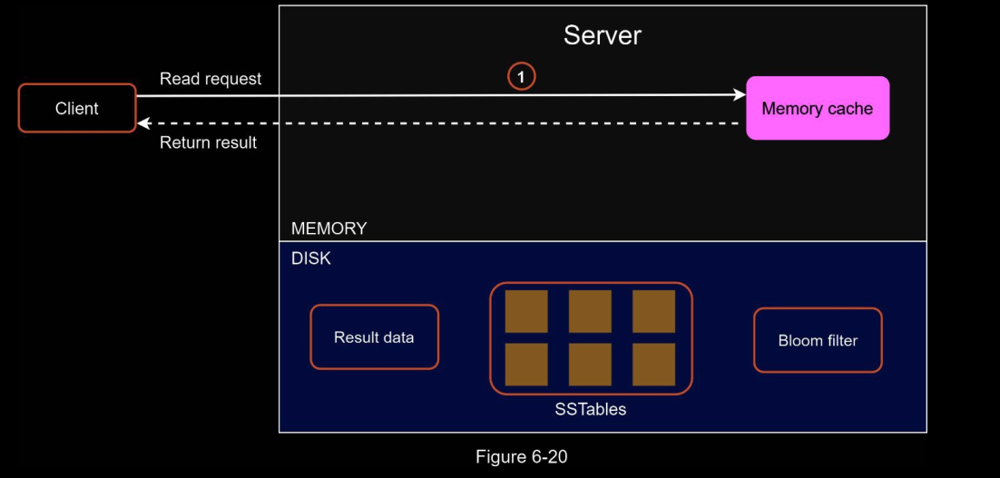

If the data is not in memory, it will be retrieved from the disk instead. We need an efficient
way to find out which SSTable contains the key. **Bloom filter** is commonly used to solve
this problem.

The read path is shown in Figure 6-21 when data is not in memory.

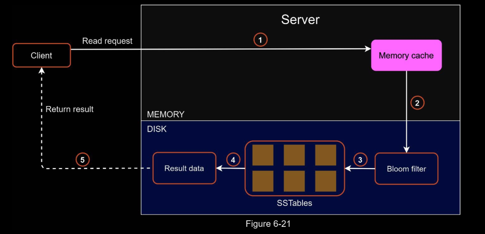

1. The system first checks if data is in memory. If not, go to step 2.
2. If data is not in memory, the system checks the bloom filter.3. The bloom filter is used to figure out which SSTables might contain the key.
4. SSTables return the result of the data set.
5. The result of the data set is returned to the client.

---

## Summary 

The following table summarizes features and corresponding techniques used for a distributed key-value
store.

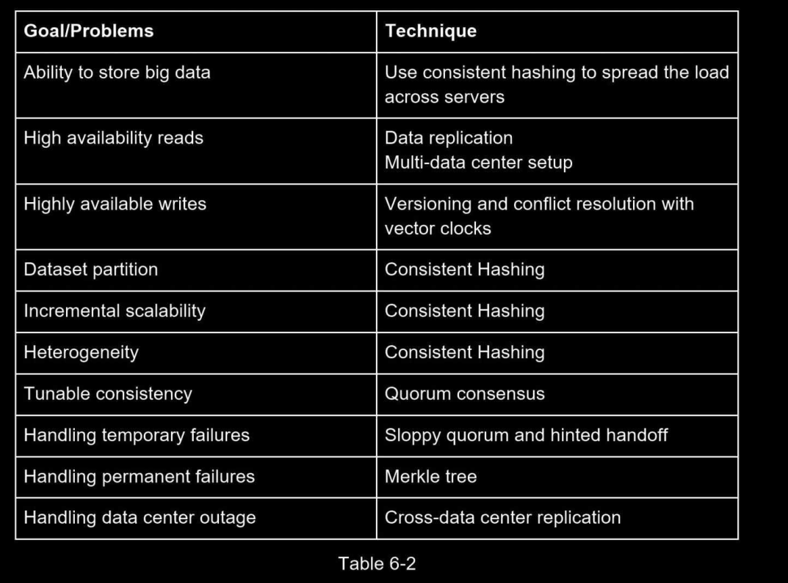
