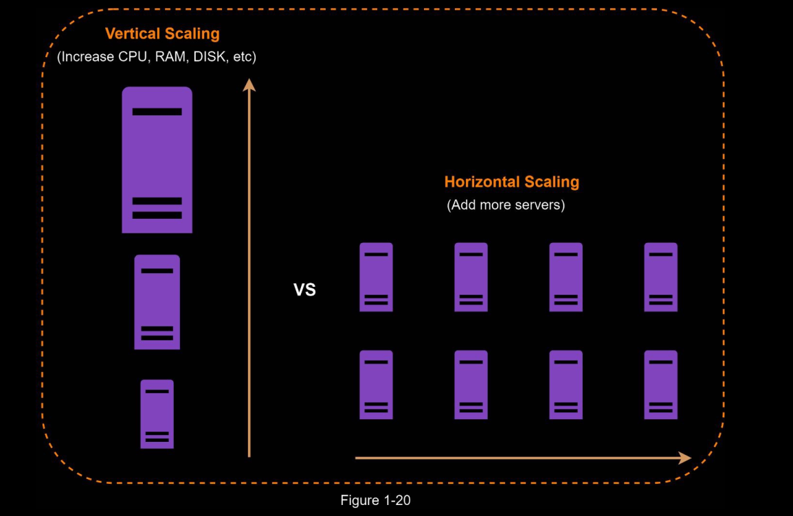
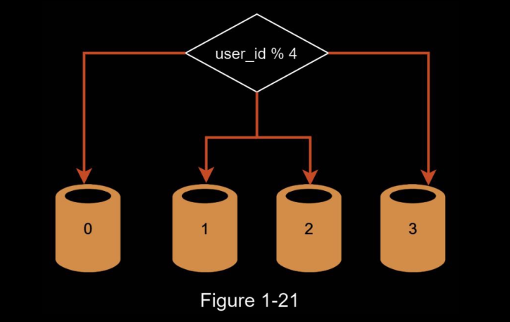

# Database Scaling

There are two broad approaches for database scaling: vertical scaling and horizontal scaling.

## Vertical scaling

Vertical scaling, also known as scaling up, is the scaling by adding more power (CPU, RAM,
DISK, etc.) to an existing machine.

Disadvantages

- You can add more CPU, RAM, etc. to your database server, but there are hardware
limits. If you have a large user base, a single server is not enough.
- Greater risk of single point of failures.
- The overall cost of vertical scaling is high. Powerful servers are much more expensive.

## Horizontal scaling (Sharding)

Horizontal scaling, also known as sharding, is the practice of adding more servers.

Sharding separates large databases into smaller, more easily managed parts called shards.
Each shard shares the same schema, though the actual data on each shard is unique to the
shard.

### Sharding Strategy

The most important factor to consider when implementing a sharding strategy is the choice of
the sharding key. Sharding key (known as a partition key) consists of one or more columns
that determine how data is distributed. As shown in Figure 1-22, “user_id” is the sharding
key.

When choosing a sharding key, one of the most importantcriteria is to choose a key that can evenly distributed data.

Complexities and Challenges: 

- **Resharding data:** Resharding data is needed when 1) a single shard could no longer hold
more data due to rapid growth. 2) Certain shards might experience shard exhaustion faster
than others due to uneven data distribution. When shard exhaustion happens, it requires
updating the sharding function and moving data around.

- **Celebrity problem**: This is also called a hotspot key problem. Excessive access to a specific
shard could cause server overload. Imagine data for Katy Perry, Justin Bieber, and Lady
Gaga all end up on the same shard. For social applications, that shard will be overwhelmed
with read operations. To solve this problem, we may need to allocate a shard for each
celebrity. Each shard might even require further partition.

- **Join and de-normalization**: Once a database has been sharded across multiple servers, it is
hard to perform join operations across database shards. A common workaround is to de-
normalize the database so that queries can be performed in a single table.