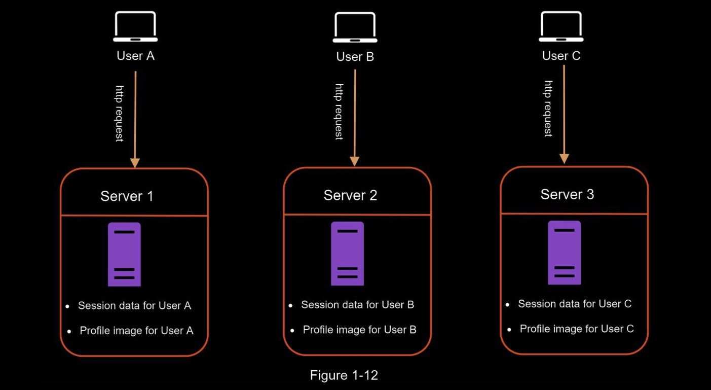
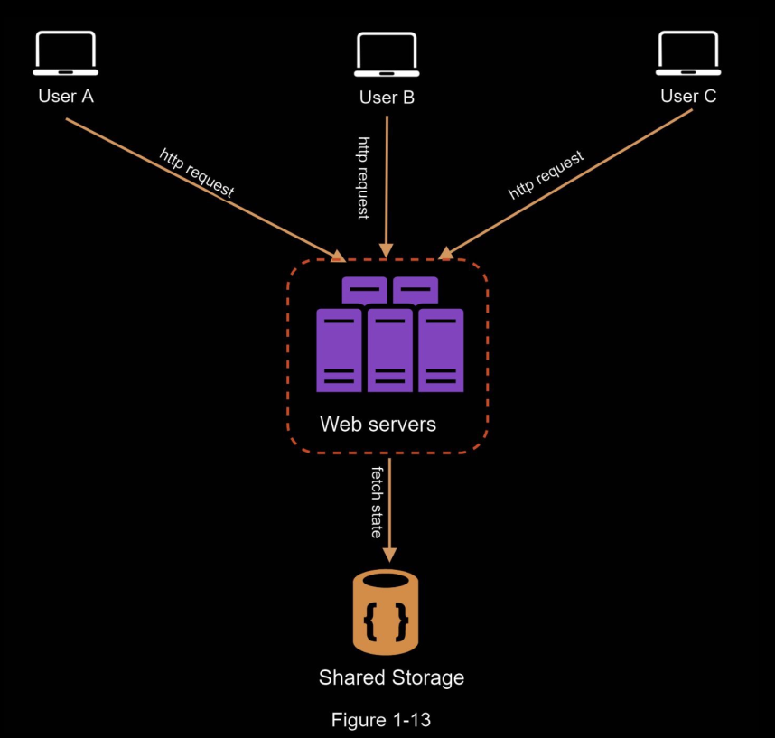
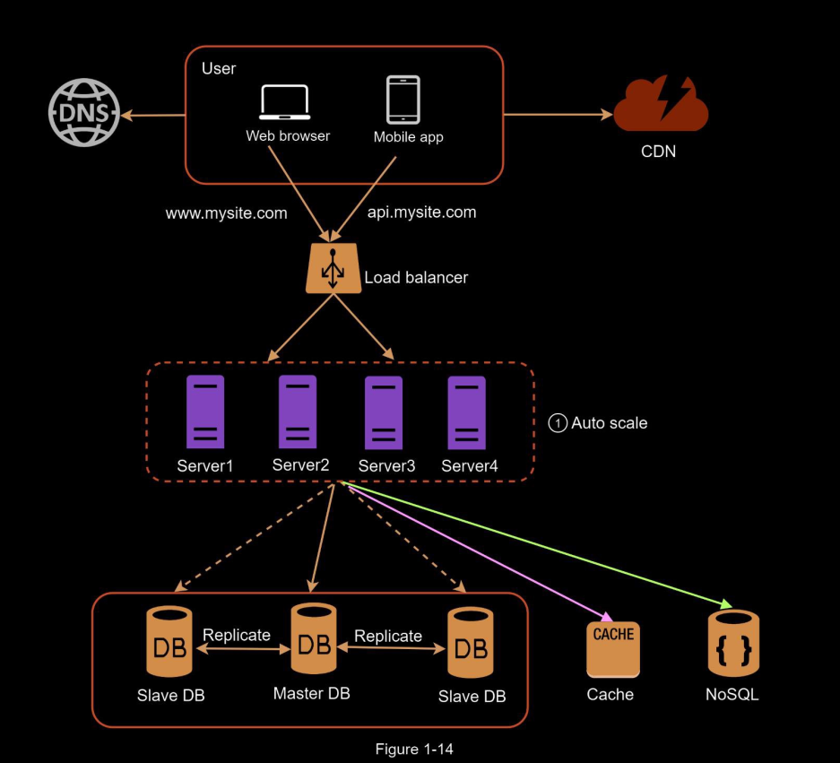

# Stateful vs Stateless web architecture

A stateful server remembers client data (state) from one request to the next. 

A stateless server keeps no state information.

## Stateless web tier
Now it is time to consider scaling the web tier horizontally. For this, we need to move state
(for instance user session data) out of the web tier. A good practice is to store session data in
the persistent storage such as relational database or NoSQL. Each web server in the cluster
can access state data from databases. This is called stateless web tier.

--- 

### Stateful Architecture

In the above diagram, all of User A's request must be routed to Server 1, because Server 2 and Server 3 do not have the session state for that user.

The issue is that every request from the same client must be routed to the same server.
    - This can be done with sticky sessions in most load balancers; 
    - however, this adds the overhead.
    -  Adding or removing servers is much more difficult with this approach. 
    -  It is also challenging to handle server failures.

### Stateless Architecture

In this stateless architecture, HTTP requests from users can be sent to any web servers, which
fetch state data from a shared data store. State data is stored in a shared data store and kept
out of web servers. A stateless system is simpler, more robust, and scalable.

---

In Figure 1-14, we move the session data out of the web tier and store them in the persistent
data store. The shared data store could be a relational database, Memcached/Redis, NoSQL,
etc. The NoSQL data store is chosen as it is easy to scale.

After the state data is removed out of web servers, auto-scaling of the web tier is easily achieved by adding or removing servers based on traffic load.