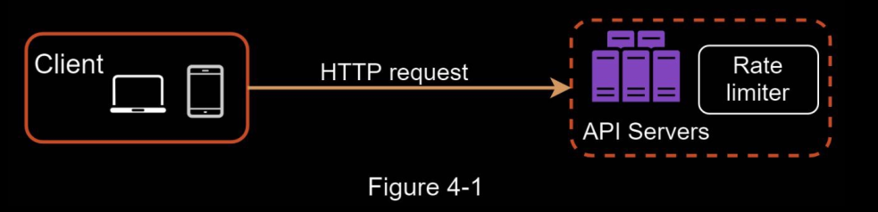
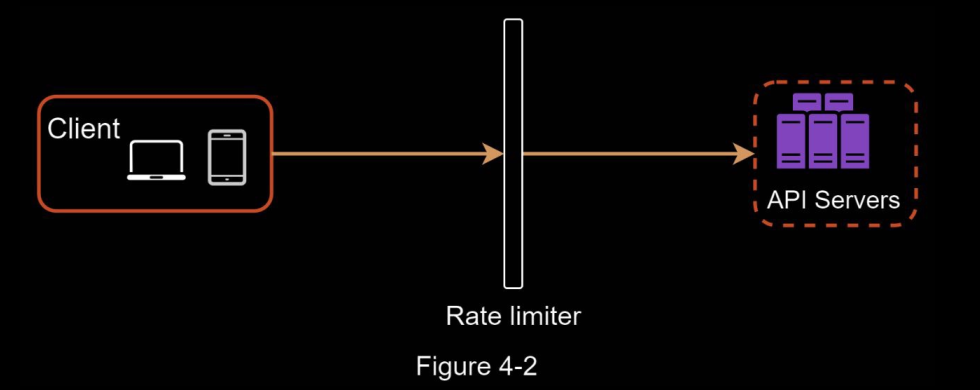
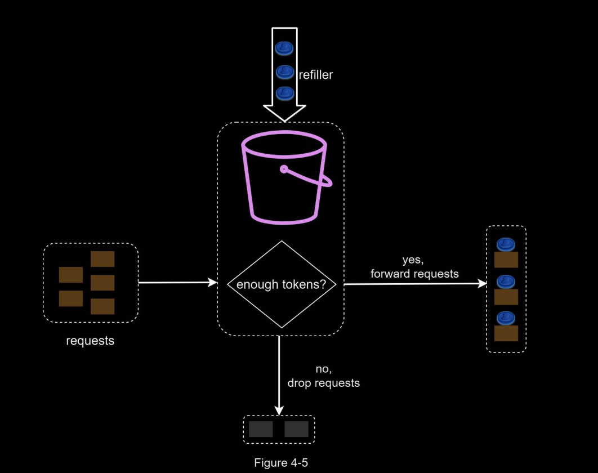
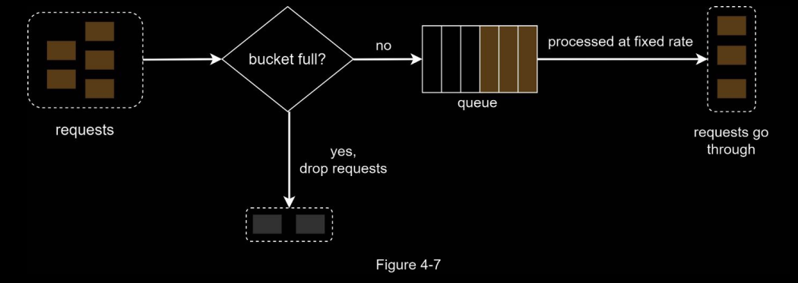

# Design an API Rate Limitter

Rate Limiters block extra requests that are above a particular threshold, and returh `429` HTTP status, with a __ header.

Benefits: 
1. Prevent resource starvation caused by Denial of Service (DoS) attacks
2. Reduce cost: 
    - Limiting excess requests means fewer servers and allocating more resources to high priority APIs. 
    - Rate limiting is extremely important for companies that use paid third party APIs. 
    - For example, you are charged on a per-call basis for the following external APIs: check credit, make a payment, retrieve health records, etc.
3. Prevent servers from being overloaded.

### Where to put the Rate Limitter

- Client side: Generally speaking, client is an unreliable place to enforce rate limiting because client requests can easily be forged by malicious actors.
- Server-side: 
    - As part of the server
        - 
    - In Front of the server as a middleware: 
        - 
    - Cloud Rate-limiting Microservices: 
        - Cloud microservices have become widely popular and rate limiting is usually implemented within a component called API gateway. 
        - API gateway is a fully managed service that supports rate limiting, SSL termination, authentication, IP whitelisting, servicing static content, etc.

---

## Algorithms

• Token bucket
• Leaking bucket
• Fixed window counter
• Sliding window log
• Sliding window counter

### Token Bucket

- Widely used
- Simple
- Well understood

**Algorithm**

- A token bucket is a container that has predefined capacity
- Tokens are placed in the bucket periodically at preset rate
- Once the bucket is full, no more tokens are added
- Each request consumes 1 token
- When a request arrives, we check if there are enough tokens
    - If there >= 1 token, the request goes through
    - If not, the request is dropped

The token bucket algo takes two parameters: 
1. Bucket size: the max number of tokens allowed in the bucket.
2. Refill rate: Number of tokens put into the bucket every second

#### How many buckets do we need

Varies and depends on rate-limiting rules. Examples: 

- It is usually necessary to have different buckets for different API endpoints.
    - For instance, 
     - if a user is allowed to make 1 post per second, add 150 friends per day, and like 5 posts per second, 3 buckets are required for each user.
- If we need to throttle requests based on IP addresses, each IP address requires a bucket.
- If the system allows a maximum of 10,000 requests per second, it makes sense to have a global bucket shared by all requests

#### Pros & Cons

Pros:
- The algorithm is easy to implement.
- Memory efficient.
- Token bucket allows a burst of traffic for short periods. A request can go through as long as there are tokens left.

Cons:
- Two parameters in the algorithm are bucket size and token refill rate. However, it might be challenging to tune them properly.

---

### Leaking Bucket

The leaking bucket algorithm is similar to the token bucket except that requests are processed
at a fixed rate.

It is usually implemented with a first-in-first-out (FIFO) queue.

Algo: 

- When a request arrives, the system checks if the queue is full. 
- If it is not full, the request is added to the queue.
- Otherwise, the request is dropped.
- Requests are pulled from the queue and processed at regular intervals.

Parameters: 

1. Bucket size
    - queue size
3. Outflow Rate: 
    - it defines how many requests can be processed at a fixed rate, usually in seconds. 

#### Pros & Cons 

Pros:
- Memory efficient given the limited queue size.
- Requests are processed at a fixed rate therefore it is suitable for use cases that a stable outflow rate is needed.

Cons:
- A burst of traffic fills up the queue with old requests, and if they are not processed in time, recent requests will be rate limited.
- There are two parameters in the algorithm. It might not be easy to tune them properly.