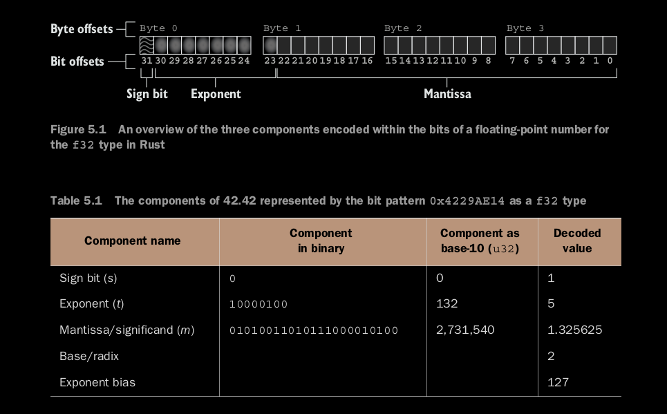

# Numbers

## Endianness

CPUs order multi-byte sequences Left to Right, or Right to Left - this is called **endianness**

Note that endianness is usually understood to be at mutiple byte level, for a single byte it is called *bit numbering*


Example of Endianness: 
    - `big_endian: [u8; 4] = [0xAA, 0xBB, 0xCC, 0xDD];` equal to -573785174
    - `little endian: [u8; 4] = [0xDD, 0xCC, 0xBB, 0xAA];` equal to -1430532899

The endianness terminology comes from the significance of the bytes in the sequence: 
    - Big Endian  = MSB end first = 2^n, 2^n - 1 ... 2^0
    - Little Endian = LSB end first = 2^0, 2^1, 2^2 .... 2^n

Example of bit endianness / bit numbering: 
    - `3` can be represented as: 
        - 0000_0011 - big endian
        - 1100_0000 - little endian
        
        
## Floating point numbers

Each floating point number is laid out in memory as scientific notation. e.g 1.898 x 10^27

Each position within a number in scientific notation is given a role:
    - A _sign_
    - The _mantissa_ aka significand e.g. 1.898
    - The _radix_ aka base, e.g. 10
    - The _exponent_ e.g. 27

A floating point value is a container with 3 fields: 
    - A sign bit
    - An exponent
    - A Mantissa
    - while the radix/base is fixed as 2


### Inside a floating point

42.42 as f32 is represented in memory by the bit pattern: 01000010001010011010111000010111




The equation to decode the fields of a floating-point number into a single number.

n = -1 ^ (sign_bit) x mantissa x Radix ^ (exponent - Bias)
n = -1 ^ 0 x 1.325625 x (2^5)
n = 42.42

### Quirks

One quirk of the floating-point numbers is that their sign bits allow for both 0 and -0

We have two bit patterns compare as equal 0 and -0

and we have identical bit patterns (NAN values) that compare as unequal


### Isolating the sign bit

Since sign bit is first, in f32 shift the number 31 places to the right

```rust
let n: f32 = 42.42;
let n_bits: u32 = n.to_bits();
let sign_bit = n_bits >> 31;
```

### Isolating the exponent

1. Perform right shift to overwrite/remove the mantissa's bits (>> 23)
    - 9 bits remain
2. then use AND mask (& 0xFF) to exclude the sign bit
    - 0xff = xyyy_yyyy AND 01111_1111 = yyyy_yyyy
3. Subtract the Bias = 127

```rust
let exponent = n_bits >> 23;
let exponent = exponent & 0xff;
let exponent = (exponent as i32) - 127; // subtracting the bias
```

### Isolating the mantissa

We could follow the same method for exponent and AND mask the sign bit and exponent with 0x7FFFFF, it's unnecessary because the next step, decoding, ignores 0 bits as irrelevant, so we don't need to do any AND masking as the decoding step also takes care of it.

To decode the mantissa, multiply each bit by its weight and sum the result.
    - the first bit's weight is 0.5
    - and each subsequent bit's weight is half of the current weight
        - e.g. 0.5 (2^-1), 0.25 (2^-2), .... , (2^-23)
    - the implicit 24th bit has the weight 1.0 (2^0) and is always supposed to be on, unless special cases: 

Special cases
1. When exponent is all 0's
    - then mantissa changes to represent subnormal numbers
    - subnormal number is between 0 and the smallest number that the normal behaviour would otherwise be able to represent.
2. When the exponent is all 1's
    - then the decimal number is infinity, negative infinity, or NAN

```rust
let n: f32 = 42.42;
let n_bits: u32 = n.to_bits();
let mut mantissa: f32 = 1.0; // starting with 1 which represents 24th bit

for i in 0..23 {
    let mask = 1 << i // 1 2 4 8 16 powers of 2
    let one_at_bit_i = n_bits & mask;
    if one_at_bit_i != 0 {
        let i = i as f32;
        let weight = 2_f32.powf(i - 23.0); // weight is 2i^(-23)
        mantissa += weight;
    }
}
```

