# Jakob Neilsen's 10 principles for interaction design

1. Ensure Visibility of System Status
2. Match b/w System & the real world
3. Give User control and freedom
4. Maintain consistency & standards
5. Error prevention
6. Promote recognition rather than recall
7. Create flexibility & efficiency of use
8. Aesthetic & minimalist design
9. Help users recognize, diagnose & recover from errors
10. Help and documentation

—

## 1. Ensure visibility of System Status

Users should be informed about what is going on through timely feedback.

**Build trust with users** by setting accurate expectations

When users are suprised with unpleasant experiences, they become frustrated and lost trust in the sytem.

Progress bars, spinners and status messages are some design elements that help communicate status to the user.

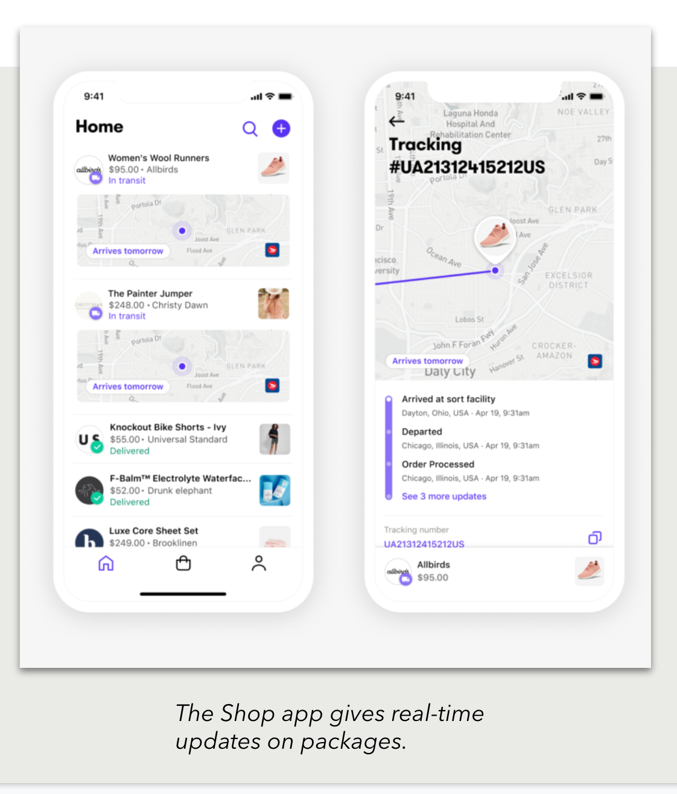
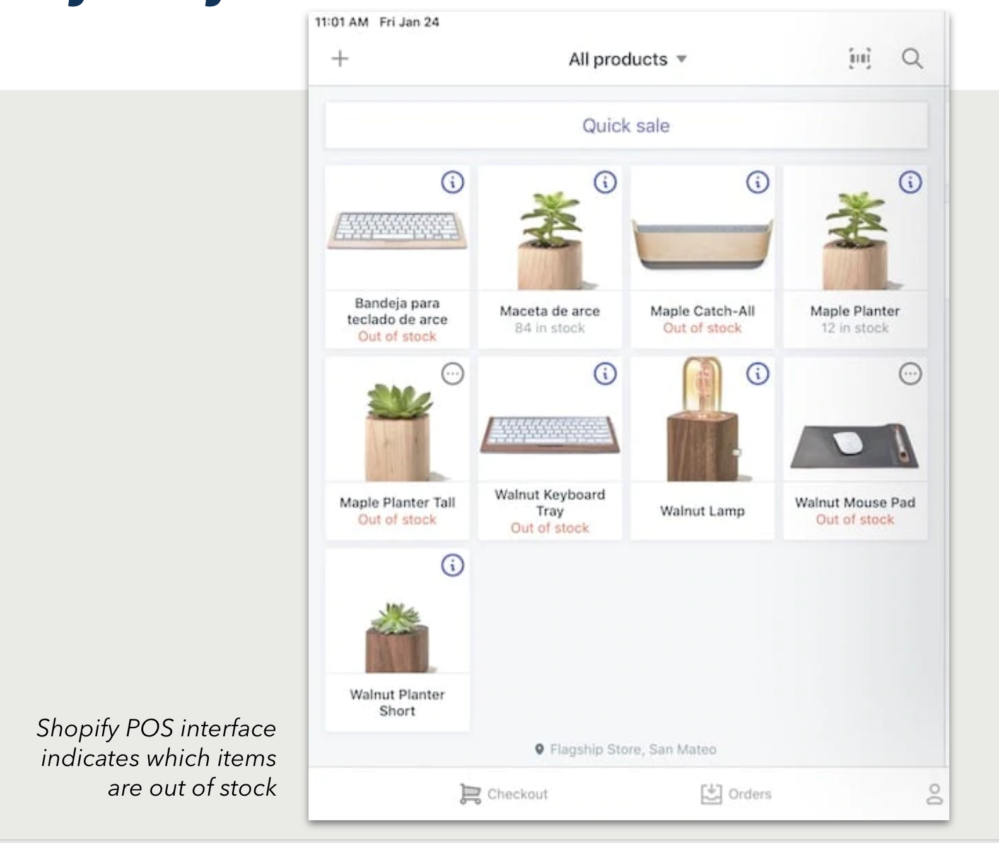

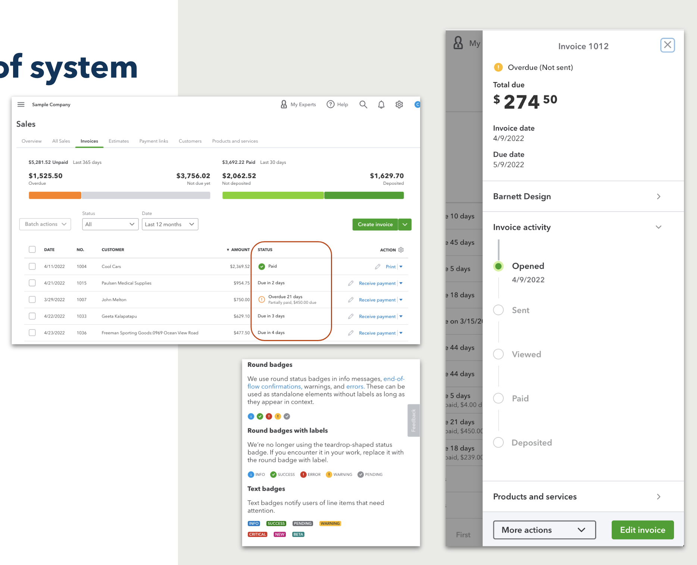

—

## 2. Match b/w system & the real world

Information should appear in a natural and logical order

Our products should speak the user's language

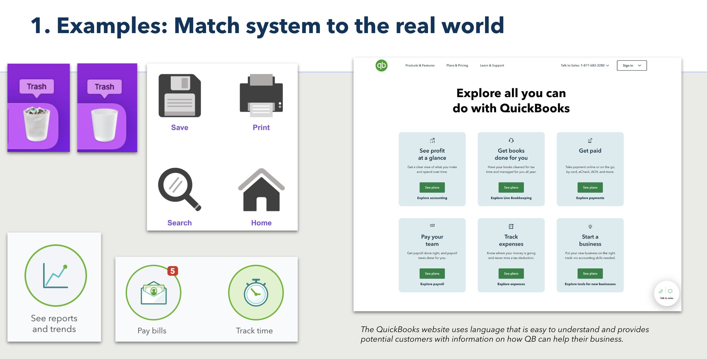

—

## 3. Give User control and freedom

Users make mistakes. They need clear "exits" which aloow users to remain in control and avoid getting stuck and feeling frustrated.

When it's easy for people to undo an action or fix an error, it fosters a sense of freedom and confidence.

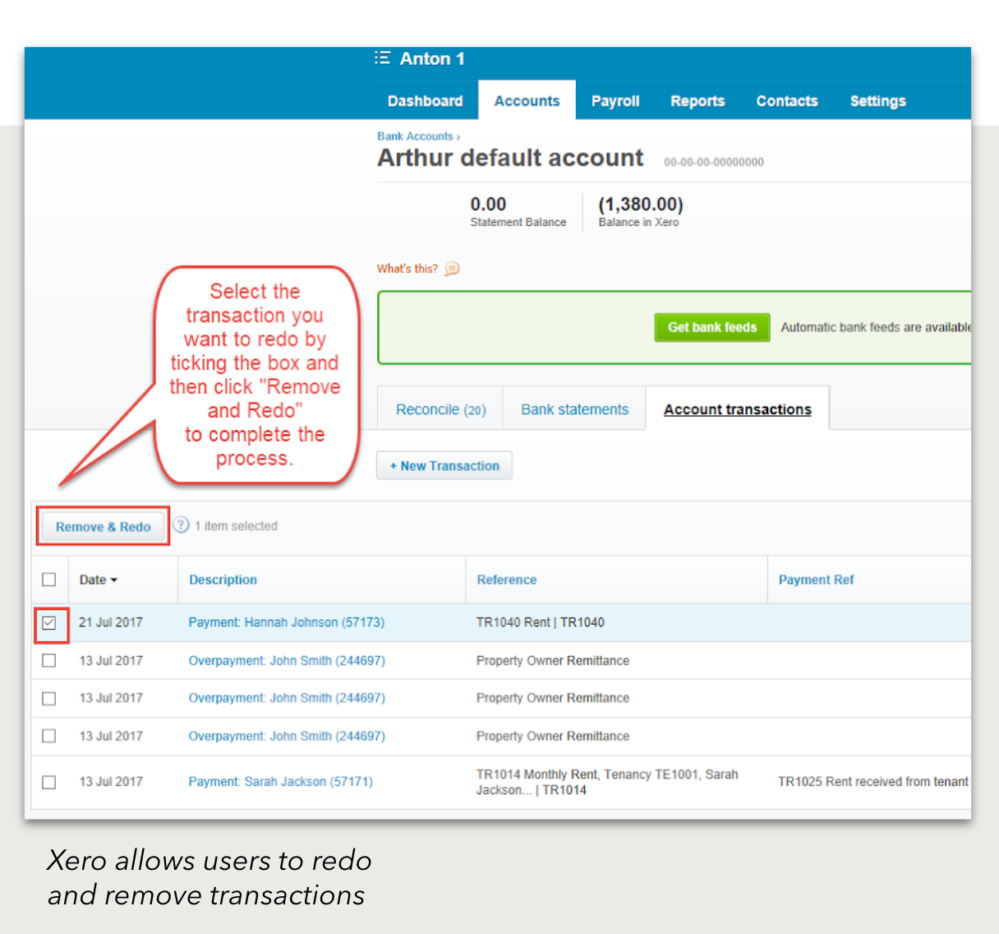

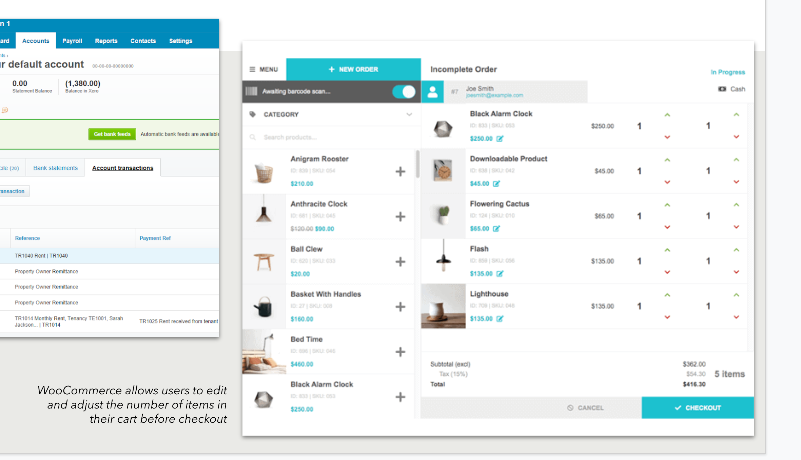

—

## 4. Maintain consistency & standards

When interfaces adhere to standards, users know what to expect, can learn how an interface works, and are less likely to be confused.

Failing to maintain consistency increases the user's congnitive load by forcing them to learn something new

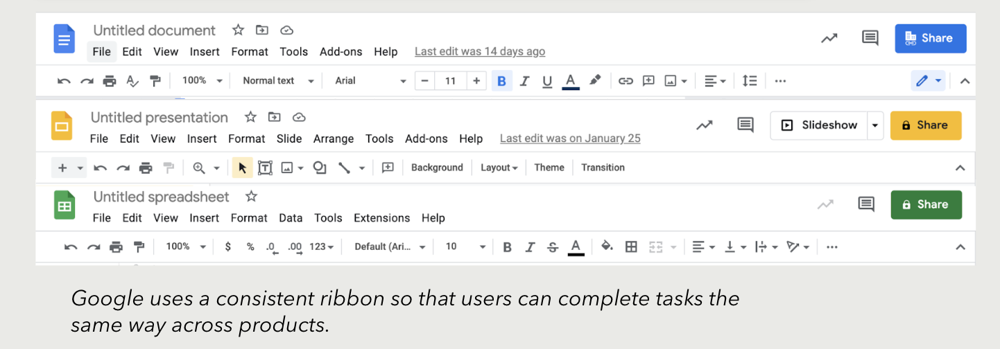

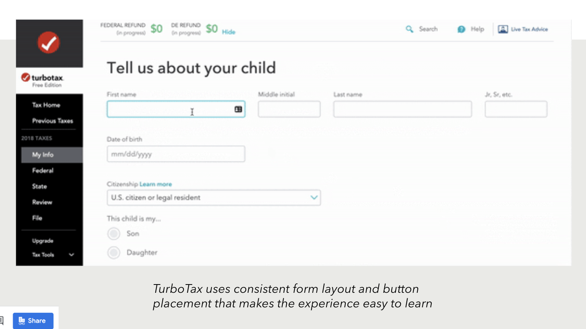

—

## 5. Prevent errors

Good error messages are important, but the best designs prevent errors from occuring.

Eliminate error-prone conditions or present users with a confirmation option before they commit to the action

There are two types of errors: 
    - **Slips**: are unconscious errors caused by inattention
    - **Mistakes**: are conscious errors based on mismatch between the user's mental model and the design

Status messages are a great way to communicate suggestions and information to users

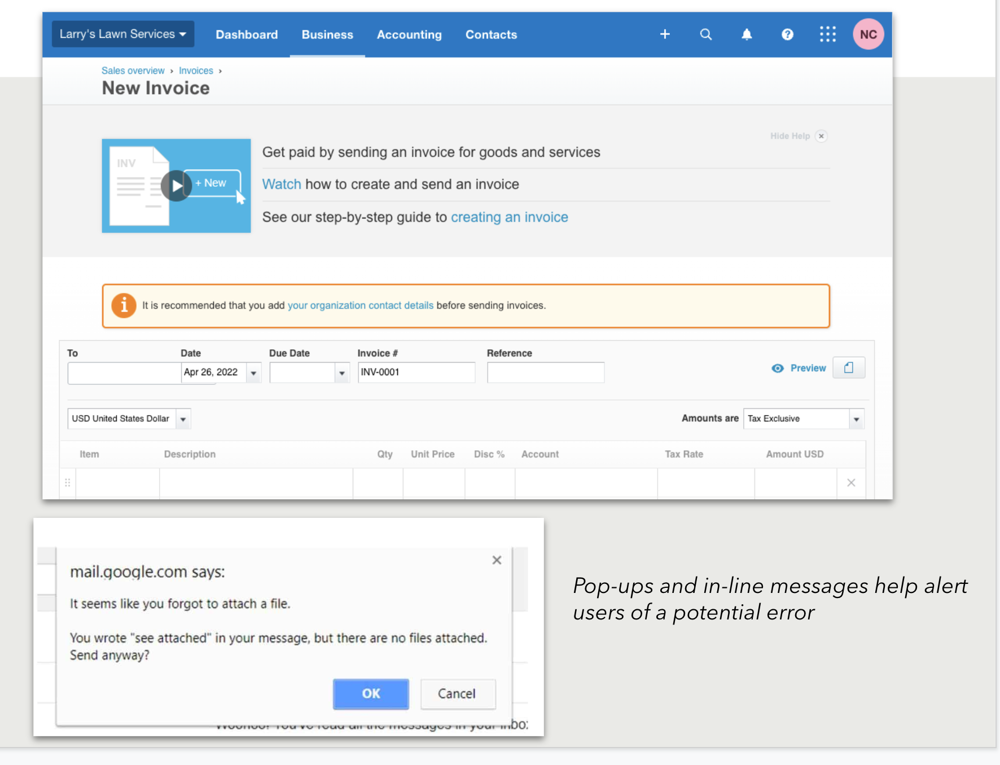

—

## 6. Promote recognition rather than recall

Our short term memory is limited.

Users should not have to rememeber (recall) information from one part of the interface to another

Interfaces should promote recognition, which reduces cognitive load.

Information required to use the interface (e.g. field labels or menu items) should be visible or easily retrievable when needed.

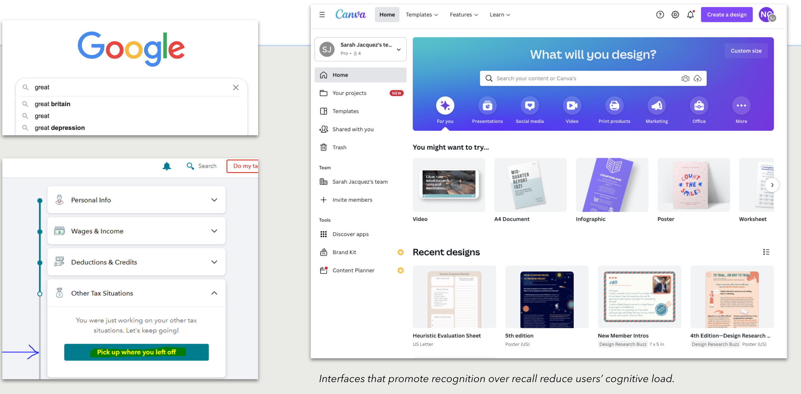

— 

## 7. Create flexibility and efficiency of use

Create shortcuts for experienced users to speed up their processes.

Allow users to save/edit frequent actions

Create flexible processes so users can take whatever path is most convenient for them.

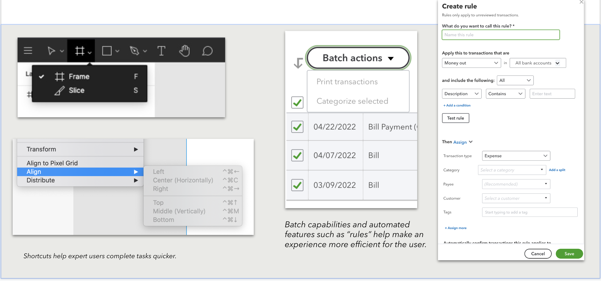

—

## 8. Aesthetic and minimalist design

Keep content and visual design focused on the essentials

Remove irrelevant information

Elements should be aligned and grouped

Do the visual elements support the user's primary goals?

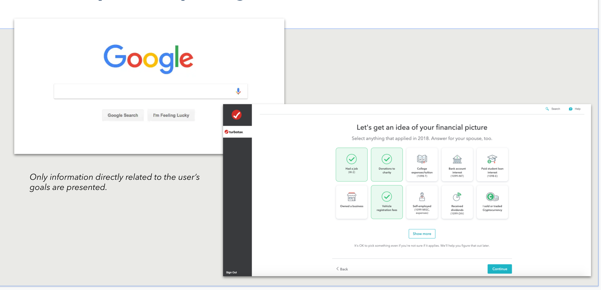

— 

## 9. Help users recognize, diagnose & recover from errors

Error messages should: 
- be in plain english language (no error codes)
- Precisely indicate the problem
- Constructively suggest a solution

These error messages should also be presented with visual treatments that will help users notice and recognize them.

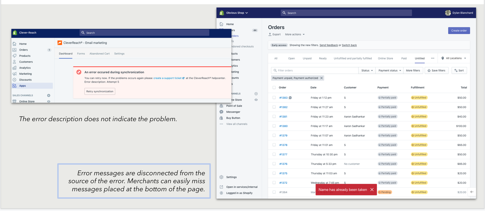

—

## 10. Provide discoverable help & documentation

Provide documentation to help users undestand how to complete their tasks

Help documentation should be easy to search and focused on the user's task

Keep it concise, list concrete steps that need to be carried out.

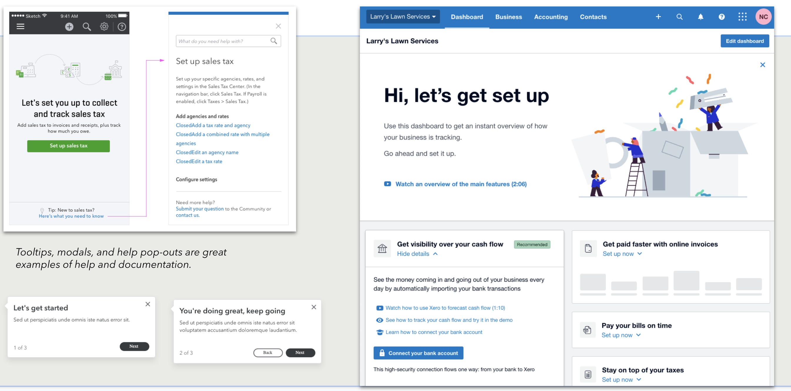
