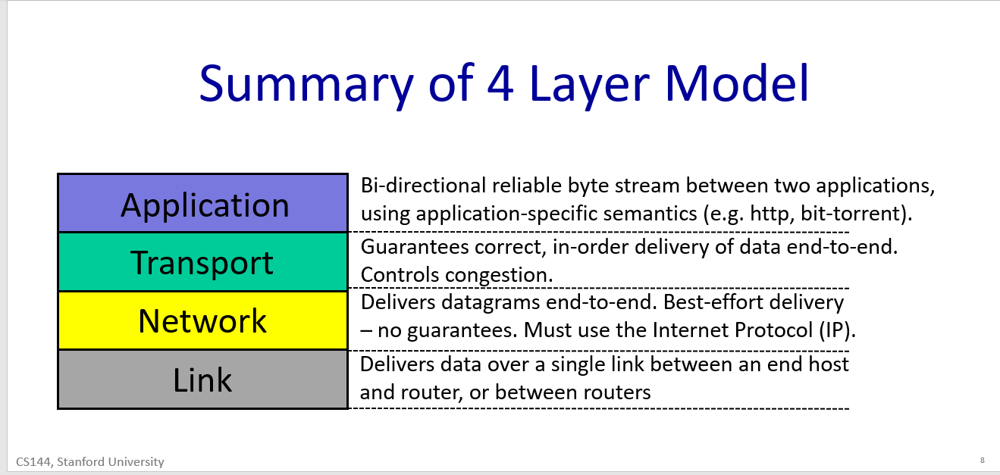
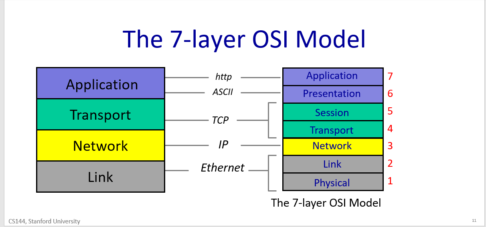

# Computer Networks

## High-level view of the internet

The Internet is a computer network that interconnects billions of computing devices throughout the world.

In Internet jargon, all of these devices are called hosts or end systems.

End systems are connected together by a network of communication links and packet switches

there are many types of communica-tion links, which are made up of different types of physical media, including coaxial cable, copper wire, optical fiber, and radio spectrum

Different links can transmit data at different rates, with the transmission rate of a link measured in bits/second.

When one end system has data to send to another end system, the sending end system segments the data and adds header bytes to each segment. The resulting packages of information, known as packets in the jargon of computer networks, are then sent through the network to the destination end system, where they are reassembled into the original data.

A packet switch takes a packet arriving on one of its incoming communication links and forwards that packet on one of its outgoing communication links. Packet switches come in many shapes and flavors, but the two most prominent types in today’s Internet are routers and link-layer switches.

Link-layer switches are typically used in access networks, while routers are typically used in the network core. The sequence of communication links and packet switches traversed by a packet from the sending end system to the receiving end system is known as a route or path.

packets are analogous to trucks, communication links are analogous to highways and roads, packet switches are analogous to intersections, and end systems are analogous to buildings. Just as a truck takes a path through the transportation network, a packet takes a path through a computer network.

End systems, packet switches, and other pieces of the Internet run protocols that control the sending and receiving of information within the Internet. The Transmission Control Protocol (TCP) and the Internet Protocol (IP) are two of the most impor-tant protocols in the Internet. The IP protocol specifies the format of the packets that are sent and received among routers and end systems. The Internet’s principal protocols are collectively known as TCP/IP.

End systems attached to the Internet provide a **socket interface** that specifies how a program running on one end system asks the Internet infrastructure to deliver data to a specific destination program running on another end system. This Internet socket interface is a set of rules that the sending program must follow so that the Internet can deliver the data to the destination program.

Suppose Alice wants to send a letter to Bob using the postal service. Alice, of course, can’t just write the letter (the data) and drop the letter out her window. Instead, the postal service requires that Alice put the letter in an envelope; write Bob’s full name, address, and zip code in the center of the envelope; seal the envelope; put a stamp in the upper-right-hand corner of the enve-lope; and finally, drop the envelope into an official postal service mailbox. Thus, the postal service has its own “postal service interface,” or set of rules, that Alice must follow to have the postal service deliver her letter to Bob. In a similar manner, the Internet has a socket interface that the program sending data must follow to have the Internet deliver the data to the program that will receive the data.

### Internet Protocols

- A protocol defines the format and the order of messages exchanged between two or more communicating entities, as well as the actions taken on the transmission and/or receipt of a message or other event.

- The Internet, and computer networks in general, make extensive use of pro-tocols. Different protocols are used to accomplish different communication tasks.

### End Systems or hosts (the network edge)

- The Internet’s end systems include desktop computers (e.g., desktop PCs, Macs, and Linux boxes), servers (e.g., Web and e-mail servers), and mobile devices (e.g., laptops, smartphones, and tablets). Furthermore, an increasing number of non-traditional “things” are being attached to the Internet as end systems.

- End systems are also referred to as hosts because they host (that is, run) application programs such as a Web browser program, a Web server program, an e-mail client program, or an e-mail server program.

- Hosts are sometimes further divided into two categories: clients and servers. Informally, cli-ents tend to be desktop and mobile PCs, smartphones, and so on, whereas serv-ers tend to be more powerful machines that store and distribute Web pages, stream video, relay e-mail, and so on. Today, most of the servers from which we receive search results, e-mail, Web pages, and videos reside in large data centers.

### Access Networks

- the network that physically connects an end system to the first router (also known as the “edge router”) on a path from the end system to any other distant end system

### Packet Switching

To send a message from a source end system to a destination end system, the source breaks long messages into smaller chunks of data known as packets. Between source and destination, each packet travels through communication links and packet switches (for which there are two predominant types, routers and link-layer switches). Packets are transmitted over each communication link at a rate
equal to the full transmission rate of the link. So, if a source end system or a packet
switch is sending a packet of L bits over a link with transmission rate R bits/sec, then
the time to transmit the packet is L / R seconds.

### Store-and-Forward Transmission

Most packet switches use store-and-forward transmission at the inputs to the
links. Store-and-forward transmission means that the packet switch must receive
the entire packet before it can begin to transmit the first bit of the packet onto the
outbound link

Let’s now consider the general case of sending one packet from source to destination over a path consisting of N links each of rate R (thus, there are N-1 routers
between source and destination). Applying the same logic as above, we see that the
end-to-end delay is:
delay = N \* L / R

### Queuing Delays and Packet Loss

Each packet switch has multiple links attached to it. For each attached link, the
packet switch has an output buffer (also called an output queue), which stores
packets that the router is about to send into that link. The output buffers play a key
role in packet switching. If an arriving packet needs to be transmitted onto a link but
finds the link busy with the transmission of another packet, the arriving packet must
wait in the output buffer. Thus, in addition to the store-and-forward delays, packets
suffer output buffer queuing delays. These delays are variable and depend on the
level of congestion in the network. Since the amount of buffer space is finite, an arriving packet may find that the buffer is completely full with other packets waiting
for transmission. In this case, packet loss will occur—either the arriving packet or
one of the already-queued packets will be dropped.

### Forwarding Tables and Routing Protocols

In the Internet, every end system has an address called an IP address. When a
source end system wants to send a packet to a destination end system, the source
includes the destination’s IP address in the packet’s header. As with postal addresses,
this address has a hierarchical structure. When a packet arrives at a router in the net-
work, the router examines a portion of the packet’s destination address and forwards
the packet to an adjacent router. More specifically, each router has a forwarding
table that maps destination addresses (or portions of the destination addresses) to that
router’s outbound links. When a packet arrives at a router, the router examines the
address and searches its forwarding table, using this destination address, to find the
appropriate outbound link. The router then directs the packet to this outbound link.

The Internet has a number of special routing protocols that are used to auto-
matically set the forwarding tables. A routing protocol may, for example, determine
the shortest path from each router to each destination and use the shortest path results
to configure the forwarding tables in the routers.

### Circuit Switching

In circuit-switched networks, the resources needed along a path (buffers, link
transmission rate) to provide for communication between the end systems are
reserved for the duration of the communication session between the end systems.

In packet-switched networks, these resources are not reserved; a session’s messages
use the resources on demand and, as a consequence, may have to wait (that is, queue)
for access to a communication link.

Traditional telephone networks are examples of circuit-switched networks.

---

## The 4-layer Internet Model

Application -> Transport -> Network -> Link

### Datagrams

- Datagrams is a packet with content and header, i.e. `| Data | From | To |`

### Link

- The Internet is made up of end-hosts, links and routers. Data is delivered hop-by-hop over each link in turn. Data is delivered in packets. A packet consists of the data we want to be delivered, along with a header that tells the network where the packet is to be delivered, where it came from and so on.

- The Link Layer’s job is to carry the data over one link at a time. Ethernet and WiFi are two examples of different Link layers.

### Network

- Network layer is special because

  - IP makes a best-effort attempt to deliver our packets to the other end. But it makes no promises.
  - IP packets can get lost, can be delivered out of order, and can be corrupted. There are no guarantees.

- How can the Internet work at all when the packets are not guaranteed to be delivered? Well, if an application wants a guarantee that its data will be re-transmitted when necessary and will be delivered to the application in order and without corruption then it needs another protocol running on top of IP. This is the job of the Transport Layer.

### Transport

- The most common Transport layer is the TCP (Transmission Control Protocol).
- TCP/IP is when an application uses both TCP and IP together
- TCP makes sure that data sent by an application at one end of the Internet is correctly delivered – in the right order - to the application at the other end of the Internet
- If the Network Layers drops some datagrams, TCP will retransmit them, multiple times if need-be
- If the Network Layer delivers them out of order – perhaps because two packets follow a different path to their destination – TCP will put the data back into the right order again
- The main thing to remember is that TCP provides a service to an application guaranteeing correct in-order delivery of data, running on top of the Network Layer service, which provides an unreliable datagram delivery service.
- Applications such as a web client, or an email client, find TCP very useful indeed. By employing TCP to make sure data is delivered correctly, they don’t have to worry about implementing all of the mechanisms inside the application. They can take advantage of the huge effort that developers put into correctly implementing TCP, and reuse it to deliver data correctly. Reuse is another big advantage of layering.
- UDP (User Datagram Protocol) is an alternative communications protocol to Transmission Control Protocol (TCP) used primarily for establishing low-latency and loss-tolerating connections between applications on the internet.

### Application

- There are many thousands of applications that use the Internet. While each application is different, it can reuse the Transport Layer by using the well-defined API from the Application Layer to the TCP or UDP service beneath.
- Applications typically want a bi-directional reliable byte stream between two end points. They can send whatever byte-stream they want, and Applications have a protocol of their own that defines the syntax and semantics of data flowing between the two end points.
- As far as the Application Layer is concerned, the GET request is sent directly to its peer at the other end – the web server Application. The Application doesn’t need to know how it got there, or how many times it needed to be retransmitted. At the web client, the Application Layer hands the GET request to the TCP layer, which provides the service of making sure it is reliably delivered. It does this using the services of the Network layer, which in turn uses the services of the Link Layer.

We say that each layer communicates with its peer layer. It’s as if each layer is only communicating with the same layer at the other end of the link or Internet, without regard for how the layer below gets the data there.

  
 Summary 

- Two further things to note

  - The first is that IP is often referred to as “the thin waist” of the Internet. This is because if we want to use the Internet, we have to use the Internet Protocol, or IP. We have no choice.
    - But we have lots of choices for Link Layers: IP runs over many different Link Layers, such as Ethernet, WiFi, DSL, 3G cellular, and so on.
    - On top of the unreliable IP layer, we can choose between many different transport layers. We already saw TCP and UDP. There is RTP for real time data and many others too. And of course there are tens of thousands of different applications
  - The second is that in the 1980s the International Standards Organization, or ISO created a 7-layer model to represent any type of network. It was called the 7-layer Open Systems Interconnection or OSI model.
    - it has been replaced by the 4-layer Internet model.
    - Today, the only real legacy of the 7-layer OSI model is the numbering system. You’ll often hear network engineers refer to the Network Layer as “Layer 3”, even though it is the 2nd layer up from the bottom in the Internet Layer. Similarly, you’ll hear people refer to Ethernet as a Layer 2 protocol, and the Application as Layer 7.

  

  
7 Layer model

  

  

  ***

## The Internet Protocol

  
The Internet Protocol (diagram)

  
IP Service model (diagram)

1. Datagrams
   - IP is a datagram service. When we ask IP to send some data for us, it creates a datagram and puts our data inside. The datagram is a packet that is routed individually through the network based on the information in its header. In other words, the datagram is self-contained.
   - The header contains the IP address of the destination, which we abbreviate here as “IP DA” for IP destination address. The forwarding decision at each router is based on the IP DA.
   - The datagram header also contains an IP source address, or “IP SA”, saying where the packet came from, so the receiver knows where to send any response.
   - Datagrams are routed hop-by-hop through the network from one router to the next, all the way from the IP source address to the IP destination address.
2. Unreliable
   - IP is unreliable. IP makes no promise that packets will be delivered to the destination. They could be delivered late, out of sequence, or never delivered at all. It’s possible that a packet will be duplicated along the way, for example by a misbehaving router.
3. Best Efforts
   - IP does make the promise to only drop datagrams if necessary. For example, the packet queue in a router might fill up because of congestion, forcing the router to drop the next arriving packet. IP won’t make any attempt to resend the data – in fact, IP doesn’t tell the source that the packet was dropped.
4. Connectionless
   - IP is an extremely simple, minimal service. It maintains no state at all related to a communication. We say that a communication service is “connectionless”, because it doesn’t start by establishing some end to state associated with the communication.

### Why is the IP service so simple?

- After all, it is the foundation of the entire Internet. Every communication over the Internet uses – must use – the IP service. Given how important the Internet is, wouldn’t it have been better to make IP reliable? After all, we did say that most applications want a reliable, byte-communication service.

Reasons

1. To keep the network simple, dumb and minimal. Faster, more streamlined and lower cost to build and maintain.
2. **The end to end principle**: Where possible, implement features in the end hosts.
3. Allows a variety of reliable (or unreliable) services to be built on top. If IP was reliable – in other words if any missing packets were retransmitted automatically – then it would not be ideal for some services. For example, in real time applications like a video chat, there might be no point in retransmitting lost data, because it might arrive too late to be useful. Instead, the application might choose to show a few blank pixels or use the pixels from the frame before. By not providing any reliability guarantees, IP lets the application choose the reliability service its needs.
4. Works over any link layer: IP makes very few assumptions about the link layer. IP makes very little expectation of the Link layer below – the link could be wired or wireless, and requires no retransmission or control of congestion

### Other IP Services

1. IP tries to prevent packets from looping forever. Because IP routers forward packets hop-by-hop across the Internet, it is possible for the forwarding table in a router to be wrong, causing a packet to start looping round and around following the same path. This is most likely to happen when the forwarding tables are changing and they temporarily get into an inconsistent state. Rather than try to prevent loops from ever happening – which would take a lot of complexity - IP uses a very simple mechanism to catch and then delete packets that appear to be stuck in a loop. To do this, IP simply adds a hop-count field in the header of every datagram. It is called the time to live, or TTL field. It starts out at a number like 128 and then is decremented by every router it passes through. If it reaches zero, IP concludes that it must be stuck in a loop and the router drops the datagram. It is a simple mechanism, typical of IP – it doesn’t guarantee loops won’t happen, it just tries to limit the damage caused by a flood of endlessly looping packets in the network.
2. IP will fragment packets if they are too long. IP is designed to run over any kind of link. Most links have a limit on the size of the packets they can carry. For example, Ethernet can only carry packets shorter than 1500bytes long. If an application has more than 1500bytes to send, it has to be broken into 1500 pieces before sending in an IP datagram. Now, along the path towards the destination, a 1500byte datagram might need to go over a link that can only carry smaller packets, for example 1000 bytes. The router connecting the two links will fragment the datagram into two smaller datagrams.
3. IP uses a header checksum to reduce chances of delivering a datagram to the wrong destination. IP includes a checksum field in the datagram header to try and make sure datagrams are delivered to the right location. It could be quite a security problem if packets are accidentally and frequently sent to the wrong place because of a mistake by a router along the way.
4. There are two versions of IP in use today: IPv4, which is used today by over 90% of end hosts. It uses the 32bit addresses you are probably familiar with. Because we are running out of IPv4 addresses, the Internet is in a gradual transition to IPv6, which uses 128 bit addresses instead.
5. Finally, IP allows new fields to be added to the datagram header. This is a mixed blessing. On the one hand, it allows new features to be added to the header that turn out to be important, but weren’t in the original standard. On the other hand, these fields need processing and so require extra features in the routers along the path, breaking the goal of a simple, dumb, minimal forwarding path. In practice, very few options are used or processed by the routers.

### IPv4 Diagram

  
IPv4 address Diagram

1. Above is a picture of an IPv4 header, which is the most common header in use today. It's drawn here in 32 bit words, with “Bit 0” the first to be sent onto the wire.
2. The Protocol ID, that tells us what is inside the data field. Essentially, it allows the destination end host to demultiplex arriving packets, sending them to the correct code to process the packet. If the Protocol ID has the value “6” then it tells us the data contains a TCP Segment and so we can safely pass the datagram to the TCP code and it will be able to parse the segment correctly. The Internet Assigned Numbers Authority (IANA) defines over 140 different values of Protocol ID, representing different transport protocols.
3. The Version tells us which version of IP – currently, the legal values are IPv4 and IPv6. This header is an IPv4 header
4. The Total packet length can be up 64kBytes including the header and all the data.
5. The “Time to Live” field helps us to prevent packets accidentally looping in the network forever. Every router is required to decrement the TTL field. If it reaches zero, the router should drop the packet.
6. Sometimes a packet is too long for the link it is about to be sent on. The Packet ID, Flags and Fragment Offset all help routers to fragment IP packets into smaller self-contained packets if need-be.
7. The Type of Service field gives a hint to routers about how important this packet is.
8. The Header Length tells us how big the header is --- some headers have optional extra fields to carry extra information.
9. Finally, a checksum is calculated over the whole header so just in case the header is corrupted, we are not likely to deliver a packet to the wrong destination by mistake.
