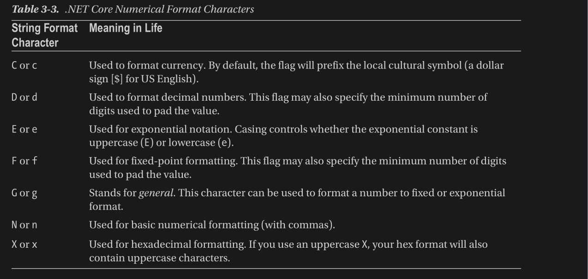
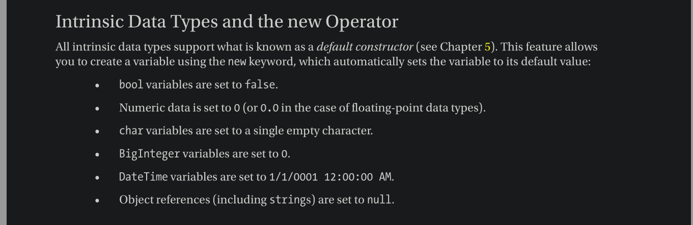
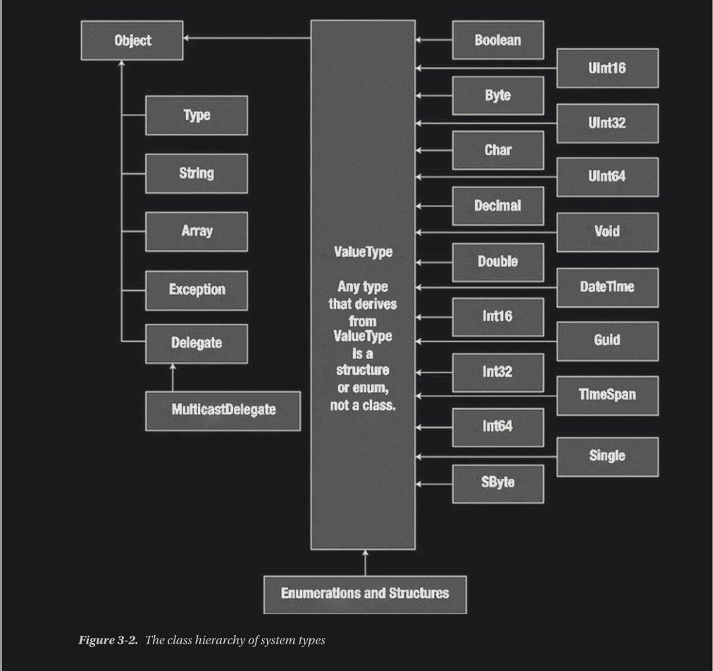
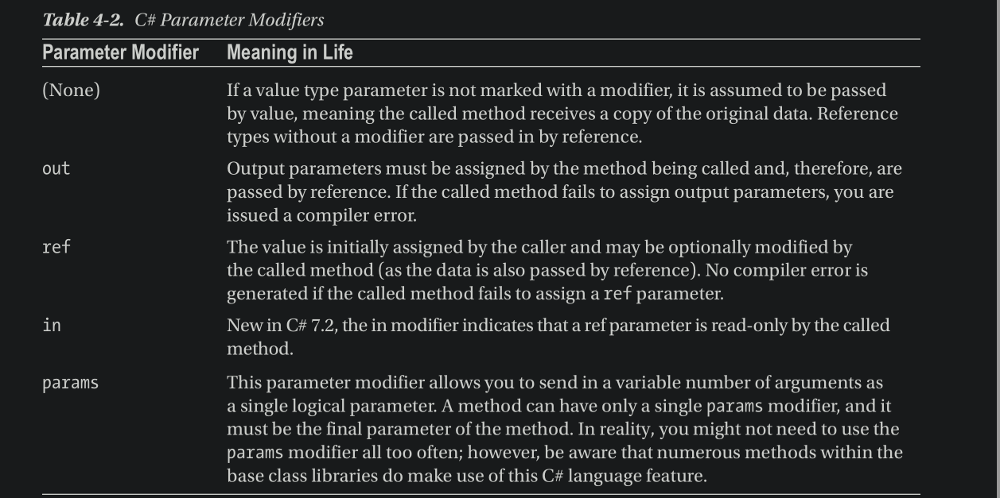

# C# 8

### Main method

The entry point of the app

The class that defimes the `Main()` method is termed as the **application object**

It is possible for a single executable application to have mroe than one application object, but the compiler must know which `Main()` method should be used as the entry point.

For the `Main()` method, any of the following signatures are permitted
   - `static int Main(string[] args)`
   - `static void Main()`
   - `static int Main()`
   - `static Task Main()`
   - `static Task<int> Main()`
   - `static Task Main(string[])`
   - `static Task<int> Main(string[])`

***

### Numerical Formatting 



### Default values (using `new`)



### Heirarchy of System Types



Descendants of `System.ValueType` are automatically allocated on the stack and therefore are very efficient
Other types are allocation on the garbage collected heap.

### Data Type Conversions

_Widening_ is the term used to define an implicit upward cast that does not result in a loss of data (e.g. from short to int)
_Narrowing_ the reverse of widening, usually a compiler error, unless permitted using _type casts_

### `checked` keyword and overflows

WHen we wrap a statement (or block of code) within the scope of the `checked` keyword, the compiler checks for overflow conditions that may happen when we add, subtract, multiply, or divide two numerical data types.

If an overflow occurs, we wil received a runtime excecption `System.OverflowException`

```csharp
static void ProcessBytes()
{
    byte b1 = 100;
    byte b2 = 250;
    // This time, tell the compiler to add CIL code
    // to throw an exception if overflow/underflow
    // takes place.
    try
    {
    byte sum = checked((byte)Add(b1, b2));
    Console.WriteLine("sum = {0}", sum);
    }
    catch (OverflowException ex)
    {
    Console.WriteLine(ex.Message);
    }
}
```

We can also enable Project-wide overflow checking. If done so, we can then use the `unchecked` keyword to disable overflow checks.

### Indices and Ranges

Indices and Ranges can be used with arrays, strings, `Span<T>` and `ReadOnlySpan<T>`

- System.Index represents an index into a sequence
- System.Range represents a subrange of indices
- The index from end Operator `^` specifies that the index is relative to the end of the sequence.
- The range operator `...` specifies the start and end of a range as its operands

The index from end operator lets you specify how many positions from the end of sequence, starting with the length. 
Remember that the last item in a sequence is one less than the actual length, so ^0 would actually cause an error. 

The following code prints the array in reverse:


```csharp
for (int i = 1; i <= gothicBands.Length; i++)
{
    Index idx = ^i;
    // Print a name
    Console.Write(gothicBands[idx] + ", ");
}
```

The range operator specifies a start and end index, and allows for access to a sub-sequence within a list. 
The start of the range is inclusive and the end of the range is exclusive. 
For example, to pull out the first two members of the array, create ranges from 0 (the first member) to 2 (one more than the desired index
position).

```csharp
foreach (var itm in gothicBands[0..2])  // end index is exclusive
{
    // Print a name
    Console.Write(itm + ", ");
}
```


### Local Functions and Static Local Functions

New methods can be created within existing methods. 

If we mark the nested functions as `static`, then the method cannot access global variables, and can only access variables in their parameters, or defined in the scope of their parent methods.

### Method Parameter Modifiers




- Output parameters do not need to be initialized before they are passed to the method. The reason for this is that the method must assign output parameters before exiting. 
- Reference parameters must be initialized before they are passed to the method. The reason for this is that you are passing a reference to an existing variable. If you don’t assign it to an initial value, that would be the equivalent of operating on an unassigned local variable.

### The `in` Modifier

The `in` modifier passes a value by reference (for both value and reference types) and prevents the called method from modifying the values. 

This clearly states a design intent in your code, as well as potentially reducing memory pressure.

When value types are passed by value, they are copied (internally) by the called method. If the object is large (such as a large struct), the extra overhead of making a copy for local use can be significant. 

Also, even when reference types are passed without a modifier, they can be modified by the called method. Both of these issues can be resolved using the in modifier.