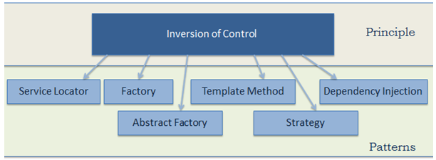

# Inversion of Control & Dep. Inversion Principle

---

## Design Principle vs Design Pattern

### Design Principle

Design principles provide high level guidelines to design better software applications. They do not provide implementation guidelines and are not bound to any programming language. The SOLID (SRP, OCP, LSP, ISP, DIP) principles are one of the most popular sets of design principles.

For example, the Single Responsibility Principle (SRP) suggests that a class should have only one reason to change. This is a high-level statement which we can keep in mind while designing or creating classes for our application. SRP does not provide specific implementation steps but it's up to you how you implement SRP in your application.

### Design Pattern

Design Pattern provides low-level solutions related to implementation, of commonly occurring object-oriented problems. In other words, design pattern suggests a specific implementation for the specific object-oriented programming problem. For example, if you want to create a class that can only have one object at a time, then you can use the Singleton design pattern which suggests the best way to create a class that can only have one object.

Design patterns are tested by others and are safe to follow, e.g. Gang of Four patterns: Abstract Factory, Factory, Singleton, Command, etc.

Principle --> Inversion of Control & Dependency Inversion Principle

Pattern   --> Dependency Injection

Framework --> IoC Container

---

## Inversion of Control

- A Design Principle

- The first step towards achieving loosely coupled design.

- It is used to invert different kinds of *controls* in object-oriented design to achieve loose coupling. Here, *controls* refer to any additional responsibilities a class has, other than its main responsibility. This includes control over the flow of an application, and control over the flow of an object creation or dependent object creation and binding.

- Example: I drive to work, even though my main job and purpose is to do work, I am doing additional work of driving a car. IoC would suggest to invert the control, meaning I hire a cab, or a driver, so that I can focus on my main job.

- The `IoC` principle helps in designing loosely coupled classes which make them testable, maintainable and extensible.

### Control Over the Dependent Object Creation

- In the example below, `A` needs `B` to do its main work of `Task1`, `A` and `B` are tightly coupled. class `B` is a dependency of class `A`

  ```csharp
    public class A
    {
        B b;

        public A()
        {
            b = new B();
        }

        public void Task1() {
            // do something here..
            b.SomeMethod();
            // do something here..
        }

    }

    public class B
    {
        public void SomeMethod()
        {
            //doing something..
        }
    }
  ```

- `IoC` would suggest to invert the dependency creation control from class `A` to another class.

  ```csharp
    public class A
    {
        B b;

        public A()
        {
            b = Factory.GetObjectOfB();
        }

        public void Task1() {
            // do something here..
            b.SomeMethod();
            // do something here..
        }
    }

    public class Factory
    {
        public static B GetObjectOfB()
        {
            return new B();
        }
    }
  ```

### Another Example

- The core business need is to get customer name from DB. `CustomerBusinessLogic` class depends on `DataAccess` class to do that.

  ```csharp
    public class CustomerBusinessLogic
    {
        DataAccess _dataAccess;

        public CustomerBusinessLogic()
        {
            _dataAccess = new DataAccess();
        }

        public string GetCustomerName(int id)
        {
            return _dataAccess.GetCustomerName(id);
        }
    }

    public class DataAccess
    {
        public string GetCustomerName(int id) {
            return "Dummy Customer Name";
        }
    }
  ```

- Problems with the above classes

  - It creates an object of `DataAccess` class and manages the lifetime of the object.
  -  changes in the `DataAccess` class will lead to changes in the `CustomerBusinessLogic` class. For example, if we add, remove or rename any method in the `DataAccess` class then we need to change the CustomerBusinessLogic class accordingly.
  - Data may come from multiple sources, so in the future we may need to create additional classes in our `CustomerBusinessLogic` class.
  - Because the `CustomerBusinessLogic` class creates an object of the concrete `DataAccess` class, it cannot be tested independently (TDD). The `DataAccess` class cannot be replaced with a mock class.

- We can use the `IoC` and `DIP` principles to decouple the classes. `IoC` is just a design principle, and it can be implemented in many patterns.



- Using the `Factory` pattern

  ```csharp
    public class DataAccessFactory
    {
        public static DataAccess GetDataAccessObj()
        {
            return new DataAccess();
        }
    }

    public class DataAccess
    {
        public string GetCustomerName(int id) {
            return "Dummy Customer Name";
        }
    }

    public class CustomerBusinessLogic
    {
        public string GetCustomerName(int id)
        {
            DataAccess _dataAccess =  DataAccessFactory.GetDataAccessObj();

            return _dataAccess.GetCustomerName(id);
        }
    }
  ```

- `IoC` is just the first step, we will not achieve complete loosely coupled classes only by using `IoC`.

---

## Dependency Inversion Principle

- `DIP` is one of the `SOLID` object-oriented principle invented by Robert Martin.

- defined as:
  - High-level modules should not depend on low-level modules. Both should depend on the abstraction.
  - Abstractions should not depend on details. Details should depend on abstractions.

-  A high-level module is a module which depends on other modules. In our example, `CustomerBusinessLogic` depends on the `DataAccess` class, so `CustomerBusinessLogic` is a high-level module and `DataAccess` is a low-level module.

- In the above snippet, `CustomerBusinessLogic` class uses the concrete `DataAccess` class, therefore, they are still tightly coupled, even though we have inverted the dependent object creation to the factory class.

- As per the first rule of `DIP`, `CustomerBusinessLogic` should not depend on the concrete `DataAccess` class, instead both classes should depend on abstraction.

- Abstraction in programming means to create an interface or an abstract class which is non-concrete.

  ```csharp
  // creating abstraction using an interface
    public interface ICustomerDataAccess
    {
        string GetCustomerName(int id);
    }

    // creating a concrete example of an abstraction
    public class CustomerDataAccess : ICustomerDataAccess
    {
        public string GetCustomerName(int id) {
            return "Dummy Customer Name";
        }
    }

    // The factory now returns ICustomerDataAccess, the abstraction
    public class DataAccessFactory
    {
        public static ICustomerDataAccess GetCustomerDataAccessObj()
        {
            return new CustomerDataAccess();
        }
    }

    // The business logic class now cares only about a DataAccess class that implements the interface
    public class CustomerBusinessLogic
    {
        ICustomerDataAccess _custDataAccess;

        public CustomerBusinessLogic()
        {
            _custDataAccess = DataAccessFactory.GetCustomerDataAccessObj();
        }

        public string GetCustomerName(int id)
        {
            return _custDataAccess.GetCustomerName(id);
        }
    }
  ```

- Thus, we have implemented `DIP` in our example where a high-level module (`CustomerBusinessLogic`) and low-level module (`CustomerDataAccess`) are dependent on an abstraction (`ICustomerDataAccess`). Also, the abstraction (`ICustomerDataAccess`) does not depend on details (`CustomerDataAccess`), but the details depend on the abstraction.

- Now, we can easily use another class which implements `ICustomerDataAccess` with a different implementation.

- Still, we have not achieved fully loosely coupled classes because the `CustomerBusinessLogic` class includes a factory class to get the reference of `ICustomerDataAccess`. This is where the Dependency Injection pattern helps us.

---

## Dependency Injection

- DI is a design pattern to allow instances of objects to be passed to other objects that require them at runtime.

- Dependency Injection (`DI`) is a design pattern used to implement `IoC`. It allows the creation of dependent objects outside of a class and provides those objects to a class through different ways. Using `DI`, we move the creation and binding of the dependent objects outside of the class that depends on them.

- The Dependency Injection pattern involves 3 types of classes.

  - *Client Class*: The client class (dependent class) is a class which depends on the service class
  - *Service Class*: The service class (dependency) is a class that provides service to the client class.
  - *Injector Class*: The injector class injects the service class object into the client class.

- Types of DI:
  - **Constructor Injection**: In the constructor injection, the injector supplies the dependency through client class's constructor.

  - **Property Injection**: In the property injection (aka the Setter Injection), the injector supplies the dependency through a public property of the client class.

  - **Method Injection**: In this type of injection, the client class implements an interface which declares the method(s) to supply the dependency and the injector uses this interface to supply the dependency to the client class.

### Constructor Injection

  ```csharp
    public class CustomerBusinessLogic
    {
        ICustomerDataAccess _dataAccess;

        public CustomerBusinessLogic(ICustomerDataAccess custDataAccess)
        {
            _dataAccess = custDataAccess;
        }

        public CustomerBusinessLogic()
        {
            _dataAccess = new CustomerDataAccess();
        }

        public string ProcessCustomerData(int id)
        {
            return _dataAccess.GetCustomerName(id);
        }
    }

    public interface ICustomerDataAccess
    {
        string GetCustomerData(int id);
    }

    public class CustomerDataAccess : ICustomerDataAccess
    {
        public string GetCustomerName(int id)
        {
            return "Dummy Customer Name";
        }
    }

    // The calling class must inject the dependency, an object implementing ICustomerDataAccess
    public class CustomerService
    {
        CustomerBusinessLogic _customerBL;

        public CustomerService()
        {
            _customerBL = new CustomerBusinessLogic(new CustomerDataAccess());
        }

        public string GetCustomerName(int id) {
            return _customerBL.GetCustomerName(id);
        }
    }
  ```

### Property Injection

- In the property injection, the dependency is provided through a public property.

  ```csharp
    public class CustomerBusinessLogic
    {
        public ICustomerDataAccess DataAccess { get; set; }

        public string GetCustomerName(int id)
        {
            return DataAccess.GetCustomerName(id);
        }
    }

    public class CustomerService
    {
        CustomerBusinessLogic _customerBL;

        public CustomerService()
        {
            _customerBL = new CustomerBusinessLogic();
            _customerBL.DataAccess = new CustomerDataAccess();  // the Dep. is assigned to the property by the callee
        }

        public string GetCustomerName(int id) {
            return _customerBL.GetCustomerName(id);
        }
    }
  ```

### Method Injection

- In the method injection, dependencies are provided through methods. This method can be a class method or an interface method.

  ```csharp
    interface IDataAccessDependency
    {
        void SetDependency(ICustomerDataAccess customerDataAccess);
    }

    public class CustomerBusinessLogic : IDataAccessDependency
    {
        ICustomerDataAccess _dataAccess;

        public string GetCustomerName(int id)
        {
            return _dataAccess.GetCustomerName(id);
        }

        public void SetDependency(ICustomerDataAccess customerDataAccess)
        {
            _dataAccess = customerDataAccess;
        }
    }

    public class CustomerService
    {
        CustomerBusinessLogic _customerBL;

        public CustomerService()
        {
            _customerBL = new CustomerBusinessLogic();
            ((IDataAccessDependency)_customerBL).SetDependency(new CustomerDataAccess());  // Dep provided thru method by Callee
        }

        public string GetCustomerName(int id) {
            return _customerBL.GetCustomerName(id);
        }
    }
  ```

### Another Example of Dependency Injection

Let’s say we have a class called `ComponentA` that is using `ComponentB`. The following example shows a typical scenario where no DI is used, and as a result these components are tightly coupled together:

```csharp

public class ComponentA
{
    private readonly ComponentB _componentB;
    public ComponentA()
    {
        this._componentB = new ComponentB();
    }
}
public class ComponentB
{
    public string Name { get; set; }
}

```

Instead of directly referencing an instance of `ComponentB`, we can decouple it by introducing an `IComponent` interface to abstract away the implementation and expect an instance of type `IComponent` in the constructor of `ComponentA`. In the example that follows, the previous code is now refactored to use DI, having `ComponentB` implement `IComponent` so that there is no direct reference to an instance of `ComponentB` anymore:

```csharp

public interface IComponent
{
    string Name { get; }
}

public class ComponentB : IComponent
{
    public string Name { get; set; } = nameof(ComponentB)
}

public class ComponentA
{
    private readonly IComponent _componentB;

    public ComponentA(IComponent componentB)
    {
        this._componentB = componentB;
    }
}
```

When we run this code as is, it will result in a `NullReferenceException` error because `ComponentA` is expecting an object of type `IComponent`, and although `ComponentB` implements the `IComponent` interface, there is nothing configured to pass in the required instance of `IComponent` to the constructor of `ComponentA`.

For the code to run without this issue, we need a mechanism to pass the correct instance of a requested type during runtime. This can be achieved by making use of an ***Inversion of Control*** (IoC) container to register all the required dependencies and their instances. There are many frameworks available on NuGet that provide IoC containers for dependency resolution, namely Unity, Castle Windsor, Autofac, and Ninject.

**Note**: As a general rule of thumb, avoid the explicit instantiation of classes, as doing this results in a tightly coupled system.

---

## IoC Container

- `IoC Container` (a.k.a. `DI Container`) is a framework for implementing automatic `DI`. It manages object creation and it's life-time, and also injects dependencies to the class.

- All the containers must provide easy support for the following `DI` lifecycle.

    - **Register**: The container must know which dependency to instantiate when it encounters a particular type. This process is called registration. Basically, it must include some way to register type-mapping.
    - **Resolve**: When using the IoC container, we don't need to create objects manually. The container does it for us. This is called resolution. The container must include some methods to resolve the specified type; the container creates an object of the specified type, injects the required dependencies if any and returns the object.
    - **Dispose**: The container must manage the lifetime of the dependent objects. Most IoC containers include different lifetimemanagers to manage an object's lifecycle and dispose it.

- Examples of Containers: sted below.

  - Unity
  - StructureMap
  = Castle Windsor
  - Ninject
  - Autofac
  - DryIoc
  - Simple Injector
  - Light Inject
