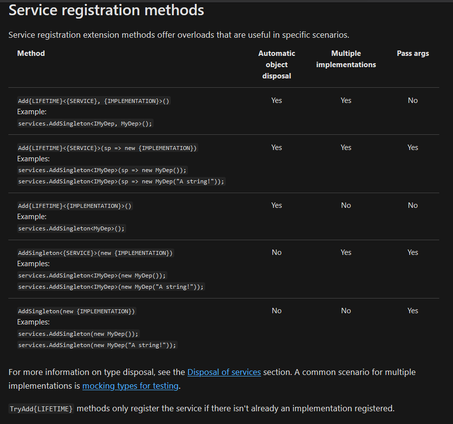

# .Net Core Service Lifetimes (Dependency Injection)

- These are used to choose an appropriate lifetime for a registered service (aka Dependency)

1. Transient

- `services.AddTransient<>()`
- Created each time they are requested from the service container.
- Transient objects are always different; a new instance is provided to every controller and every service.
- THis works best for lightweight, stateless services

2. Scoped

- `services.AddScoped<>()`
- Scoped lifetime services are created once per client request (connection)
- Scoped objects are the same within a request, but different across different requests.
- When using a scoped service in a middleware, inject the service into the Invoke or InvokeAsync method. Don't inject via constructor injection because it forces the service to behave like a singleton.

3. Singleton

- `services.AddSingleton<>()`
- Singleton lifetime services are created the first time they're requested (or when `Startup.ConfigureServices` is run and an instance is specified with the service registration).
- Every subsequent request uses the same instance.
- If the app requires singleton behavior, allowing the service container to manage the service's lifetime is recommended. Don't implement the singleton design pattern and provide user code to manage the object's lifetime in the class.

## Service Registration Methods

