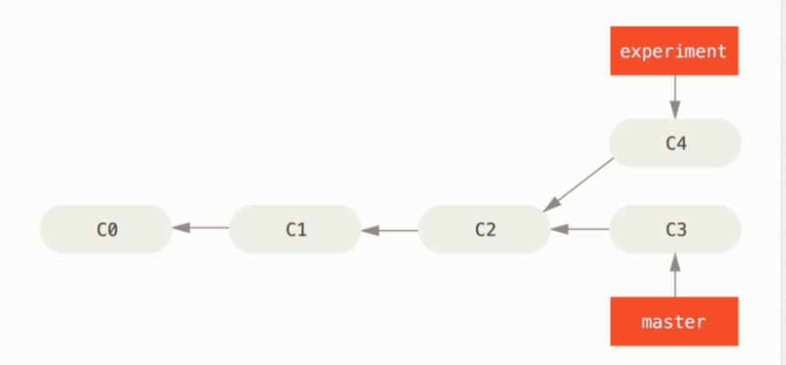
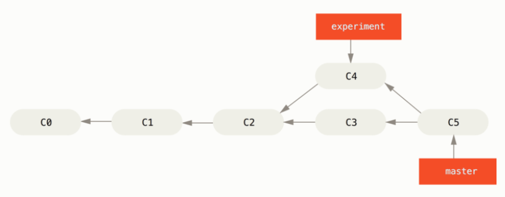
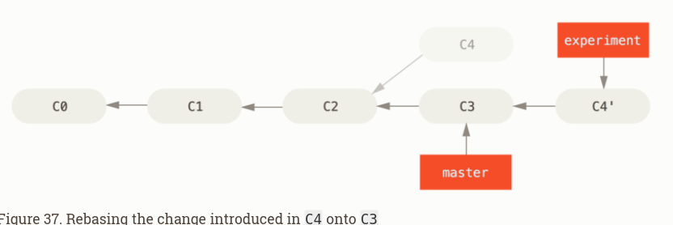

# Git merge vs rebase

https://git-scm.com/book/en/v2/Git-Branching-Rebasing#The-Basic-Rebase

Starting from this situation: 

The easiest way to integrate the branches, is the `merge` command. It performs a three-way merge between the two latest branch snapshots (`C3` and `C4`) and the most recent common ancestor of the two (`C2`), creating a new snapshot (and commit). 

`git checkout experiment`
`git merge master`

The C5 commit, the merge commit, is special that it has two parents.

To rebase, we would checkout `experiment` branch, and then rebase it onto the `master` branch as follows.

`git checkout experiment`
`git rebase master`

At this point, you can go back to the `master` branch and do a fast-forward merge.

`git checkout master`
`git merge experiment`

Now, the snapshot pointed to by `C4'` is exactly the same as the one that was pointed to by `C5` in [the merge example](https://git-scm.com/book/en/v2/ch00/rebasing-merging-example). There is no difference in the end product of the integration, but rebasing makes for a cleaner history. If you examine the log of a rebased branch, it looks like a linear history: it appears that all the work happened in series, even when it originally happened in parallel.