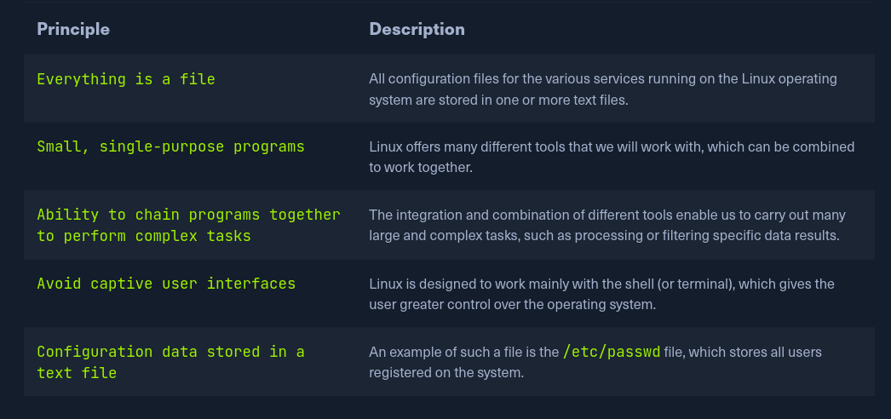
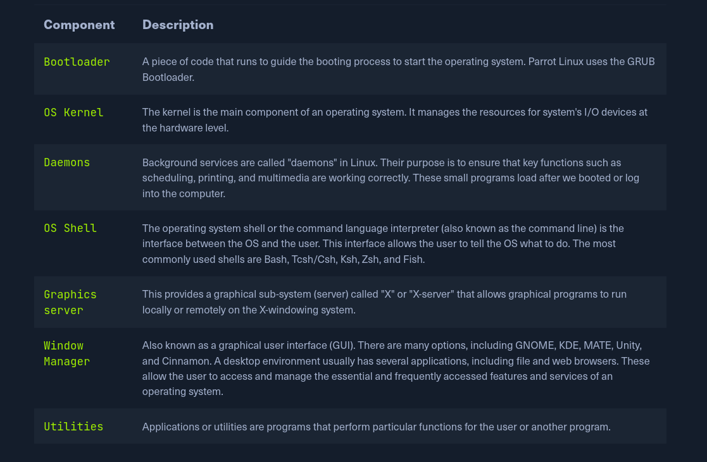
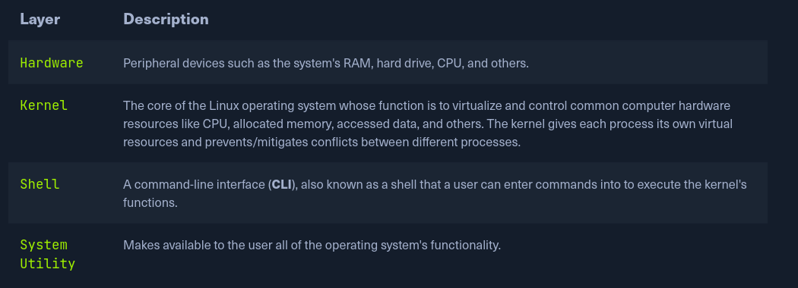
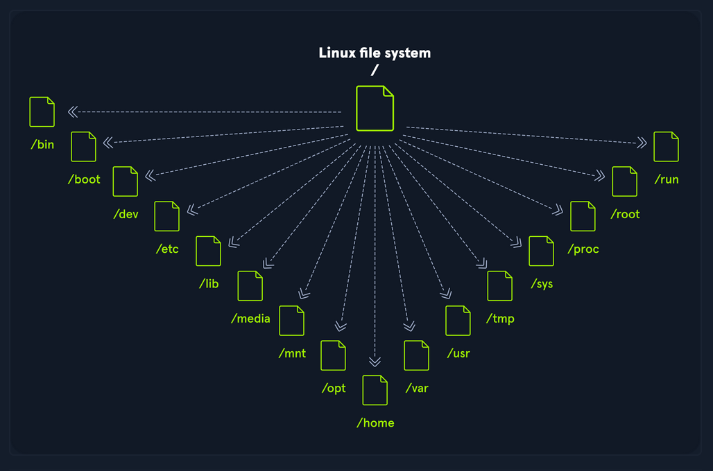

# Linux Structure

## Philosophy

Linux follows five core principles:

## Components

## Linux Architecture

The Linux operating system can be broken down into layers:

## File System Hierarchy

The Linux operating system is structured in a tree-like hierarchy and is documented in the [Filesystem Hierarchy](http://www.pathname.com/fhs/) Standard (FHS). Linux is structured with the following standard top-level directories:

| Path   | Description                                                                                                                                              |
|--------|----------------------------------------------------------------------------------------------------------------------------------------------------------|
| /      | the root, contains all files needed to boot. After boot, all of the other filesystems are mounted at standard mount points as subdirectories of the root |
| /bin   | contains essential command binaries                                                                                                                      |
| /boot  | static bootloader + kernel executable + files needed 4 boot                                                                                              |
| /dev   | device files                                                                                                                                             |
| /etc   | Local system config files, may also have installed applications config                                                                                   |
| /home  | Each user on the system has a sub-dir here                                                                                                               |
| /lib   | shared library files reqd 4 system boot                                                                                                                  |
| /media | Externel removable media devices, e.g. USB                                                                                                               |
| /mnt   | Temporary mount points for regular FSs                                                                                                                   |
| /opt   | Optional files, e.g. 3rd party tools                                                                                                                     |
| /root  | the home directory of the root user                                                                                                                      |
| /sbin  | contains exes for sys admins                                                                                                                             |
| /tmp   | temporary files, cleared upon system boot                                                                                                                |
| /usr   | contains user's exes, libs, man files                                                                                                                    |
| /var   | variable data files such as log files, email in-boxes, web-app related data, cron files and more                                                         |
