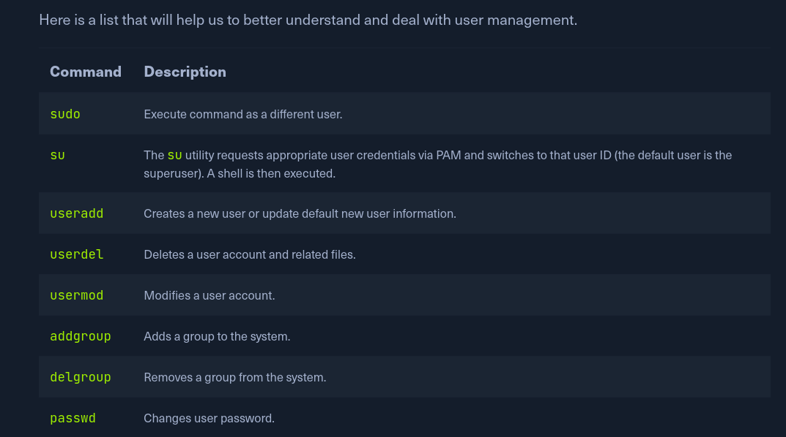

# User Management




## `useradd` vs `adduser`

https://askubuntu.com/questions/345974/what-is-the-difference-between-adduser-and-useradd

The main difference is that **adduser sets up user folders, directories, and other necessary functions easily, whereas useradd creates a new user without adding the directories** as mentioned above and settings.

`useradd` is the system binary, while `adduser` is a perl script using the former underneath.

Use `adduser`/`deluser`:
(I remember which to use by thinking that `user*` comes after `adduser/deluser` in the alphabet, and therefore is "worse".)


## Scenario for Practice

https://www.youtube.com/watch?v=jwnvKOjmtEA

`adduser thor`  -> does not work 

`sudo adduser thor` -> works, creates home directory for Thor among other things

List all the users: 
`cat /etc/passwd`
- `thor:x:1001:1004:Thor,,,:/home/thor:/bin/bash`\
- `x` means password is stored in `/etc/shadow` as hashed
- `1001` is the user id 
- `1004` is the group id
- `/home/thor` is the home directory
- `/bin/bash` is the default shell for this user

Creating a user also creates a group with the same name.

`sudo useradd ironman` -> creates a user but no home directory and password

`sudo passwd ironman` -> to set the password for ironman

`sudo usermod ironman --shell /bin/bash` to set the default shell for this user

`su ironman` -> switch user

`visudo` is the command to edit the `sudoers` file

In sudoeers file , `%sudo` is the sudo group, and we give thanos the sudo powers by modifying the sudoers file

```
root   ALL=(ALL:ALL) ALL
thanos ALL = ALL

%sudo   ALL=(ALL) NOPASSWD: ALL
%avengers ALL = NOPASSWD:ALL
```

`sudo userdel captainamerica`  -> delete user

`sudo groupadd avengers` 
- list groups: `cat /etc/group`

`groups`  -> list all the groups the current user belongs to

`sudo usermod -aG avengers ironman`  -> append group avengers to ironman's list of groups

`sudo gpasswd -d thanos avengers` -> remove a user from a group

`su - ironman` -> login as ironman

`sudo userdel thanos` -> delete thanos

`sudo groupdel avengers` -> delete group avengers