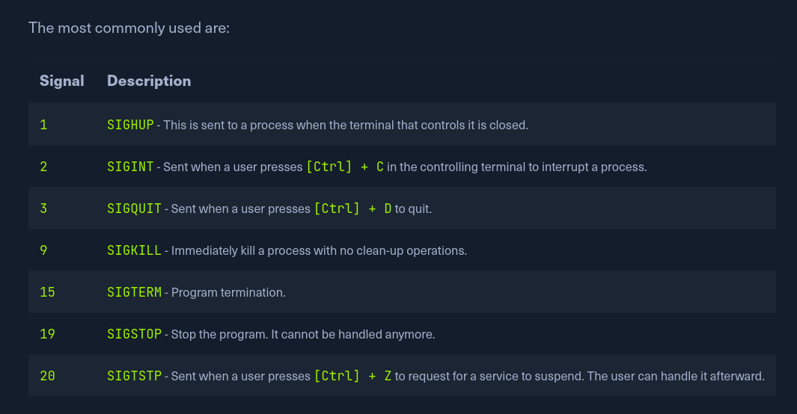

# Service & Process Management

In general, there are two types of services: internal, the relevant services that are required at system startup, which for example, perform hardware-related tasks, and services that are installed by the user, which usually include all server services. Such services run in the background without any user interaction. These are also called `daemons` and are identified by the letter '`d`' at the end of the program name, for example, `sshd` or `systemd`.

Most Linux distributions have now switched to `systemd`. This daemon is an `Init process` started first and thus has the process ID (PID) 1. This daemon monitors and takes care of the orderly starting and stopping of other services. All processes have an assigned PID that can be viewed under `/proc/` with the corresponding number. Such a process can have a parent process ID (PPID), known as the child process.

Besides `systemctl` we can also use `update-rc.d` to manage SysV init script links.
- SysV init scripts contain the list of all daemons that start on system boot?

## `systemctl`

start a daemon/service
- `sudo systemctl start ssh`

`sudo systemctl status ssh` 
- check status of a service

`systemctl enable ssh`
- add a service to SysV start service

`systemctl list-units -t service` OR `--type=service`
- list all sub-services (called units) of systemd

To see any problems during service start: 
`journalctl -u ssh.service --no-pager`

## Kill a Process

A process can be in the following states:

* Running
* Waiting (waiting for an event or system resource)
* Stopped
* Zombie (stopped but still has an entry in the process table).

Processes can be controlled using `kill`, `pkill`, `pgrep`, and `killall`. To interact with a process, we must send a signal to it. We can view all signals with the following command:

`kill -l`

`pgrep <process_name>` - find the pid of the process with this name

`kill 9 <pid>` - kill a process

`pkill -9 <name of process>` - kill a process using grep without knowing the pid of the process

## Background a Process

Sometimes it will be necessary to put the scan or process we just started in the background to continue using the current session to interact with the system or start other processes. As we have already seen, we can do this with the shortcut `[Ctrl + Z]`. As mentioned above, we send the `SIGTSTP` signal to the kernel, which suspends the process.

Use `jobs` to list all background processes.

The `[Ctrl] + Z` shortcut suspends the processes, and they will not be executed further. To keep it running in the background, we have to enter the command `bg` to put the process in the background.

(The process running in the "background" cannot be stopped by CTRL+C command, to stop it first bring it to foreground with `fg` command)

Another option is to automatically set the process with an AND sign (`&`) at the end of the command.
`ping -c 10 www.hackthebox.eu &`

If we want to get the background process into the foreground and interact with it again, we can use the `fg <ID>` command.

## Execute Multiple Commands

There are three possibilities to run several commands, one after the other. These are separated by:

* Semicolon (`;`)
* Double `ampersand` characters (`&&`)
* Pipes (`|`)

`;` ignores the result of the previous command