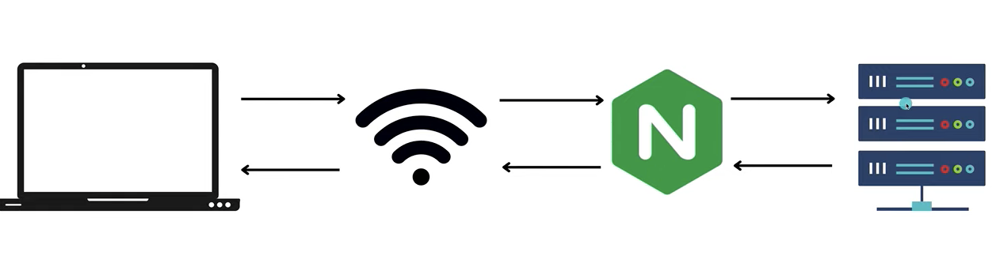
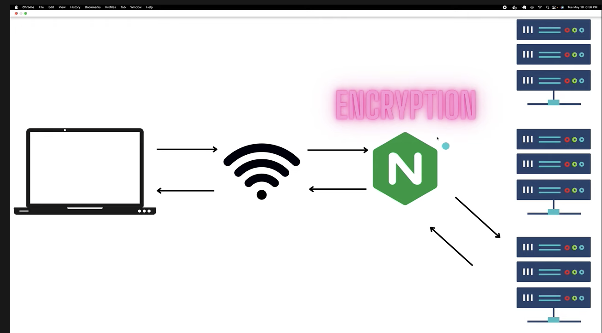

# Nginx Tutorial 

https://www.youtube.com/watch?v=7VAI73roXaY&t=203s




Usually an nginx server is placed in front of actual servers. This setup is known as **Reverse Proxy**

Problem reverse proxy solves is that when we scale an application to inlcude multiple servers, the rev proxy can then act as a "load balancer" and directs the requests to individual servers. 





Another use case for nginx is encryption/HTTPS.


## Terminology

Assume this `nginx.conf` file 

```
events {
    worker_connections  1024;
}
```

**Directive**: the key value pair within the blocks (worker_connections: 1024 in the above snippet)
**Context**: The curly braces block of code containing one ore more directives

`root` directive needs a absolute path (and NOT a relative path)