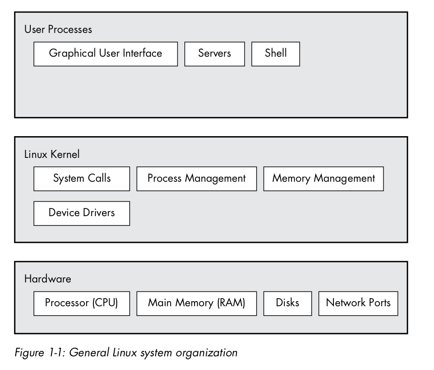

# Linux

## Big Picture

A linux system has three main systems: 
    - hardware (lowest)
    - Kernel (interface between h/w and user space)
    - user space - consisting of processes managed by kernel 

The Kernal runs in _kernal mode_ and the user processes run in _user mode_

Code running in kernel mode has unrestricted access to the processor and main memory.

User Space refers to the part of the memory that the user processes can access.

### Kernel 

The kernel is in charge of managing tasks in 4 general system areas: 

1. Processes - which process are allowed to use the CPU
2. Memory - The kernel needs to keep track of all memory - what is currently allocated to a particular process, what might be shared between processes, and what is free.
3. Device Drivers - interface between h/w and processes
4. System calls and support - processes use System calls to communicate with the kernel.

### Time Slices and Context Switching

Processes do not all run at the same time, they run one by one, with each process pausing and givng control to the next, this is called _context switch_

Each piece of processor time, called a _time slice_ gives a process enough time for significant computation (a process usually finishes its current task during a single slice).

Kernal is responsible for context switching: 
1. The CPU (the actual hardware) interrupts the current process based
on an internal timer, switches into kernel mode, and hands control back to the kernel.
2. The kernel records the current state of the CPU and memory, which will be essential to resuming the process that was just interrupted.
3. The kernel performs any tasks that might have come up during the preceding time slice (such as collecting data from input and output,
or I/O, operations).
4. The kernel is now ready to let another process run. The kernel analyzes the list of processes that are ready to run and chooses one.
5. The kernel prepares the memory for this new process, and then prepares the CPU.
6. The kernel tells the CPU how long the time slice for the new process will last.
7. The kernel switches the CPU into user mode and hands control of the CPU to the process.

The context switch answers the important question of when the kernal runs. It runs between process time slices during a context switch.

### Memory Management

Because the kernel must manage memory during a context switch, it has a complex job of memory management. The kernel’s job is complicated
because the following conditions must hold:
- The kernel must have its own private area in memory that user processes can’t access.
- Each user process needs its own section of memory.
- One user process may not access the private memory of another process.
- User processes can share memory.
- Some memory in user processes can be read-only. 
- The system can use more memory than is physically present by using disk space as auxiliary.

Fortunately for the kernel, there is help. 

Modern CPUs include a _**memory management unit (MMU)**_ that enables a memory access scheme called virtual memory. 

When using virtual memory, a process does not directly access the memory by its physical location in the hardware. Instead, the kernel sets up
each process to act as if it had an entire machine to itself. When the process accesses some of its memory, the MMU intercepts the access and uses a memory address map to translate the memory location from the process into an actual physical memory location on the machine. 

The kernel must still initialize and continuously maintain and alter this memory address map.

For example, during a context switch, the kernel has to change the map from the outgoing process to the incoming process.

**NOTE** The implementation of a memory address map is called a _page table_.

### Device Drivers and Management

A device is typically acessible only in Kernel mode. (could be dangerous otherwise)

Device drivers strive to present a uniform interface from h/w to user processes to simplify the developer's job

### System Calls

_System Calls_ perform specific tasks that a user process cannot alone do well, or cannot do at all.
    - e.g. act of opening, reading and writing files all involve system calls

Two important sys calls
    - `fork()` - when a process calls `fork()` the kernel creates a nearly identical copy of the process.
    - `exec()` - when a process calls `exec(program)` (e.g. exec(ls)), the kernel starts the program, replacing the current process.

All user processes on a Linux system start as a result of `fork()`, and most of the time, then `exec(program)` to replace the copy with the new program. e.g typing `ls` in a terminal

### User Space

The main memory that the kernel allocates for user processes is called user space.

Most of the real action in linux happens in user space.

Although all processes are essentially equal from the kernel’s point of view, they perform different tasks for users.

### Users 

A user is an entity that can run processes and own files. 

A user is associated with a _username_, however the kernel identifies users by their _userids_

Users exist primarily to support permissions and boundaries.

Every user-space process has a user owner, and processes are said to run as the owner. 

A user may terminate or modify the behavior of its own processes (within certain limits), but it cannot interfere with other users’ processes.

In addition, users may own files and choose whether they share them with other users.

The _root_ user is an exception to the preceding rules because root may terminate and alter another user’s processes and read any
file on the local system. 

For this reason, root is known as the superuser. A person who can operate as root is said to have root access and is an administrator on a traditional Unix system.

**Groups** are sets of users. The primary purpose of groups is to allow a user to share file access to other users in a group.

