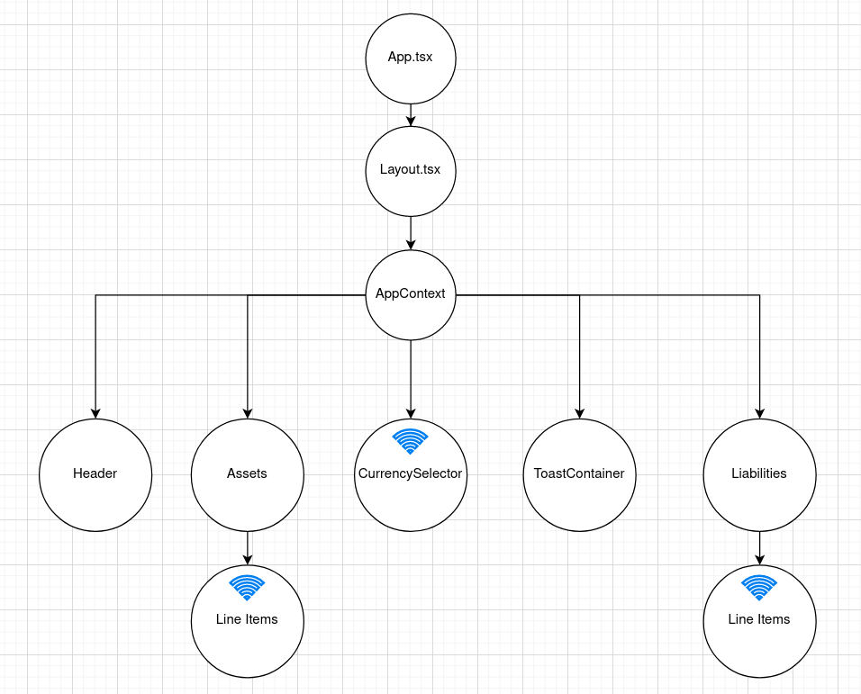

## Craft Demo

### Net Worth Tracker{.subtitle}

---

## Stack 
 
- Server
    - NodeJS
    - Express
    - TypeScript 
    
- Client 
    - React 
    - TypeScript
    - Tailwind CSS

## Folder Structure

---

### Client side{.slide2}

- `src`
    - `components`
    - `api`
    - `context`
    - `data`
    - `localStorage`
    - `strings`
    - `types`
    - `utils`
    - `validation`
- `package.json`
- `tailwind.config.js`

--- 

### Server Side
- `src`
    - `api`
    - `domain`
    - `types`
    - `utils`
    - `validation`
- `index.ts`
- `package.json`

---

### Client: Component Tree



--- 

### Server - REST API

1. `/api/networth/convert` to convert from one currency to another
   
   - Accepts JSON body

```typescript
type ConvertNetWorthRequest = {
  oldCurrencyCode: CurrencyCode; // 3 letter International Currency Code
  newCurrencyCode: CurrencyCode;
  netWorth: NetWorth;
};

```

    - Returns JSON 

```typescript
type NetWorth = {
  netWorth: string;
  assets: Asset;
  liabilities: Liability;
}
```

--- 

### Server - REST API

2. `/api/networth/calculate` to re-calculate net worth once a line item is changed
   
   - Accepts JSON body 

```typescript
type CalculateNetWorthRequest = {
  assets: Asset;
  liabilities: Liability;
  currency: CurrencyCode;
};

```

- Returns 

```typescript
type NetWorthCalculation = { 
    netWorth: string;
    totalAssets: string;
    totalLiabilities: string;
}
```
   
---

### Client side - dependencies

1. Forms with **React Hook Forms**
2. **Tailwind CSS** for styling 
3. **React Number Format** for money input and display
4. **Yup** for data validation
5. **Axios** for making HTTP requests 
6. **React Toastify** for error message display
7. **Jest** for testing

---

### Server side - dependencies

1. **Deniro.js** for representing Money in code
2. **Yup** for request validation
3. **Jest** for testing
4. **Axios** for fetching currency rates from external API


<style>
    .reveal .slides {
      height: 100%;
      top: 0;
      margin-top: 0;
    }
    
    .reveal .slides>section {
      min-height: 90%;
    }
    
    .reveal .slides>section>section {
      min-height: 100%;
    }
    
    .subtitle {
    
    }
    
</style>