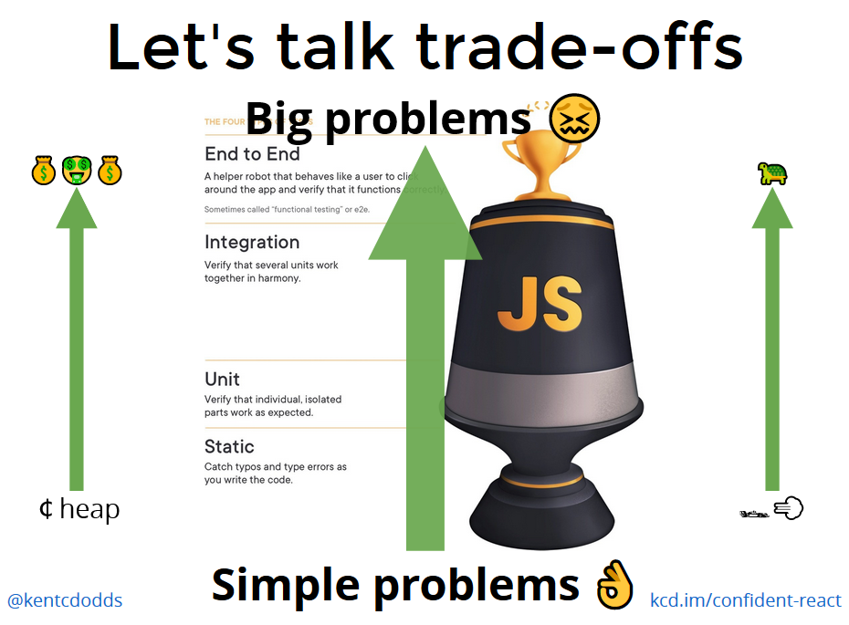

# Testing UI Components with Jest and React Testing Library

## Philosphy behind Testing Library

- The whole idea behind React Testing library is that instead of testing implementation details, we should be testing the way our software is supposed to be used by the end-user.
- The previous method used to be to write a lot of unit tests, write some snapshot tests using techniques like shallow rendering, and write even fewer end-to-end tests.

## Types of tests

- **Static** - Catch typos and type errors as you write the code. (TypeScript & ESLint)
- **Unit**: Verify that individual, isolated parts work as expected.
- **Integration**: Verify that several units work together in harmony.
- **End to End**: A helper robot that behaves like a user to click around the app and verify that it functions correctly. Sometimes called "functional testing" or e2e.

---

## Testing Trophy

## Why do we test, and Trade-Offs in testing

- As we move up the testing trophy, we're increasing what is called the "confidence coefficient." This is the relative confidence that each test can get us at that level. We can imagine that above the trophy is manual testing. That would get us really great confidence from those tests, but the tests would be really expensive and slow.

- the lower the trophy you are, the less code your tests are testing. If you're operating at a low level you need more tests to cover the same number of lines of code in your application as a single test could higher up the trophy. In fact, as you go lower down the testing trophy, there are some things that are impossible to test.

    - **Cost** - As we move up the testing trophy, the tests become more costly. This comes in the form of actual money to run the tests in a continuous integration environment, but also in the time it takes engineers to write and maintain each individual test.
    - **Speed** - As we move up the testing trophy, the tests typically run slower. This is due to the fact that the higher we are on the testing trophy, the more code our test is running
    - **Confidence** - Integration and e2e tests give us the most condifence in the usability of our app.

---

## Why is testing implementation details bad?

### Implementation details are things which users of your code will not typically use, see, or even know about.

There are two distinct reasons that it's important to avoid testing implementation details. Tests which test implementation details:

- Can break when you refactor application code. **False negatives**
- May not fail when you break application code. **False positives**

## Notes

- we use regex to match text in html elements
